# Neutralization assays of HAARVI sera versus WT and mutant spike-pseudotyped lentiviruses

Andrea (with some help from me) cloned these mutants and she made spike-PV lentivirus. 
Andrea set up most of the neuts, with help from me on a few things here and there. 

She started each sample at a slightly different initial dilution to capture the full neutralization curve for each sample, given that each serum has a different neutralization potency (determined in Kate's original paper).

The data that are analyzed in this notebook were pre-processed by Kate's `excel_to_fracinfect` script. 

### Import modules


```python
import collections
import itertools
import math
import os
import re
import string
import warnings
import xml.etree.ElementTree as ElementTree

from IPython.display import display, HTML
from IPython.display import display, SVG
from matplotlib.backends.backend_pdf import PdfPages
import matplotlib as mpl
import matplotlib.pyplot as plt

import natsort
import numpy as np
import pandas as pd
from plotnine import *

import neutcurve
from neutcurve.colorschemes import CBMARKERS, CBPALETTE
import seaborn

import svgutils

import yaml
```


```python
warnings.simplefilter('ignore')
```


```python
plt.style.use('seaborn-white')
theme_set(theme_seaborn(style='white', context='talk', font='FreeSans', font_scale=1))
#theme_set(theme_seaborn(style='white', context='talk', font='FreeSans', font_scale=1))
```


    <plotnine.themes.theme_seaborn.theme_seaborn at 0x7f2744d7dd50>


```python
def svg_dim(svgfile, dim):
    """Get width or height `dim` of `svgfile` in points."""
    return float(ElementTree.parse(svgfile)
                            .getroot().attrib[dim]
                            .replace('px', '')
                            .replace('pt', '')
                            )
```

### Create results directory


```python
resultsdir='results/mutant_neuts_results/'
os.makedirs(resultsdir, exist_ok=True)
```

Read config file


```python
with open('mutant_neuts_config.yaml') as f:
    config = yaml.safe_load(f)
    
with open ('../config.yaml') as f:
    global_config = yaml.safe_load(f)
```

## Read in escape fractions


```python
escape_fracs_file = os.path.join('..', global_config['escape_fracs'])
escape_fracs = pd.read_csv(escape_fracs_file).query('library == "average"')
escape_fracs.head()

escape_metrics = ['mut_escape_frac_epistasis_model',
                  'site_total_escape_frac_epistasis_model',
                  'site_avg_escape_frac_epistasis_model',
                 ]
```

### Read in data
* Concatenate the `frac_infectivity` files.
* Remove samples specified in config file. 
* Also remove specified sample / dilution combinations where something has clearly gone wrong experimentally (like forgetting to add virus or cells). 
* Replace `serum` with `display_name`


```python
frac_infect = pd.DataFrame() # create empty data frame

if config['neut_samples_ignore']:
    neut_samples_ignore = config['neut_samples_ignore']

for f in config['neut_input_files'].keys():
    df = (pd.read_csv(f, index_col=0).assign(date=config['neut_input_files'][f]))
    frac_infect = frac_infect.append(df).reset_index(drop=True)

print(f"Length before dropping anything = {len(frac_infect.index)}")
    
frac_infect = (frac_infect
#         .query('serum not in @neut_samples_ignore') # currently none in config
        .replace({'serum' : config['display_names']})
        .reset_index(drop=True)
       )

print(f"Length after dropping neut_samples_ignore = {len(frac_infect.index)}")

# below deals with samples / dates/ dilutions to ignore, which are currently none

# for s in config['neut_ignore_dilutions']:
#     dil = config['neut_ignore_dilutions'][s]
#     l = len((frac_infect[(frac_infect['serum'] == s) & (frac_infect['concentration'] == dil)]))
#     print(f"Dropping {l} rows")
#     frac_infect = frac_infect.drop(frac_infect[((frac_infect['serum'] == s) & (frac_infect['concentration'] == dil))].index)
#     print(f"Length after dropping {s}: {dil} = {len(frac_infect.index)}")

for s in config['neut_ignore_dates']:
    dat = config['neut_ignore_dates'][s]
    l = len((frac_infect[(frac_infect['serum'] == s) & (frac_infect['date'] == dat)]))
    print(f"Dropping {l} rows")
    frac_infect = frac_infect.drop(frac_infect[((frac_infect['serum'] == s) & (frac_infect['date'] == dat))].index)
    print(f"Length after dropping {s}: {dat} = {len(frac_infect.index)}")

frac_infect.head(2)
```

    Length before dropping anything = 1384
    Length after dropping neut_samples_ignore = 1384
    Dropping 28 rows
    Length after dropping 24C_d32: 201224 = 1356


<div>
<style scoped>
    .dataframe tbody tr th:only-of-type {
        vertical-align: middle;
    }

    .dataframe tbody tr th {
        vertical-align: top;
    }

    .dataframe thead th {
        text-align: right;
    }
</style>
<table border="1" class="dataframe">
  <thead>
    <tr style="text-align: right;">
      <th></th>
      <th>serum</th>
      <th>virus</th>
      <th>replicate</th>
      <th>concentration</th>
      <th>fraction infectivity</th>
      <th>date</th>
    </tr>
  </thead>
  <tbody>
    <tr>
      <th>0</th>
      <td>1C_d26</td>
      <td>WT</td>
      <td>1</td>
      <td>0.025000</td>
      <td>0.005157</td>
      <td>201106</td>
    </tr>
    <tr>
      <th>1</th>
      <td>1C_d26</td>
      <td>WT</td>
      <td>1</td>
      <td>0.008333</td>
      <td>0.042560</td>
      <td>201106</td>
    </tr>
  </tbody>
</table>
</div>


### Use `neutcurve` to fit Hill curves to data.
Get IC50 and calculate NT50. 
Determine if IC50 is bound.


```python
for d in frac_infect['date'].unique():
    print(d)
```

    201106
    201116
    201119
    201221
    201224
    210115


```python
fitparams = pd.DataFrame(columns=['serum', 'virus', 'ic50', 'NT50', 'ic50_bound', 'date'])

for d in frac_infect['date'].unique():
    fits = neutcurve.CurveFits(frac_infect.query('date==@d'))

    fp = (
        fits.fitParams()
        .assign(NT50=lambda x: 1/x['ic50'],
                date=d
               )
        .replace({'WT':'wildtype'})
        # get columns of interest
        [['serum', 'virus', 'ic50', 'NT50', 'ic50_bound', 'date']] 
        )

    # couldn't get lambda / conditional statement to work with assign, so try it here:
    fp['ic50_is_bound'] = fp['ic50_bound'].apply(lambda x: True if x!='interpolated' else False)
    fitparams=fitparams.append(fp, ignore_index=True)

fitparams.head()
```


<div>
<style scoped>
    .dataframe tbody tr th:only-of-type {
        vertical-align: middle;
    }

    .dataframe tbody tr th {
        vertical-align: top;
    }

    .dataframe thead th {
        text-align: right;
    }
</style>
<table border="1" class="dataframe">
  <thead>
    <tr style="text-align: right;">
      <th></th>
      <th>serum</th>
      <th>virus</th>
      <th>ic50</th>
      <th>NT50</th>
      <th>ic50_bound</th>
      <th>date</th>
      <th>ic50_is_bound</th>
    </tr>
  </thead>
  <tbody>
    <tr>
      <th>0</th>
      <td>1C_d26</td>
      <td>wildtype</td>
      <td>0.000600</td>
      <td>1666.929235</td>
      <td>interpolated</td>
      <td>201106</td>
      <td>False</td>
    </tr>
    <tr>
      <th>1</th>
      <td>1C_d26</td>
      <td>F456K</td>
      <td>0.000871</td>
      <td>1148.676778</td>
      <td>interpolated</td>
      <td>201106</td>
      <td>False</td>
    </tr>
    <tr>
      <th>2</th>
      <td>1C_d26</td>
      <td>E484P</td>
      <td>0.002929</td>
      <td>341.449922</td>
      <td>interpolated</td>
      <td>201106</td>
      <td>False</td>
    </tr>
    <tr>
      <th>3</th>
      <td>1C_d113</td>
      <td>wildtype</td>
      <td>0.002278</td>
      <td>438.988101</td>
      <td>interpolated</td>
      <td>201106</td>
      <td>False</td>
    </tr>
    <tr>
      <th>4</th>
      <td>1C_d113</td>
      <td>F456K</td>
      <td>0.000863</td>
      <td>1158.774452</td>
      <td>interpolated</td>
      <td>201106</td>
      <td>False</td>
    </tr>
  </tbody>
</table>
</div>


### Calculate fold change for each mutant relative to wild type.


```python
fc = (
    fitparams
    .query('virus != "wildtype"')
    .rename(columns={'virus': 'mutant'})
    .merge(fitparams.query('virus == "wildtype"')
                    [['serum', 'ic50', 'date']]
                    .rename(columns={'ic50': 'wildtype_ic50'}),
           on=['serum', 'date'],
           how='left',
           validate='many_to_one',
           )
    .assign(fold_change=lambda x: x['ic50'] / x['wildtype_ic50'],
            log2_fold_change=lambda x: np.log(x['fold_change']) / np.log(2))
    )

fc.head(3)
```


<div>
<style scoped>
    .dataframe tbody tr th:only-of-type {
        vertical-align: middle;
    }

    .dataframe tbody tr th {
        vertical-align: top;
    }

    .dataframe thead th {
        text-align: right;
    }
</style>
<table border="1" class="dataframe">
  <thead>
    <tr style="text-align: right;">
      <th></th>
      <th>serum</th>
      <th>mutant</th>
      <th>ic50</th>
      <th>NT50</th>
      <th>ic50_bound</th>
      <th>date</th>
      <th>ic50_is_bound</th>
      <th>wildtype_ic50</th>
      <th>fold_change</th>
      <th>log2_fold_change</th>
    </tr>
  </thead>
  <tbody>
    <tr>
      <th>0</th>
      <td>1C_d26</td>
      <td>F456K</td>
      <td>0.000871</td>
      <td>1148.676778</td>
      <td>interpolated</td>
      <td>201106</td>
      <td>False</td>
      <td>0.000600</td>
      <td>1.451173</td>
      <td>0.537220</td>
    </tr>
    <tr>
      <th>1</th>
      <td>1C_d26</td>
      <td>E484P</td>
      <td>0.002929</td>
      <td>341.449922</td>
      <td>interpolated</td>
      <td>201106</td>
      <td>False</td>
      <td>0.000600</td>
      <td>4.881914</td>
      <td>2.287447</td>
    </tr>
    <tr>
      <th>2</th>
      <td>1C_d113</td>
      <td>F456K</td>
      <td>0.000863</td>
      <td>1158.774452</td>
      <td>interpolated</td>
      <td>201106</td>
      <td>False</td>
      <td>0.002278</td>
      <td>0.378838</td>
      <td>-1.400346</td>
    </tr>
  </tbody>
</table>
</div>


### Plot the raw neutralization curves


```python
plotted_sera = [] # empty list we will use as a check to make sure we plot everything! 

for plot_grp in [config['antibody_controls'], config['serum_samples']]:
    for d in frac_infect['date'].unique():
        fits = neutcurve.CurveFits(frac_infect.query('date==@d & serum in @plot_grp'))
        xlab= 'antibody (ng/mL)' if plot_grp==config['antibody_controls'] else 'serum dilution'
        name= 'mab' if plot_grp==config['antibody_controls'] else 'sera'
        plotted_sera = plotted_sera + [s for s in plot_grp if s in fits.sera]
        
        if len([s for s in plot_grp if s in fits.sera])>=1:
            fig, axes = fits.plotSera(xlabel=xlab)

            plotfile = f'./{resultsdir}/{d}_{name}_mutant_neuts.pdf'
            print(f"Saving to {plotfile}")
            fig.savefig(plotfile, bbox_inches='tight')

excluded_sera = [s for s in fitparams['serum'] if s not in plotted_sera]
print(f"Curves not plotted for {excluded_sera}")
```

    Saving to ./results/mutant_neuts_results//201116_mab_mutant_neuts.pdf
    Saving to ./results/mutant_neuts_results//201106_sera_mutant_neuts.pdf
    Saving to ./results/mutant_neuts_results//201116_sera_mutant_neuts.pdf
    Saving to ./results/mutant_neuts_results//201119_sera_mutant_neuts.pdf
    Saving to ./results/mutant_neuts_results//201221_sera_mutant_neuts.pdf
    Saving to ./results/mutant_neuts_results//201224_sera_mutant_neuts.pdf
    Saving to ./results/mutant_neuts_results//210115_sera_mutant_neuts.pdf
    Curves not plotted for []


    
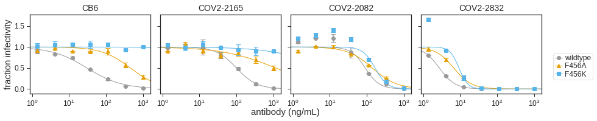
    


    
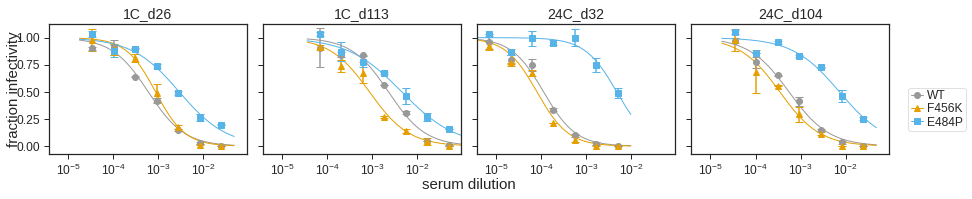
    


    
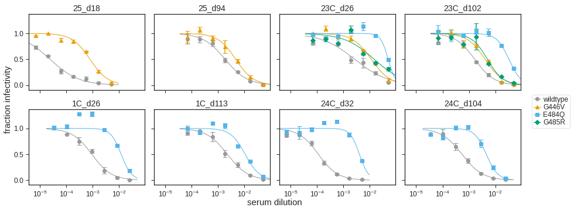
    


    
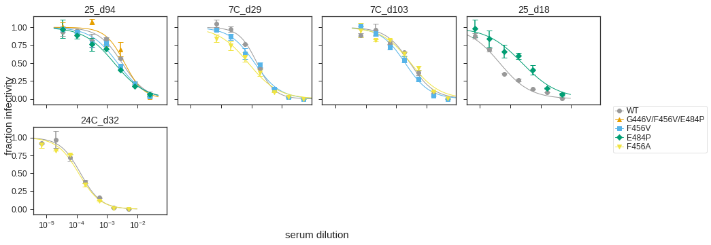
    


    
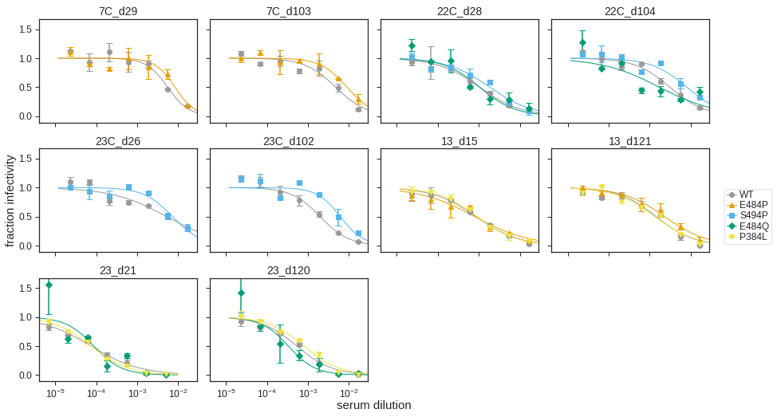
    


    
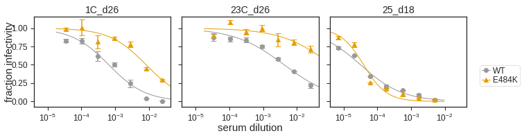
    


    
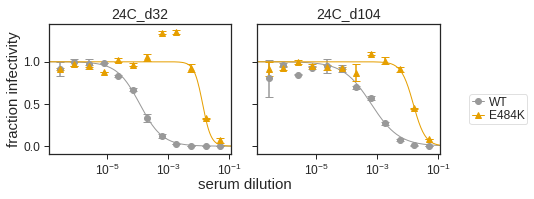
    


## Make table of NT50 for each genotype (wildtype or mutant) for each serum.
This is actually an important thing we should probably add to the paper. 
Even though the NT50s decrease by ~10-fold or more for some sera against some mutants, the absolute NT50 remaining might still be quite potent. 
It would be nice to have this clearly shown.


```python
# get RBD depletion neuts
depletion_df = (pd.read_csv(config['rbd_depletion_foldchange'])
                .query('depletion=="post-depletion" & sample_group=="serum"')
                [['display_PID', 'Days Post-Symptom Onset','display_name',
                  'NT50','sample_name','ic50_is_bound'
                 ]]
                .assign(virus="RBD antibodies depleted")
                .sort_values('display_name', key=lambda x: np.argsort(natsort.index_natsorted(x)))
               )

depletion_df.head()

# get cleaner version of fitparams
fitparams_clean = (fitparams.drop(columns=['ic50', 'ic50_bound', 'date'])
                   # get the metadata from depletion_df
                   .merge((depletion_df
                          .drop(columns=['virus', 'NT50','ic50_is_bound'])
                          .drop_duplicates()),
                          left_on=['serum'],
                          right_on=['sample_name'],
                          how='left',
                          validate='many_to_one',
                         )
                   .drop(columns=['serum'])
                  )

# get list of all the sera for which we have mutant neuts
tested_subjects = [i for i in fitparams_clean['display_PID'].unique() if str(i) != 'nan']
print(tested_subjects)

# merge mutant neuts with RBD depletion neuts
titers = (pd.concat([fitparams_clean,depletion_df], axis=0, ignore_index=True)
          # remove individuals / sera for which we don't have mutant neuts
          .query('display_PID in @tested_subjects & display_name!="subject A (day 45)"')
         )


# if there are multiple measurements for a virus x serum, get the average NT50
titers=(titers
            .groupby(['virus','display_PID','Days Post-Symptom Onset','display_name'])
            .aggregate({'NT50' : 'mean'})
            .reset_index()
            .drop_duplicates()
            .rename(columns={'NT50':'avg_NT50'})
            .merge(titers, how='right')
             )

# get titers as string that indicates which are at limit of detection
titers=titers.assign(NT50_str=lambda x: x['avg_NT50'].astype(int).astype(str))
titers['NT50_str'] = np.where(titers['ic50_is_bound'], 
                              '<'+titers['NT50_str'], 
                              titers['NT50_str']
                             )
titers_str = titers.drop(columns=['sample_name','NT50','ic50_is_bound']).drop_duplicates()

# pivot table
cols=['display_PID','Days Post-Symptom Onset','display_name']
pivot_on='virus'
print(titers_str['virus'].unique())

viruses_to_keep=['wildtype', 'E484K', 'E484Q', 'E484P','RBD antibodies depleted']

other_viruses=['G446V', 'G485R','S494P','P384L','F456K', 'F456V', 'F456A',]

titers_table = (titers_str
                .query('virus in @viruses_to_keep')
                .assign(virus=lambda x: pd.Categorical(x['virus'], ordered=True,
                                                       categories=viruses_to_keep
                                                      )
                       )
                .pivot(index=cols, columns='virus', values=['NT50_str'])
                .fillna('n.d.')
                .rename(columns=str)
                .rename_axis()
                .reset_index()
               )

titers_table.to_csv(f'{resultsdir}/E484_NT50s.csv', index=False)
titers_table
```

    ['subject B', 'subject C', 'subject G', 'subject I', 'subject K', 'subject E', 'subject J', 'subject A']
    ['wildtype' 'F456K' 'E484P' 'G446V' 'E484Q' 'G485R' 'G446V/F456V/E484P'
     'F456V' 'F456A' 'S494P' 'P384L' 'E484K' 'RBD antibodies depleted']


<div>
<style scoped>
    .dataframe tbody tr th:only-of-type {
        vertical-align: middle;
    }

    .dataframe tbody tr th {
        vertical-align: top;
    }

    .dataframe thead tr th {
        text-align: left;
    }
</style>
<table border="1" class="dataframe">
  <thead>
    <tr>
      <th></th>
      <th>display_PID</th>
      <th>Days Post-Symptom Onset</th>
      <th>display_name</th>
      <th colspan="5" halign="left">NT50_str</th>
    </tr>
    <tr>
      <th>virus</th>
      <th></th>
      <th></th>
      <th></th>
      <th>wildtype</th>
      <th>E484K</th>
      <th>E484Q</th>
      <th>E484P</th>
      <th>RBD antibodies depleted</th>
    </tr>
  </thead>
  <tbody>
    <tr>
      <th>0</th>
      <td>subject A</td>
      <td>21.0</td>
      <td>subject A (day 21)</td>
      <td>13402</td>
      <td>n.d.</td>
      <td>11539</td>
      <td>n.d.</td>
      <td>845</td>
    </tr>
    <tr>
      <th>1</th>
      <td>subject A</td>
      <td>120.0</td>
      <td>subject A (day 120)</td>
      <td>1867</td>
      <td>n.d.</td>
      <td>3041</td>
      <td>n.d.</td>
      <td>&lt;20</td>
    </tr>
    <tr>
      <th>2</th>
      <td>subject B</td>
      <td>26.0</td>
      <td>subject B (day 26)</td>
      <td>1431</td>
      <td>121</td>
      <td>83</td>
      <td>341</td>
      <td>136</td>
    </tr>
    <tr>
      <th>3</th>
      <td>subject B</td>
      <td>113.0</td>
      <td>subject B (day 113)</td>
      <td>442</td>
      <td>n.d.</td>
      <td>94</td>
      <td>221</td>
      <td>&lt;20</td>
    </tr>
    <tr>
      <th>4</th>
      <td>subject C</td>
      <td>32.0</td>
      <td>subject C (day 32)</td>
      <td>8490</td>
      <td>74</td>
      <td>249</td>
      <td>212</td>
      <td>27</td>
    </tr>
    <tr>
      <th>5</th>
      <td>subject C</td>
      <td>104.0</td>
      <td>subject C (day 104)</td>
      <td>1722</td>
      <td>65</td>
      <td>219</td>
      <td>136</td>
      <td>&lt;20</td>
    </tr>
    <tr>
      <th>6</th>
      <td>subject E</td>
      <td>28.0</td>
      <td>subject E (day 28)</td>
      <td>961</td>
      <td>n.d.</td>
      <td>959</td>
      <td>n.d.</td>
      <td>231</td>
    </tr>
    <tr>
      <th>7</th>
      <td>subject E</td>
      <td>104.0</td>
      <td>subject E (day 104)</td>
      <td>320</td>
      <td>n.d.</td>
      <td>579</td>
      <td>n.d.</td>
      <td>&lt;20</td>
    </tr>
    <tr>
      <th>8</th>
      <td>subject G</td>
      <td>18.0</td>
      <td>subject G (day 18)</td>
      <td>31617</td>
      <td>25440</td>
      <td>n.d.</td>
      <td>4033</td>
      <td>727</td>
    </tr>
    <tr>
      <th>9</th>
      <td>subject G</td>
      <td>94.0</td>
      <td>subject G (day 94)</td>
      <td>428</td>
      <td>n.d.</td>
      <td>n.d.</td>
      <td>578</td>
      <td>&lt;20</td>
    </tr>
    <tr>
      <th>10</th>
      <td>subject I</td>
      <td>26.0</td>
      <td>subject I (day 26)</td>
      <td>267</td>
      <td>&lt;40</td>
      <td>20</td>
      <td>n.d.</td>
      <td>21</td>
    </tr>
    <tr>
      <th>11</th>
      <td>subject I</td>
      <td>102.0</td>
      <td>subject I (day 102)</td>
      <td>551</td>
      <td>n.d.</td>
      <td>30</td>
      <td>n.d.</td>
      <td>50</td>
    </tr>
    <tr>
      <th>12</th>
      <td>subject J</td>
      <td>15.0</td>
      <td>subject J (day 15)</td>
      <td>1177</td>
      <td>n.d.</td>
      <td>n.d.</td>
      <td>1259</td>
      <td>166</td>
    </tr>
    <tr>
      <th>13</th>
      <td>subject J</td>
      <td>121.0</td>
      <td>subject J (day 121)</td>
      <td>697</td>
      <td>n.d.</td>
      <td>n.d.</td>
      <td>431</td>
      <td>&lt;20</td>
    </tr>
    <tr>
      <th>14</th>
      <td>subject K</td>
      <td>29.0</td>
      <td>subject K (day 29)</td>
      <td>420</td>
      <td>n.d.</td>
      <td>n.d.</td>
      <td>120</td>
      <td>50</td>
    </tr>
    <tr>
      <th>15</th>
      <td>subject K</td>
      <td>103.0</td>
      <td>subject K (day 103)</td>
      <td>279</td>
      <td>n.d.</td>
      <td>n.d.</td>
      <td>112</td>
      <td>&lt;20</td>
    </tr>
  </tbody>
</table>
</div>


## Make plot showing NT50 for each genotype (wildtype or mutant) for each serum.
This is actually an important thing we should probably add to the paper. 
Even though the NT50s decrease by ~10-fold or more for some sera against some mutants, the absolute NT50 remaining might still be quite potent. 
It would be nice to have this clearly shown.


```python
titers.head()
all_viruses=['wildtype', 'E484K', 'E484Q', 'E484P','G446V', 'G485R','S494P','P384L','F456K', 'F456V', 'F456A','RBD antibodies depleted']
all_viruses_dep=['wildtype', 'E484K', 'E484Q', 'E484P','G446V', 'G485R','S494P','P384L','F456K', 'F456V', 'F456A','G446V/F456V/E484P','RBD-absorbed']
E484_viruses=['wildtype', 'E484K', 'E484Q', 'E484P','RBD-absorbed']

titers['dPSO_group'] = (titers['Days Post-Symptom Onset']
                                  .apply(lambda x: 'early\ntime point' if x<=45 else 'late\ntime point')
                                 )

titers['E484_mut'] = pd.np.where(titers.virus.str.contains("E484K"),True,False)

for virus_set,name in zip([all_viruses_dep, E484_viruses],['all_viruses','E484_viruses']):
    p = (ggplot((titers
                 .assign(dPSO=lambda x: x['Days Post-Symptom Onset'].astype(int).astype(str))
                 .sort_values('dPSO', key=lambda x: np.argsort(natsort.index_natsorted(x)))
                 .replace({'RBD antibodies depleted':'RBD-absorbed'})
                 .query('virus in @virus_set')
                 .assign(virus=lambda x: pd.Categorical(x['virus'], ordered=True,
                                                           categories=virus_set)) 
                )) +
         aes('virus', 'NT50', fill='ic50_is_bound', shape='E484_mut') +
         geom_jitter(aes(shape='E484_mut'), size=2.5, alpha=0.6, width=0, height=0, random_state=0) +
         scale_x_discrete(name='') +
         scale_y_log10(name='neutralization titer (NT50)', expand=(0.1,0.1)) +
         facet_grid('dPSO_group~display_PID', scales='free_x') +
#          theme_classic() +
         theme_bw() +
         theme(axis_text_x=element_text(angle=90),
               figure_size=(1.25 * titers['display_PID'].nunique(), 2.5),
               strip_margin_y=0.35,
               strip_background_y=element_blank(),
#                panel_grid_major_y=element_line(),
               ) +
#          geom_hline(yintercept=20, linetype='dashed', size=1,
#                     alpha=0.6, color=CBPALETTE[0]) +
         scale_fill_manual(values=['gray', 'white'],name='below limit\nof detection')
         +scale_shape_manual(values=['o', 'D'],name='E484K')
#          +scale_color_manual(values=['gray', '#D55E00'],name='E484 mutant')
         )

    _ = p.draw()

    plotfile = f'{resultsdir}/{name}_NT50.pdf'
    print(f"Saving to {plotfile}")
    p.save(plotfile, verbose=False)
```

    Saving to results/mutant_neuts_results//all_viruses_NT50.pdf
    Saving to results/mutant_neuts_results//E484_viruses_NT50.pdf


    
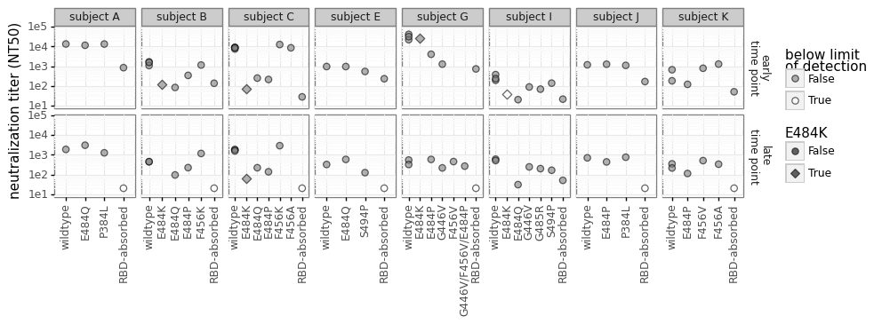
    


    
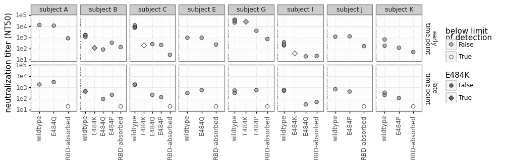
    


### Plot fold-change IC50 relative to wild type for each mutant.
You could also imagine drawing a dashed line with the fold-change with RBD depletion, which sets an upper limit on what we would expect to see (the max drop in NT50 we could see due to anything RBD-related). 

To do this you would need to:
* Read in foldchange IC50 due to RBD depletion (specify path in config file)
* Merge with mutant `foldchange` dataframe
* Add `geom_hline` with depletion foldchange


```python
depletion_fc = (pd.read_csv(config['rbd_depletion_foldchange'])
                .drop(columns=['depletion', 'ic50', 'ic50_bound', 'ic50_is_bound', 'NT50', 'serum'])
                .drop_duplicates()
                .rename(columns={'fold_change':'depletion_fc'})
                .query('sample_group=="serum"')
               )

depletion_fc.head()
print(len(depletion_fc))

depletion_fc['dPSO_group'] = (depletion_fc['Days Post-Symptom Onset']
                                  .apply(lambda x: 'early' if x<=45 else 'late')
                                 )

foldchange = fc.merge(depletion_fc,
                      left_on=['serum'],
                      right_on=['sample_name'],
                      how='left',
                      validate='many_to_one'
                      )

display(foldchange.head())

# write to file
(foldchange
 [['display_name', 'serum', 'mutant', 'date', 'ic50', 'wildtype_ic50', 'fold_change', 'NT50', 'ic50_bound']]
 .to_csv(f'{resultsdir}/mutants_foldchange_ic50.csv', index=False, float_format='%.4g')
 )
```

    35


<div>
<style scoped>
    .dataframe tbody tr th:only-of-type {
        vertical-align: middle;
    }

    .dataframe tbody tr th {
        vertical-align: top;
    }

    .dataframe thead th {
        text-align: right;
    }
</style>
<table border="1" class="dataframe">
  <thead>
    <tr style="text-align: right;">
      <th></th>
      <th>serum</th>
      <th>mutant</th>
      <th>ic50</th>
      <th>NT50</th>
      <th>ic50_bound</th>
      <th>date</th>
      <th>ic50_is_bound</th>
      <th>wildtype_ic50</th>
      <th>fold_change</th>
      <th>log2_fold_change</th>
      <th>...</th>
      <th>experiment</th>
      <th>Sex</th>
      <th>Age</th>
      <th>Severity</th>
      <th>IC50_D614</th>
      <th>NT50_D614</th>
      <th>logNT50_D614</th>
      <th>logNT50_G614</th>
      <th>max_fc</th>
      <th>dPSO_group</th>
    </tr>
  </thead>
  <tbody>
    <tr>
      <th>0</th>
      <td>1C_d26</td>
      <td>F456K</td>
      <td>0.000871</td>
      <td>1148.676778</td>
      <td>interpolated</td>
      <td>201106</td>
      <td>False</td>
      <td>0.000600</td>
      <td>1.451173</td>
      <td>0.537220</td>
      <td>...</td>
      <td>expt_41</td>
      <td>Male</td>
      <td>35.0</td>
      <td>Symptomatic Hospitalized</td>
      <td>0.001594</td>
      <td>627.425740</td>
      <td>6.441625</td>
      <td>7.354642</td>
      <td>14.243019</td>
      <td>early</td>
    </tr>
    <tr>
      <th>1</th>
      <td>1C_d26</td>
      <td>E484P</td>
      <td>0.002929</td>
      <td>341.449922</td>
      <td>interpolated</td>
      <td>201106</td>
      <td>False</td>
      <td>0.000600</td>
      <td>4.881914</td>
      <td>2.287447</td>
      <td>...</td>
      <td>expt_41</td>
      <td>Male</td>
      <td>35.0</td>
      <td>Symptomatic Hospitalized</td>
      <td>0.001594</td>
      <td>627.425740</td>
      <td>6.441625</td>
      <td>7.354642</td>
      <td>14.243019</td>
      <td>early</td>
    </tr>
    <tr>
      <th>2</th>
      <td>1C_d113</td>
      <td>F456K</td>
      <td>0.000863</td>
      <td>1158.774452</td>
      <td>interpolated</td>
      <td>201106</td>
      <td>False</td>
      <td>0.002278</td>
      <td>0.378838</td>
      <td>-1.400346</td>
      <td>...</td>
      <td>expt_51</td>
      <td>Male</td>
      <td>35.0</td>
      <td>Symptomatic Hospitalized</td>
      <td>0.008034</td>
      <td>124.464922</td>
      <td>4.824024</td>
      <td>5.651999</td>
      <td>14.243019</td>
      <td>late</td>
    </tr>
    <tr>
      <th>3</th>
      <td>1C_d113</td>
      <td>E484P</td>
      <td>0.004507</td>
      <td>221.895200</td>
      <td>interpolated</td>
      <td>201106</td>
      <td>False</td>
      <td>0.002278</td>
      <td>1.978358</td>
      <td>0.984303</td>
      <td>...</td>
      <td>expt_51</td>
      <td>Male</td>
      <td>35.0</td>
      <td>Symptomatic Hospitalized</td>
      <td>0.008034</td>
      <td>124.464922</td>
      <td>4.824024</td>
      <td>5.651999</td>
      <td>14.243019</td>
      <td>late</td>
    </tr>
    <tr>
      <th>4</th>
      <td>24C_d32</td>
      <td>F456K</td>
      <td>0.000080</td>
      <td>12569.984770</td>
      <td>interpolated</td>
      <td>201106</td>
      <td>False</td>
      <td>0.000112</td>
      <td>0.711198</td>
      <td>-0.491677</td>
      <td>...</td>
      <td>expt_35</td>
      <td>Female</td>
      <td>76.0</td>
      <td>Symptomatic Non-Hospitalized</td>
      <td>0.000174</td>
      <td>5761.315215</td>
      <td>8.658921</td>
      <td>8.154701</td>
      <td>125.366727</td>
      <td>early</td>
    </tr>
  </tbody>
</table>
<p>5 rows × 38 columns</p>
</div>


```python
plot_sera = config["serum_samples"]
excluded_sera=[s for s in foldchange['serum'] if s not in plot_sera]
print(f'Not plotting results for {excluded_sera}')

p = (ggplot(foldchange
            .query("serum in @plot_sera")
            ) +
     aes('mutant', 'fold_change', 
        ) +
     geom_point(size=2.5) +
     scale_y_log10(name='fold change IC50') +
     facet_grid('dPSO_group~display_PID', scales='free_x') +
     theme_classic() +
     theme(axis_text_x=element_text(angle=90),
           figure_size=(1 * foldchange['mutant'].nunique(), 2.5),
           ) +
     geom_hline(yintercept=1, linetype='dashed', size=1,
                alpha=0.6, color=CBPALETTE[0]) +
     geom_hline(aes(yintercept='depletion_fc'),
                color=CBPALETTE[3],
                alpha=0.7,
                size=1,
                linetype='dotted',
               ) +
     scale_color_manual(values=CBPALETTE[1:],
                        name='upper limit')
     )

_ = p.draw()

# plotfile = f'{resultsdir}/fold_change_IC50_earlylate.pdf'
# print(f"Saving to {plotfile}")
# p.save(plotfile, verbose=False)
```

    Not plotting results for ['CB6', 'CB6', 'COV2-2165', 'COV2-2165', 'COV2-2082', 'COV2-2082', 'COV2-2832', 'COV2-2832']


    
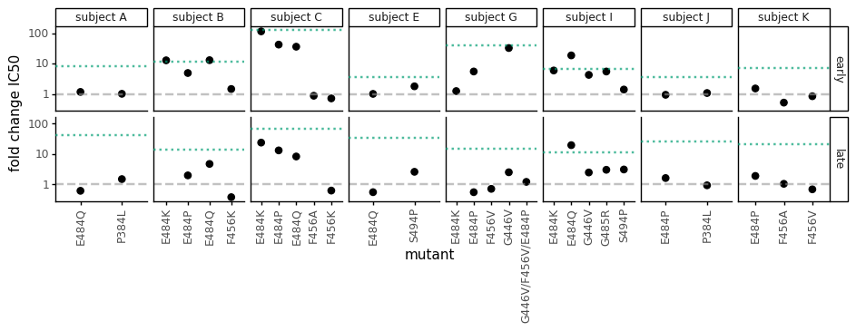
    


Create plot just for antibody controls here:


```python
antibody_controls = config['antibody_controls']

upper_bound = (
    foldchange
    .query('ic50_bound == "lower" & serum in @antibody_controls')
    [['serum', 'fold_change']]
    .drop_duplicates()
    )
assert len(upper_bound) == upper_bound['serum'].nunique()

p = (ggplot(foldchange
            .query("serum in @antibody_controls")
            .assign(ic50_is_bound=lambda x: x['ic50_is_bound'],
                    )
            ) +
     aes('mutant', 'fold_change', color='ic50_is_bound') +
     geom_point(size=2.5) +
     scale_y_log10(name='fold change IC50') +
     facet_grid('~serum', scales='free') +
     theme_classic() +
     theme(axis_text_x=element_text(angle=90),
           figure_size=(0.5 * foldchange['mutant'].nunique(), 1.25),
           ) +
     geom_hline(yintercept=1, linetype='dashed', size=1,
                alpha=0.6, color=CBPALETTE[0]) +
     geom_hline(data=upper_bound,
                mapping=aes(yintercept='fold_change'),
                color=CBPALETTE[2],
                alpha=0.7,
                size=1,
                linetype='dotted',
                ) +
     scale_color_manual(values=CBPALETTE[1:],
                        name='upper limit')
     )

_ = p.draw()

plotfile = f'{resultsdir}/fold_change_IC50_antibodies.pdf'
print(f"Saving to {plotfile}")
p.save(plotfile, verbose=False)
```

    Saving to results/mutant_neuts_results//fold_change_IC50_antibodies.pdf


    
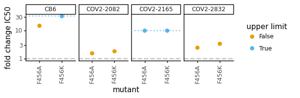
    


Now plot everything altogether


```python
upper_bound = (
    foldchange
    .query('ic50_bound == "lower"')
    [['serum', 'fold_change']]
    .drop_duplicates()
    )
assert len(upper_bound) == upper_bound['serum'].nunique()

ncol=min(8, foldchange['serum'].nunique())
nrow= math.ceil(foldchange['serum'].nunique() / ncol)

p = (ggplot(foldchange
            .assign(ic50_is_bound=lambda x: x['ic50_is_bound'],
                    )
            ) +
     aes('mutant', 'fold_change', color='ic50_is_bound') +
     geom_point(size=2.5) +
     scale_y_log10(name='fold change IC50') +
     facet_wrap('~serum', scales='free_x', ncol=ncol,) +
     theme_classic() +
     theme(axis_text_x=element_text(angle=90),
           figure_size=(ncol*1.25, foldchange['serum'].nunique()*0.25),
           subplots_adjust={'hspace':0.85}
           ) +
     geom_hline(yintercept=1, linetype='dashed', size=1,
                alpha=0.6, color=CBPALETTE[0]) +
     geom_hline(data=upper_bound,
                mapping=aes(yintercept='fold_change'),
                color=CBPALETTE[2],
                alpha=0.7,
                size=1,
                linetype='dotted',
                ) +
     geom_hline(aes(yintercept='depletion_fc'),
                color=CBPALETTE[3],
                alpha=0.7,
                size=1,
                linetype='dotted',
               ) +
     scale_color_manual(values=CBPALETTE[1:],
                        name='upper limit')
     )

_ = p.draw()

plotfile = f'{resultsdir}/fold_change_IC50.pdf'
print(f"Saving to {plotfile}")
p.save(plotfile, verbose=False)
```

    Saving to results/mutant_neuts_results//fold_change_IC50.pdf


    
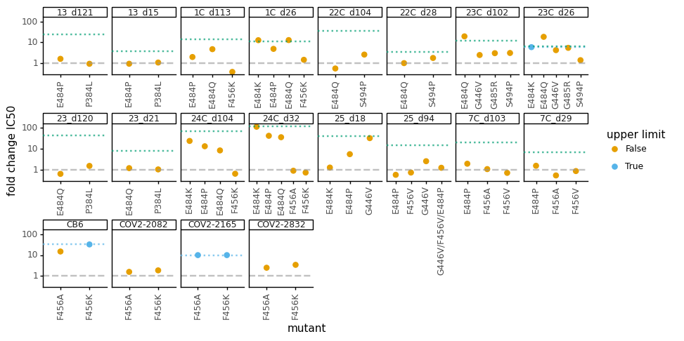
    


## Make nice plots of neut curves for paper
Make nice plots of all the neutralization curves for a paper figure:


```python
def classify_serum_or_antibody(name):
    if name in config['serum_samples']:
        return 'serum'
    elif name in config['antibody_controls']:
        return 'antibody'
    else:
        raise ValueError(f"Cannot classify {name}")
        
def get_display_name(row):
    if row['serum_or_antibody'] == 'serum':
        return depletion_fc.set_index('sample_name')['display_name'].to_dict()[row['serum']]
    else:
        return 'antibody ' + row['serum']

frac_infect = (
    frac_infect
    .assign(serum_or_antibody=lambda x: x['serum'].map(classify_serum_or_antibody),
            display_name=lambda x: x.apply(get_display_name, axis=1),
            virus=lambda x: x['virus'].map(lambda s: 'wildtype' if s == 'WT' else s)
            )
    .sort_values('date')
    # https://stackoverflow.com/a/63890954
    .sort_values('display_name', key=lambda x: np.argsort(natsort.index_natsorted(x)))
    .assign(display_name_date=lambda x: x['display_name'] + '\n' + x['date'].astype(str) + ' assays')
    )

svgs = []
for group in ['serum', 'antibody']:
    print(f"\nMaking plot for {group}:")
    fits = neutcurve.CurveFits(frac_infect.query('serum_or_antibody == @group'),
                               serum_col='display_name_date')
    fig, axes = fits.plotSera(xlabel={'antibody': 'antibody concentration (ng/ml)',
                                      'serum': 'serum dilution'}[group],
                              ncol=6,
                              heightscale=1,
                              widthscale=0.88,
                              )
    plotfile = f'./{resultsdir}/{group}_mutant_neuts.svg'
    svgs.append(plotfile)
    print(f"Saving to {plotfile}")
    fig.savefig(plotfile, bbox_inches='tight')
    plt.close(fig)
    
merged_svg = os.path.join(resultsdir, 'mutant_neuts.svg')
print(f"\nCombining plots into {merged_svg}:")
panel_pad = 40
letter_height = 10
fig_svgs = []
fig_height = 0
for letter, svg in zip(string.ascii_uppercase, svgs):
    fig_height += panel_pad
    fig_svgs.append(svgutils.compose.Text(letter, 5, letter_height,
                                          font='Arial', size=22, weight='bold'
                                          ).move(0, fig_height)
                    )
    fig_height += letter_height
    fig_svgs.append(svgutils.compose.SVG(svg).move(0, fig_height))
    fig_height += svg_dim(svg, 'height')
svgutils.compose.Figure(max([svg_dim(svg, 'width') for svg in svgs]),
                        fig_height,
                        *fig_svgs,
                        ).save(merged_svg)
display(SVG(merged_svg))
```

    
    Making plot for serum:
    Saving to ./results/mutant_neuts_results//serum_mutant_neuts.svg
    
    Making plot for antibody:
    Saving to ./results/mutant_neuts_results//antibody_mutant_neuts.svg
    
    Combining plots into results/mutant_neuts_results/mutant_neuts.svg:


    

    


Make plots of just key sera of interest.
For these, we specify which sera and viruses to show.
Then we plot just the **first** assay for each virus and sera in the final version, but first plot all assays and make sure wildtype is relatively consistent across assay dates:


```python
# key sera of interest
sera_to_plot = ['subject C (day 32)',
                'subject B (day 26)',
                'subject I (day 26)',
                'subject I (day 102)',
                'subject G (day 18)',
                'subject G (day 94)']
# key viruses of interest
viruses_to_plot = ['wildtype',
                   'G446V',
                   'E484K',
                   'E484Q',
                   'G485R',
                   ]

# plot curves for sera of interest with separate plot for each assay date
fits_by_date = neutcurve.CurveFits(frac_infect.query('(display_name in @sera_to_plot) and (virus in @viruses_to_plot)'),
                                   serum_col='display_name_date')
fig_by_date, _ = fits_by_date.plotSera(xlabel='serum dilution',
                                       ncol=5,
                                       heightscale=1,
                                       widthscale=0.9,
                                       )
display(fig_by_date)
plt.close(fig_by_date)

# tabulate IC50s of wildtype on each assay date
(display(
    frac_infect
    [['display_name_date', 'display_name', 'date']]
    .drop_duplicates()
    .rename(columns={'display_name_date': 'serum'})
    .merge(fits_by_date.fitParams(), how='right')
    .drop(columns='serum')
    .sort_values(['display_name', 'virus', 'date'])
    .query('virus == "wildtype"')
    ))

# Now plot by sera **not** including assay date; when multiple measurements for
# an assay date just take the first one.
df = (frac_infect
      .query('(display_name in @sera_to_plot) and (virus in @viruses_to_plot)')
      .assign(first_assay_date=lambda x: x.groupby(['display_name', 'virus'])['date'].transform('first'))
      .query('date == first_assay_date')
      )
fits = neutcurve.CurveFits(df,
                           serum_col='display_name')
fig, _ = fits.plotSera(xlabel='serum dilution',
                       ncol=2,
                       heightscale=0.95,
                       widthscale=0.94,
                       max_viruses_per_subplot=len(viruses_to_plot),
                       sharex=False,
                       )
display(fig)
main_fig_neut_svg = os.path.join(resultsdir, 'main_fig_neut.svg')
print(f"Saving to {main_fig_neut_svg}")
fig.savefig(main_fig_neut_svg, bbox_inches='tight')
plt.close(fig)
```


    
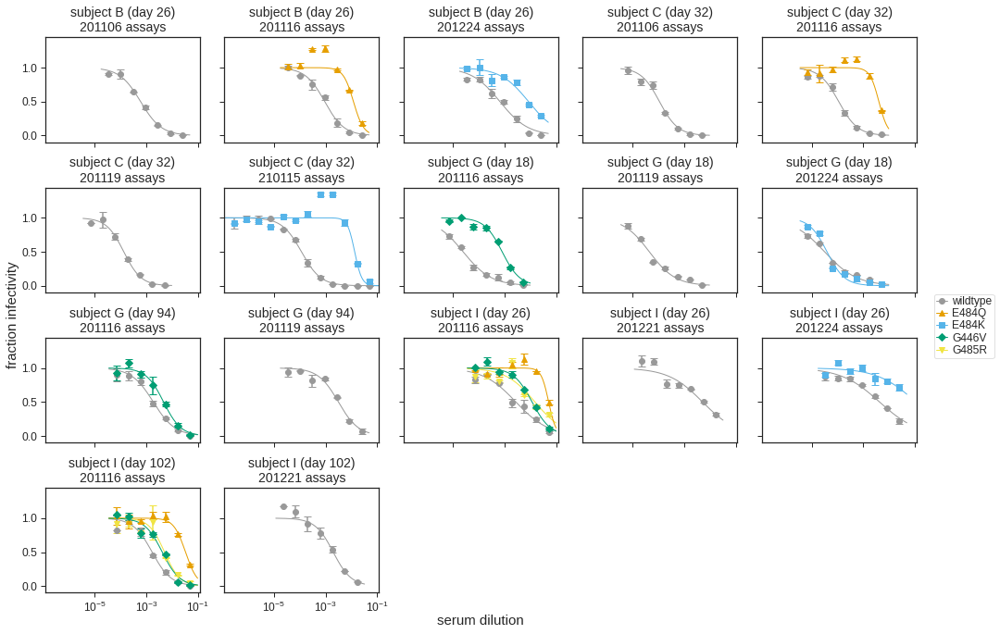
    


<div>
<style scoped>
    .dataframe tbody tr th:only-of-type {
        vertical-align: middle;
    }

    .dataframe tbody tr th {
        vertical-align: top;
    }

    .dataframe thead th {
        text-align: right;
    }
</style>
<table border="1" class="dataframe">
  <thead>
    <tr style="text-align: right;">
      <th></th>
      <th>display_name</th>
      <th>date</th>
      <th>virus</th>
      <th>replicate</th>
      <th>nreplicates</th>
      <th>ic50</th>
      <th>ic50_bound</th>
      <th>ic50_str</th>
      <th>midpoint</th>
      <th>slope</th>
      <th>top</th>
      <th>bottom</th>
    </tr>
  </thead>
  <tbody>
    <tr>
      <th>0</th>
      <td>subject B (day 26)</td>
      <td>201106</td>
      <td>wildtype</td>
      <td>average</td>
      <td>2</td>
      <td>0.000600</td>
      <td>interpolated</td>
      <td>0.0006</td>
      <td>0.000600</td>
      <td>1.076034</td>
      <td>1</td>
      <td>0</td>
    </tr>
    <tr>
      <th>1</th>
      <td>subject B (day 26)</td>
      <td>201116</td>
      <td>wildtype</td>
      <td>average</td>
      <td>2</td>
      <td>0.000927</td>
      <td>interpolated</td>
      <td>0.000927</td>
      <td>0.000927</td>
      <td>1.161519</td>
      <td>1</td>
      <td>0</td>
    </tr>
    <tr>
      <th>3</th>
      <td>subject B (day 26)</td>
      <td>201224</td>
      <td>wildtype</td>
      <td>average</td>
      <td>2</td>
      <td>0.000646</td>
      <td>interpolated</td>
      <td>0.000646</td>
      <td>0.000646</td>
      <td>0.797637</td>
      <td>1</td>
      <td>0</td>
    </tr>
    <tr>
      <th>5</th>
      <td>subject C (day 32)</td>
      <td>201106</td>
      <td>wildtype</td>
      <td>average</td>
      <td>2</td>
      <td>0.000112</td>
      <td>interpolated</td>
      <td>0.000112</td>
      <td>0.000112</td>
      <td>1.212649</td>
      <td>1</td>
      <td>0</td>
    </tr>
    <tr>
      <th>7</th>
      <td>subject C (day 32)</td>
      <td>201116</td>
      <td>wildtype</td>
      <td>average</td>
      <td>2</td>
      <td>0.000112</td>
      <td>interpolated</td>
      <td>0.000112</td>
      <td>0.000112</td>
      <td>1.182218</td>
      <td>1</td>
      <td>0</td>
    </tr>
    <tr>
      <th>8</th>
      <td>subject C (day 32)</td>
      <td>201119</td>
      <td>wildtype</td>
      <td>average</td>
      <td>2</td>
      <td>0.000134</td>
      <td>interpolated</td>
      <td>0.000134</td>
      <td>0.000134</td>
      <td>1.293819</td>
      <td>1</td>
      <td>0</td>
    </tr>
    <tr>
      <th>9</th>
      <td>subject C (day 32)</td>
      <td>210115</td>
      <td>wildtype</td>
      <td>average</td>
      <td>2</td>
      <td>0.000116</td>
      <td>interpolated</td>
      <td>0.000116</td>
      <td>0.000116</td>
      <td>1.164791</td>
      <td>1</td>
      <td>0</td>
    </tr>
    <tr>
      <th>11</th>
      <td>subject G (day 18)</td>
      <td>201116</td>
      <td>wildtype</td>
      <td>average</td>
      <td>2</td>
      <td>0.000024</td>
      <td>interpolated</td>
      <td>2.43e-05</td>
      <td>0.000024</td>
      <td>0.794332</td>
      <td>1</td>
      <td>0</td>
    </tr>
    <tr>
      <th>13</th>
      <td>subject G (day 18)</td>
      <td>201119</td>
      <td>wildtype</td>
      <td>average</td>
      <td>2</td>
      <td>0.000045</td>
      <td>interpolated</td>
      <td>4.52e-05</td>
      <td>0.000045</td>
      <td>0.862053</td>
      <td>1</td>
      <td>0</td>
    </tr>
    <tr>
      <th>14</th>
      <td>subject G (day 18)</td>
      <td>201224</td>
      <td>wildtype</td>
      <td>average</td>
      <td>2</td>
      <td>0.000032</td>
      <td>interpolated</td>
      <td>3.17e-05</td>
      <td>0.000032</td>
      <td>0.696382</td>
      <td>1</td>
      <td>0</td>
    </tr>
    <tr>
      <th>16</th>
      <td>subject G (day 94)</td>
      <td>201116</td>
      <td>wildtype</td>
      <td>average</td>
      <td>2</td>
      <td>0.001858</td>
      <td>interpolated</td>
      <td>0.00186</td>
      <td>0.001858</td>
      <td>1.034102</td>
      <td>1</td>
      <td>0</td>
    </tr>
    <tr>
      <th>18</th>
      <td>subject G (day 94)</td>
      <td>201119</td>
      <td>wildtype</td>
      <td>average</td>
      <td>2</td>
      <td>0.003129</td>
      <td>interpolated</td>
      <td>0.00313</td>
      <td>0.003129</td>
      <td>1.111736</td>
      <td>1</td>
      <td>0</td>
    </tr>
    <tr>
      <th>28</th>
      <td>subject I (day 102)</td>
      <td>201116</td>
      <td>wildtype</td>
      <td>average</td>
      <td>2</td>
      <td>0.001677</td>
      <td>interpolated</td>
      <td>0.00168</td>
      <td>0.001677</td>
      <td>1.186140</td>
      <td>1</td>
      <td>0</td>
    </tr>
    <tr>
      <th>30</th>
      <td>subject I (day 102)</td>
      <td>201221</td>
      <td>wildtype</td>
      <td>average</td>
      <td>2</td>
      <td>0.001977</td>
      <td>interpolated</td>
      <td>0.00198</td>
      <td>0.001977</td>
      <td>1.245650</td>
      <td>1</td>
      <td>0</td>
    </tr>
    <tr>
      <th>20</th>
      <td>subject I (day 26)</td>
      <td>201116</td>
      <td>wildtype</td>
      <td>average</td>
      <td>2</td>
      <td>0.002674</td>
      <td>interpolated</td>
      <td>0.00267</td>
      <td>0.002674</td>
      <td>0.686468</td>
      <td>1</td>
      <td>0</td>
    </tr>
    <tr>
      <th>23</th>
      <td>subject I (day 26)</td>
      <td>201221</td>
      <td>wildtype</td>
      <td>average</td>
      <td>2</td>
      <td>0.005194</td>
      <td>interpolated</td>
      <td>0.00519</td>
      <td>0.005194</td>
      <td>0.655719</td>
      <td>1</td>
      <td>0</td>
    </tr>
    <tr>
      <th>24</th>
      <td>subject I (day 26)</td>
      <td>201224</td>
      <td>wildtype</td>
      <td>average</td>
      <td>2</td>
      <td>0.004230</td>
      <td>interpolated</td>
      <td>0.00423</td>
      <td>0.004230</td>
      <td>0.586796</td>
      <td>1</td>
      <td>0</td>
    </tr>
  </tbody>
</table>
</div>


    
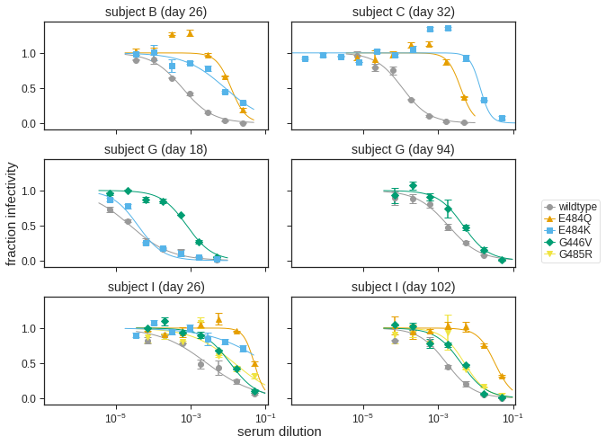
    


    Saving to results/mutant_neuts_results/main_fig_neut.svg


## Make plots with escape fractions and fold-change IC50.

Define general function for making violin plots of escape combined with fold-change IC50s for all sera:


```python
def day_labeller(old_label):
    new_label = f'day {old_label}'
    return(new_label)

def accessible_down(mutant):
    """Is mutation accessible in down conformation?"""
    if re.search('446|484|485|494', mutant):
        return 'yes'
    elif re.search('384|456', mutant):
        return 'no'
    else:
        raise ValueError(f"no up/down accessibility info for {mutant}")
        
show_legend_subjects = ['subject B']

def make_escape_and_ic50_plot(escape_metric,
                              output_svg,
                              escape_ymax,
                              ylabel,
                              ):
    svgs = {'main_fig_neuts': main_fig_neut_svg}
    for subject, subj_df in foldchange.query('sample_group == "serum"').groupby('display_PID'):
    
        ic50s = subj_df[['serum', 'mutant', 'fold_change']]
    
        subject_df = (subj_df[['serum', 'depletion_fc', 
                               'sample', 'Participant ID', 'Days Post-Symptom Onset',
                               'sample_name', 'display_PID', 'display_name',
                               ]]
                      .drop_duplicates()
                      .assign(day=lambda x: x['Days Post-Symptom Onset'].astype(int))
                      )
        if isinstance(escape_ymax, dict):
            violin_ymax = max([escape_ymax[display_name]
                               for display_name in subject_df['display_name'].unique()])
        else:
            violin_ymax = escape_ymax
    
        # get escape fracs for this subject dealing with fact that selections
        # have additional underscore giving concentration
        serum_to_selection = {}
        for serum in subject_df['serum'].tolist():
            selection = [s for s in escape_fracs['selection'].unique() if re.fullmatch(f"{serum}_\d+", s)]
            assert len(selection) == 1, f"for serum {serum} did not find 1 selection:\n{selection}"
            serum_to_selection[serum] = selection[0]
    
        # get data frame with escape fractions for just this subject, indicating which mutations
        # have fold change IC50
        df = (subject_df
              .assign(selection=lambda x: x['serum'].map(serum_to_selection))
              .merge(escape_fracs,
                     how='left', on='selection', validate='one_to_many')
              .assign(mutant=lambda x: x['wildtype'] + x['label_site'].astype(str) + x['mutation'],
                      site_label=lambda x: x['wildtype'] + x['label_site'].astype(str),
                      )
              .merge(ic50s, how='left', on=['serum', 'mutant'], validate='one_to_one')
              .assign(day=lambda x: pd.Categorical(x['Days Post-Symptom Onset'], 
                                                   natsort.natsorted(x['day'].unique()), 
                                                   ordered=True),
                     )
              )
        
        # data frame with mutations with fold changes for this subject
        df_foldchange = (
            df
            .query('fold_change.notnull()')
            .sort_values('site')
            .assign(mutant=lambda x: pd.Categorical(x['mutant'], x['mutant'].unique(), ordered=True),
                    accessible_down=lambda x: pd.Categorical(x['mutant'].map(accessible_down),
                                                             ['no', 'yes'],
                                                             ordered=True)
                    )
            )
           
        if 'mut' in escape_metric:
            ptlabel = 'mutant'
        else:
            assert 'site' in escape_metric
            ptlabel = 'site_label'
            df = df[['display_PID', 'day', escape_metric, ptlabel]].drop_duplicates()

        # make violin plot
        violin = (ggplot(df) +
                  aes('day', escape_metric) +
                  geom_violin(color='gray', fill='gray', alpha=0.5, adjust=5) +
                  geom_jitter(data=df_foldchange[['day', escape_metric, ptlabel, 'accessible_down']].drop_duplicates(),
                              mapping=aes(color='accessible_down', shape='accessible_down'),
                              size=2,
                              height=0,
                              width=0.1,
                              alpha=1,
                              random_state=1,
                              ) +
                  geom_text(data=df_foldchange[['day', escape_metric, ptlabel, 'accessible_down']].drop_duplicates(),
                            mapping=aes(label=ptlabel, color='accessible_down'),
                            size=8,
                            adjust_text={'expand_points': (1.05, 1.1),
                                         'expand_text': (1.05, 1.2),
                                         }
                            ) +
                  expand_limits(y=(0, violin_ymax)) +
                  theme_matplotlib() +
                  theme(figure_size=(1.2 * df['day'].nunique(), 2.0),
                        strip_background=element_blank(),
                        axis_text_x=element_blank(),
                        axis_ticks_major_x=element_blank(),
                        legend_position='none',
                        axis_title_x=element_blank(),
                        ) +
                  scale_y_continuous(name=ylabel, 
                                     expand=(0.075, 0)) +
                  facet_wrap('~ day', scales='free_x', labeller=day_labeller) +
                  scale_color_manual(values=[CBPALETTE[5], CBPALETTE[6]], drop=False) +
                  scale_shape_manual(values=['^', 'o'], drop=False)
                  )
        violin_svg = os.path.join(resultsdir, f"{subject.replace(' ', '_')}_violin_{escape_metric}.svg")
        violin.save(violin_svg, verbose=False)
    
        # make foldchange plot
        fc_df = (
            df_foldchange
            [['mutant', 'fold_change', 'day', 'depletion_fc']]
            .merge(ic50s[['mutant', 'fold_change', 'serum']]
                        .merge(df_foldchange[['serum', 'day', 'depletion_fc']].drop_duplicates()),
                   how='outer'
                   )
            .assign(accessible_down=lambda x: pd.Categorical(x['mutant'].map(accessible_down),
                                                             ['no', 'yes'],
                                                             ordered=True))
            )
        fc = (ggplot(fc_df) +
              aes('mutant', 'fold_change', color='accessible_down', shape='accessible_down') +
              geom_point(size=2) +
              theme_matplotlib() +
              theme(figure_size=(0.4 * len(df_foldchange), 1.8),
                    axis_text_x=element_text(angle=90, size=9),
                    strip_background=element_blank(),
                    axis_title_x=element_blank(),
                    ) +
              expand_limits(y=(0.5, 100)) +
              scale_y_log10(name='fold change IC50') +
              geom_hline(yintercept=1, color='gray', linetype='dashed', size=1, alpha=0.5) +
              geom_hline(aes(yintercept='depletion_fc'),
                         color=CBPALETTE[1],
                         alpha=0.7,
                         size=1,
                         linetype='dotted',
                         ) +
              facet_wrap('~ day', scales='free_x', labeller=day_labeller)  +
              scale_color_manual(values=[CBPALETTE[5], CBPALETTE[6]], drop=False,
                                 name='accessible\nin down RBD') +
              scale_shape_manual(values=['^', 'o'], drop=False,
                                 name='accessible\nin down RBD')
              )
        if subject not in show_legend_subjects:
            fc = (fc +
                  theme(legend_position='none',
                        legend_margin=0,
                        legend_box_margin=0,
                        )
                  )
        
        fc_svg = os.path.join(resultsdir, f"{subject.replace(' ', '_')}_fc_{escape_metric}.svg")
        fc.save(fc_svg, verbose=False)
    
        # assemble into a panel for this subject
        horiz_pad = 6
        title_pad = 5
        svg = os.path.join(resultsdir, f"{subject.replace(' ', '_')}.svg")
        width = svg_dim(violin_svg, 'width') + horiz_pad + svg_dim(fc_svg, 'width')
        svgutils.compose.Figure(
                width,
                max(svg_dim(violin_svg, 'height'), svg_dim(fc_svg, 'height')) + title_pad,
                svgutils.compose.Text(subject, width / 2 - horiz_pad, title_pad / 2, font='Arial', size=12),
                svgutils.compose.SVG(violin_svg).move(0, title_pad),
                svgutils.compose.SVG(fc_svg).move(svg_dim(violin_svg, 'width') + horiz_pad, title_pad)
                ).save(svg)
        svgs[subject] = svg
        
    # assemble into final SVG
    layout = [
        [('A', 'Mutations at 484 can have large effects on neutralization.'),
         'subject C',
         'subject B',
         ('B', 'Mutations at 446, 485, and 494 can also affect neutralization.'),
         'subject I',
         'subject E',
         'subject G',
         ],
        [('C', 'Some sera are unaffected by any single mutation.'),
         'subject J',
         'subject K',
         'subject A',
         ('D', 'Neutralization curves for key sera / mutations.'),
         'main_fig_neuts',
         ],
        ]
    scale_panels = collections.defaultdict(lambda: 1)
    scale_panels['main_fig_neuts'] = 0.73
    fig_svgs = []  # build up this list of `svgutils.compose.SVG` objects
    fig_height = fig_width = 0
    height_pad = 20
    width_pad = 17
    for icol, col_list in enumerate(layout):
        col_height = 0
        col_width = 0
        for panel in col_list:
            if panel in svgs:
                svg = svgs.pop(panel)
                width = svg_dim(svg, 'width') * scale_panels[panel]
                height = svg_dim(svg, 'height') * scale_panels[panel]
                fig_svgs.append(svgutils.compose.SVG(svg).scale(scale_panels[panel]).move(fig_width, col_height))
                col_height += height + height_pad
                col_width = max(col_width, width)
            else:
                (letter, title) = panel
                col_height += 18  # margin between vertical lettered panels
                fig_svgs.append(svgutils.compose.Text(letter, fig_width + 10, col_height,
                                                      font='Arial', size=16, weight='bold'))
                fig_svgs.append(svgutils.compose.Text(title, fig_width + 40, col_height,
                                                      font='Arial', size=14, weight='italic'))
                col_height += 16  # height of text
        fig_height = max(fig_height, col_height)
        fig_width += col_width + width_pad
    assert len(svgs) == 0, ValueError(f"still have some SVGs: {svgs}")
    svgutils.compose.Figure(fig_width, fig_height, *fig_svgs).save(output_svg)
```

Make the mutation-level plot:


```python
mut_fig_svg = os.path.join(resultsdir, 'validation_fig_mut.svg')
make_escape_and_ic50_plot(escape_metric='mut_escape_frac_epistasis_model',
                          output_svg=mut_fig_svg,
                          escape_ymax=0.4,
                          ylabel='escape fraction',
                          )
display(SVG(mut_fig_svg))
```


    

    


Make the site-level plot (total escape at site):


```python
sitetotal_fig_svg = os.path.join(resultsdir, 'validation_fig_sitetotal.svg')
make_escape_and_ic50_plot(escape_metric='site_total_escape_frac_epistasis_model',
                          output_svg=sitetotal_fig_svg,
                          escape_ymax=(pd.read_csv(config['ylim_file'])
                                       .set_index('condition')['maximum'].to_dict()
                                       ),
                          ylabel='total escape at site',
                          )
display(SVG(sitetotal_fig_svg))
```


    

    


```python
!jupyter nbconvert mutant_neuts.ipynb --to markdown
```
