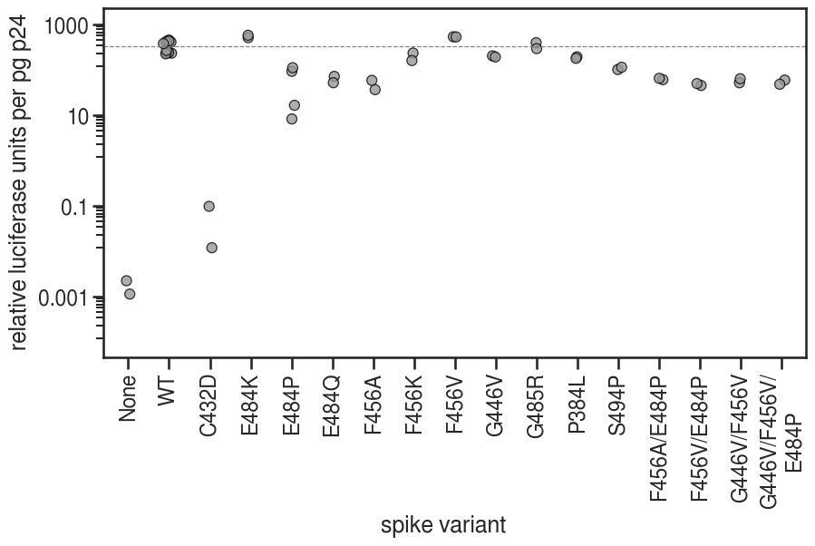
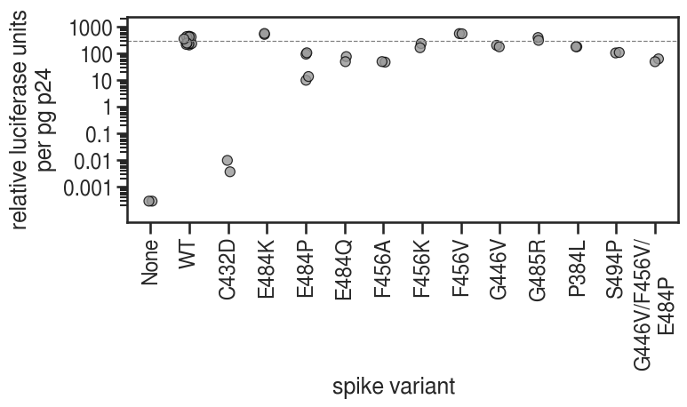
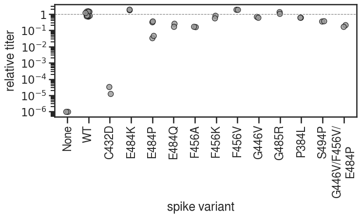

# Titer analysis for mutant viruses

RLU titering and p24 ELISAs for all viruses made for this study that grew well in initial titering. 

This includes the double mutant viruses that were not actually run in neuts. 

Most of these viruses were grown by Andrea Loes. The December viruses were grown by Amin Addetia and the WT virus for neuts (September) was grown by Kate Crawford.

Initial titering was done by whoever grew the virus. Kate Crawford did final titering and p24 ELISAs.

Each virus was titered or run in the p24 ELISA in duplicate. Values were averaged prior to plotting and a single point is shown for each virus. 

Raw data is in the January 22 and 25, 2021 excel files in the `./data` subdirectory. Those excel files include titer and p24 calculations.


```python
import os
import warnings
import math

from IPython.display import display, HTML
from IPython.display import display, SVG
from matplotlib.backends.backend_pdf import PdfPages
import matplotlib as mpl
import matplotlib.pyplot as plt

import pandas as pd
import numpy as np
from plotnine import *

```


```python
warnings.simplefilter('ignore')
```


```python
CBP = ('#999999', '#E69F00', '#56B4E9', '#009E73', '#F0E442', '#0072B2', '#D55E00', '#CC79A7')
plt.style.use('seaborn-white')
theme_set(theme_seaborn(style='white', context='talk', font='FreeSans', font_scale=1))
```


```python
resultsdir='results/p24_titering/'
os.makedirs(resultsdir, exist_ok=True)
```

## Read in csv of cleaned titer and p24 data


```python
df = pd.read_csv('./data/210125_p24_titers_calc.csv').set_index('VirusNumber', drop=True)
display(df.head())
```


<div>
<style scoped>
    .dataframe tbody tr th:only-of-type {
        vertical-align: middle;
    }

    .dataframe tbody tr th {
        vertical-align: top;
    }

    .dataframe thead th {
        text-align: right;
    }
</style>
<table border="1" class="dataframe">
  <thead>
    <tr style="text-align: right;">
      <th></th>
      <th>Sample</th>
      <th>VirusDate</th>
      <th>Used in neuts</th>
      <th>p24 pg/mL</th>
      <th>Avg RLU/mL</th>
      <th>Median RLU/mL</th>
      <th>TechRep</th>
      <th>Neut Dilution</th>
    </tr>
    <tr>
      <th>VirusNumber</th>
      <th></th>
      <th></th>
      <th></th>
      <th></th>
      <th></th>
      <th></th>
      <th></th>
      <th></th>
    </tr>
  </thead>
  <tbody>
    <tr>
      <th>1</th>
      <td>WT</td>
      <td>20-10-30</td>
      <td>N</td>
      <td>8.889640e+05</td>
      <td>401000000.0</td>
      <td>384134400</td>
      <td>1</td>
      <td>NaN</td>
    </tr>
    <tr>
      <th>2</th>
      <td>P384L</td>
      <td>20-10-30</td>
      <td>Y</td>
      <td>1.085360e+06</td>
      <td>209000000.0</td>
      <td>189574400</td>
      <td>1</td>
      <td>20.0</td>
    </tr>
    <tr>
      <th>3</th>
      <td>F456K</td>
      <td>20-10-30</td>
      <td>Y</td>
      <td>1.302027e+06</td>
      <td>304000000.0</td>
      <td>299872000</td>
      <td>1</td>
      <td>10.0</td>
    </tr>
    <tr>
      <th>4</th>
      <td>E484Q</td>
      <td>20-10-30</td>
      <td>Y</td>
      <td>1.022748e+06</td>
      <td>72900000.0</td>
      <td>76072000</td>
      <td>1</td>
      <td>20.0</td>
    </tr>
    <tr>
      <th>5</th>
      <td>G485R</td>
      <td>20-10-30</td>
      <td>Y</td>
      <td>7.605856e+05</td>
      <td>299541114.3</td>
      <td>294278200</td>
      <td>1</td>
      <td>32.0</td>
    </tr>
  </tbody>
</table>
</div>


## Add columns for avg and median RLUs normalized by p24


```python
# add columns for Avg and median RLUs normalized by p24
df['Avg RLU/pg p24'] = df['Avg RLU/mL'] / df['p24 pg/mL']
df['Med RLU/pg p24'] = df['Median RLU/mL'] / df['p24 pg/mL']
display(df)
```


<div>
<style scoped>
    .dataframe tbody tr th:only-of-type {
        vertical-align: middle;
    }

    .dataframe tbody tr th {
        vertical-align: top;
    }

    .dataframe thead th {
        text-align: right;
    }
</style>
<table border="1" class="dataframe">
  <thead>
    <tr style="text-align: right;">
      <th></th>
      <th>Sample</th>
      <th>VirusDate</th>
      <th>Used in neuts</th>
      <th>p24 pg/mL</th>
      <th>Avg RLU/mL</th>
      <th>Median RLU/mL</th>
      <th>TechRep</th>
      <th>Neut Dilution</th>
      <th>Avg RLU/pg p24</th>
      <th>Med RLU/pg p24</th>
    </tr>
    <tr>
      <th>VirusNumber</th>
      <th></th>
      <th></th>
      <th></th>
      <th></th>
      <th></th>
      <th></th>
      <th></th>
      <th></th>
      <th></th>
      <th></th>
    </tr>
  </thead>
  <tbody>
    <tr>
      <th>1</th>
      <td>WT</td>
      <td>20-10-30</td>
      <td>N</td>
      <td>8.889640e+05</td>
      <td>401000000.0</td>
      <td>384134400</td>
      <td>1</td>
      <td>NaN</td>
      <td>451.086900</td>
      <td>432.114703</td>
    </tr>
    <tr>
      <th>2</th>
      <td>P384L</td>
      <td>20-10-30</td>
      <td>Y</td>
      <td>1.085360e+06</td>
      <td>209000000.0</td>
      <td>189574400</td>
      <td>1</td>
      <td>20.0</td>
      <td>192.562766</td>
      <td>174.664932</td>
    </tr>
    <tr>
      <th>3</th>
      <td>F456K</td>
      <td>20-10-30</td>
      <td>Y</td>
      <td>1.302027e+06</td>
      <td>304000000.0</td>
      <td>299872000</td>
      <td>1</td>
      <td>10.0</td>
      <td>233.482106</td>
      <td>230.311665</td>
    </tr>
    <tr>
      <th>4</th>
      <td>E484Q</td>
      <td>20-10-30</td>
      <td>Y</td>
      <td>1.022748e+06</td>
      <td>72900000.0</td>
      <td>76072000</td>
      <td>1</td>
      <td>20.0</td>
      <td>71.278574</td>
      <td>74.380023</td>
    </tr>
    <tr>
      <th>5</th>
      <td>G485R</td>
      <td>20-10-30</td>
      <td>Y</td>
      <td>7.605856e+05</td>
      <td>299541114.3</td>
      <td>294278200</td>
      <td>1</td>
      <td>32.0</td>
      <td>393.829574</td>
      <td>386.910018</td>
    </tr>
    <tr>
      <th>6</th>
      <td>S494P</td>
      <td>20-10-30</td>
      <td>Y</td>
      <td>1.051577e+06</td>
      <td>106000000.0</td>
      <td>107374200</td>
      <td>1</td>
      <td>50.0</td>
      <td>100.801028</td>
      <td>102.107827</td>
    </tr>
    <tr>
      <th>7</th>
      <td>G446V/F456V</td>
      <td>20-10-30</td>
      <td>N</td>
      <td>7.686937e+05</td>
      <td>39600000.0</td>
      <td>43172400</td>
      <td>1</td>
      <td>NaN</td>
      <td>51.515970</td>
      <td>56.163335</td>
    </tr>
    <tr>
      <th>8</th>
      <td>G446V/F456V/E484P</td>
      <td>20-10-30</td>
      <td>Y</td>
      <td>8.141892e+05</td>
      <td>48100000.0</td>
      <td>49775200</td>
      <td>1</td>
      <td>6.0</td>
      <td>59.077178</td>
      <td>61.134685</td>
    </tr>
    <tr>
      <th>9</th>
      <td>WT</td>
      <td>20-10-16</td>
      <td>N</td>
      <td>1.787613e+06</td>
      <td>416523628.6</td>
      <td>425927200</td>
      <td>1</td>
      <td>NaN</td>
      <td>233.005527</td>
      <td>238.265934</td>
    </tr>
    <tr>
      <th>10</th>
      <td>F456V</td>
      <td>20-10-16</td>
      <td>Y</td>
      <td>8.975225e+05</td>
      <td>478000000.0</td>
      <td>486155200</td>
      <td>1</td>
      <td>40.0</td>
      <td>532.577197</td>
      <td>541.663543</td>
    </tr>
    <tr>
      <th>11</th>
      <td>E484P</td>
      <td>20-10-16</td>
      <td>Y</td>
      <td>4.173423e+05</td>
      <td>38400000.0</td>
      <td>38344000</td>
      <td>1</td>
      <td>6.0</td>
      <td>92.010792</td>
      <td>91.876610</td>
    </tr>
    <tr>
      <th>12</th>
      <td>WT</td>
      <td>20-11-9</td>
      <td>N</td>
      <td>9.385135e+05</td>
      <td>383000000.0</td>
      <td>380955200</td>
      <td>1</td>
      <td>NaN</td>
      <td>408.092166</td>
      <td>405.913402</td>
    </tr>
    <tr>
      <th>13</th>
      <td>G446V</td>
      <td>20-11-9</td>
      <td>Y</td>
      <td>8.425675e+05</td>
      <td>170000000.0</td>
      <td>166024000</td>
      <td>1</td>
      <td>25.0</td>
      <td>201.764245</td>
      <td>197.045335</td>
    </tr>
    <tr>
      <th>14</th>
      <td>E484P</td>
      <td>20-11-9</td>
      <td>Y</td>
      <td>5.024774e+05</td>
      <td>4120000.0</td>
      <td>4851200</td>
      <td>1</td>
      <td>6.0</td>
      <td>8.199373</td>
      <td>9.654563</td>
    </tr>
    <tr>
      <th>15</th>
      <td>F456V/E484P</td>
      <td>20-11-9</td>
      <td>N</td>
      <td>6.569820e+05</td>
      <td>29500000.0</td>
      <td>29219200</td>
      <td>1</td>
      <td>NaN</td>
      <td>44.902299</td>
      <td>44.474890</td>
    </tr>
    <tr>
      <th>16</th>
      <td>WT</td>
      <td>20-12-5</td>
      <td>N</td>
      <td>7.506757e+05</td>
      <td>181000000.0</td>
      <td>169088800</td>
      <td>1</td>
      <td>NaN</td>
      <td>241.116108</td>
      <td>225.248803</td>
    </tr>
    <tr>
      <th>17</th>
      <td>C432D</td>
      <td>20-12-5</td>
      <td>N</td>
      <td>3.362613e+05</td>
      <td>32600.0</td>
      <td>3200</td>
      <td>1</td>
      <td>NaN</td>
      <td>0.096948</td>
      <td>0.009516</td>
    </tr>
    <tr>
      <th>18</th>
      <td>E484K</td>
      <td>20-12-5</td>
      <td>Y</td>
      <td>6.479730e+05</td>
      <td>329000000.0</td>
      <td>327698000</td>
      <td>1</td>
      <td>50.0</td>
      <td>507.737213</td>
      <td>505.727870</td>
    </tr>
    <tr>
      <th>19</th>
      <td>WT</td>
      <td>20-11-13</td>
      <td>N</td>
      <td>1.681306e+06</td>
      <td>646000000.0</td>
      <td>601462400</td>
      <td>1</td>
      <td>NaN</td>
      <td>384.225052</td>
      <td>357.735174</td>
    </tr>
    <tr>
      <th>20</th>
      <td>F456A</td>
      <td>20-11-13</td>
      <td>Y</td>
      <td>9.060810e+05</td>
      <td>32900000.0</td>
      <td>41859200</td>
      <td>1</td>
      <td>6.0</td>
      <td>36.310218</td>
      <td>46.198075</td>
    </tr>
    <tr>
      <th>21</th>
      <td>F456A/E484P</td>
      <td>20-11-13</td>
      <td>N</td>
      <td>1.334459e+06</td>
      <td>80400000.0</td>
      <td>79824000</td>
      <td>1</td>
      <td>NaN</td>
      <td>60.249113</td>
      <td>59.817477</td>
    </tr>
    <tr>
      <th>22</th>
      <td>WT</td>
      <td>20-09-20</td>
      <td>Y</td>
      <td>9.632883e+05</td>
      <td>229000000.0</td>
      <td>195571600</td>
      <td>1</td>
      <td>50.0</td>
      <td>237.727383</td>
      <td>203.024998</td>
    </tr>
    <tr>
      <th>23</th>
      <td>NoVEP</td>
      <td>20-11-9</td>
      <td>N</td>
      <td>2.837162e+06</td>
      <td>3200.0</td>
      <td>800</td>
      <td>1</td>
      <td>NaN</td>
      <td>0.001128</td>
      <td>0.000282</td>
    </tr>
    <tr>
      <th>1</th>
      <td>WT</td>
      <td>20-10-30</td>
      <td>N</td>
      <td>8.889640e+05</td>
      <td>372000000.0</td>
      <td>373344200</td>
      <td>2</td>
      <td>NaN</td>
      <td>418.464656</td>
      <td>419.976753</td>
    </tr>
    <tr>
      <th>2</th>
      <td>P384L</td>
      <td>20-10-30</td>
      <td>Y</td>
      <td>1.085360e+06</td>
      <td>193000000.0</td>
      <td>189942400</td>
      <td>2</td>
      <td>20.0</td>
      <td>177.821119</td>
      <td>175.003990</td>
    </tr>
    <tr>
      <th>3</th>
      <td>F456K</td>
      <td>20-10-30</td>
      <td>Y</td>
      <td>1.302027e+06</td>
      <td>207000000.0</td>
      <td>208743600</td>
      <td>2</td>
      <td>10.0</td>
      <td>158.982881</td>
      <td>160.322024</td>
    </tr>
    <tr>
      <th>4</th>
      <td>E484Q</td>
      <td>20-10-30</td>
      <td>Y</td>
      <td>1.022748e+06</td>
      <td>52900000.0</td>
      <td>49203200</td>
      <td>2</td>
      <td>20.0</td>
      <td>51.723410</td>
      <td>48.108833</td>
    </tr>
    <tr>
      <th>5</th>
      <td>G485R</td>
      <td>20-10-30</td>
      <td>Y</td>
      <td>7.605856e+05</td>
      <td>222040271.4</td>
      <td>230166400</td>
      <td>2</td>
      <td>32.0</td>
      <td>291.933298</td>
      <td>302.617340</td>
    </tr>
    <tr>
      <th>6</th>
      <td>S494P</td>
      <td>20-10-30</td>
      <td>Y</td>
      <td>1.051577e+06</td>
      <td>119000000.0</td>
      <td>111993000</td>
      <td>2</td>
      <td>50.0</td>
      <td>113.163418</td>
      <td>106.500090</td>
    </tr>
    <tr>
      <th>7</th>
      <td>G446V/F456V</td>
      <td>20-10-30</td>
      <td>N</td>
      <td>7.686937e+05</td>
      <td>48600000.0</td>
      <td>42281200</td>
      <td>2</td>
      <td>NaN</td>
      <td>63.224145</td>
      <td>55.003965</td>
    </tr>
    <tr>
      <th>8</th>
      <td>G446V/F456V/E484P</td>
      <td>20-10-30</td>
      <td>Y</td>
      <td>8.141892e+05</td>
      <td>38900000.0</td>
      <td>39028000</td>
      <td>2</td>
      <td>6.0</td>
      <td>47.777593</td>
      <td>47.934804</td>
    </tr>
    <tr>
      <th>9</th>
      <td>WT</td>
      <td>20-10-16</td>
      <td>N</td>
      <td>1.787613e+06</td>
      <td>400264957.1</td>
      <td>382692000</td>
      <td>2</td>
      <td>NaN</td>
      <td>223.910340</td>
      <td>214.079934</td>
    </tr>
    <tr>
      <th>10</th>
      <td>F456V</td>
      <td>20-10-16</td>
      <td>Y</td>
      <td>8.975225e+05</td>
      <td>475000000.0</td>
      <td>479437700</td>
      <td>2</td>
      <td>40.0</td>
      <td>529.234662</td>
      <td>534.179051</td>
    </tr>
    <tr>
      <th>11</th>
      <td>E484P</td>
      <td>20-10-16</td>
      <td>Y</td>
      <td>4.173423e+05</td>
      <td>46200000.0</td>
      <td>43204200</td>
      <td>2</td>
      <td>6.0</td>
      <td>110.700484</td>
      <td>103.522205</td>
    </tr>
    <tr>
      <th>12</th>
      <td>WT</td>
      <td>20-11-9</td>
      <td>N</td>
      <td>9.385135e+05</td>
      <td>400000000.0</td>
      <td>383332800</td>
      <td>2</td>
      <td>NaN</td>
      <td>426.205918</td>
      <td>408.446770</td>
    </tr>
    <tr>
      <th>13</th>
      <td>G446V</td>
      <td>20-11-9</td>
      <td>Y</td>
      <td>8.425675e+05</td>
      <td>161000000.0</td>
      <td>145967100</td>
      <td>2</td>
      <td>25.0</td>
      <td>191.082608</td>
      <td>173.240834</td>
    </tr>
    <tr>
      <th>14</th>
      <td>E484P</td>
      <td>20-11-9</td>
      <td>Y</td>
      <td>5.024774e+05</td>
      <td>8240000.0</td>
      <td>6706600</td>
      <td>2</td>
      <td>6.0</td>
      <td>16.398746</td>
      <td>13.347067</td>
    </tr>
    <tr>
      <th>15</th>
      <td>F456V/E484P</td>
      <td>20-11-9</td>
      <td>N</td>
      <td>6.569820e+05</td>
      <td>32500000.0</td>
      <td>31820800</td>
      <td>2</td>
      <td>NaN</td>
      <td>49.468635</td>
      <td>48.434816</td>
    </tr>
    <tr>
      <th>16</th>
      <td>WT</td>
      <td>20-12-5</td>
      <td>N</td>
      <td>7.506757e+05</td>
      <td>200000000.0</td>
      <td>179872000</td>
      <td>2</td>
      <td>NaN</td>
      <td>266.426639</td>
      <td>239.613462</td>
    </tr>
    <tr>
      <th>17</th>
      <td>C432D</td>
      <td>20-12-5</td>
      <td>N</td>
      <td>3.362613e+05</td>
      <td>3990.0</td>
      <td>1200</td>
      <td>2</td>
      <td>NaN</td>
      <td>0.011866</td>
      <td>0.003569</td>
    </tr>
    <tr>
      <th>18</th>
      <td>E484K</td>
      <td>20-12-5</td>
      <td>Y</td>
      <td>6.479730e+05</td>
      <td>372000000.0</td>
      <td>355718400</td>
      <td>2</td>
      <td>50.0</td>
      <td>574.098003</td>
      <td>548.971030</td>
    </tr>
    <tr>
      <th>19</th>
      <td>WT</td>
      <td>20-11-13</td>
      <td>N</td>
      <td>1.681306e+06</td>
      <td>634000000.0</td>
      <td>574771200</td>
      <td>2</td>
      <td>NaN</td>
      <td>377.087745</td>
      <td>341.859898</td>
    </tr>
    <tr>
      <th>20</th>
      <td>F456A</td>
      <td>20-11-13</td>
      <td>Y</td>
      <td>9.060810e+05</td>
      <td>52700000.0</td>
      <td>43949400</td>
      <td>2</td>
      <td>6.0</td>
      <td>58.162568</td>
      <td>48.504933</td>
    </tr>
    <tr>
      <th>21</th>
      <td>F456A/E484P</td>
      <td>20-11-13</td>
      <td>N</td>
      <td>1.334459e+06</td>
      <td>86300000.0</td>
      <td>84700100</td>
      <td>2</td>
      <td>NaN</td>
      <td>64.670379</td>
      <td>63.471466</td>
    </tr>
    <tr>
      <th>22</th>
      <td>WT</td>
      <td>20-09-20</td>
      <td>Y</td>
      <td>9.632883e+05</td>
      <td>223000000.0</td>
      <td>222003200</td>
      <td>2</td>
      <td>50.0</td>
      <td>231.498718</td>
      <td>230.463929</td>
    </tr>
    <tr>
      <th>23</th>
      <td>NoVEP</td>
      <td>20-11-9</td>
      <td>N</td>
      <td>2.837162e+06</td>
      <td>6300.0</td>
      <td>800</td>
      <td>2</td>
      <td>NaN</td>
      <td>0.002221</td>
      <td>0.000282</td>
    </tr>
  </tbody>
</table>
</div>


```python
# extract median WT median RLU/pg p24
medWT_p24norm = np.median(df[df['Sample']=='WT']['Med RLU/pg p24'])
medWT_RLUs = np.median(df[df['Sample']=='WT']['Median RLU/mL'])
df['Relative to WT'] = df['Med RLU/pg p24'] / medWT_p24norm
display(df)
```


<div>
<style scoped>
    .dataframe tbody tr th:only-of-type {
        vertical-align: middle;
    }

    .dataframe tbody tr th {
        vertical-align: top;
    }

    .dataframe thead th {
        text-align: right;
    }
</style>
<table border="1" class="dataframe">
  <thead>
    <tr style="text-align: right;">
      <th></th>
      <th>Sample</th>
      <th>VirusDate</th>
      <th>Used in neuts</th>
      <th>p24 pg/mL</th>
      <th>Avg RLU/mL</th>
      <th>Median RLU/mL</th>
      <th>TechRep</th>
      <th>Neut Dilution</th>
      <th>Avg RLU/pg p24</th>
      <th>Med RLU/pg p24</th>
      <th>Relative to WT</th>
    </tr>
    <tr>
      <th>VirusNumber</th>
      <th></th>
      <th></th>
      <th></th>
      <th></th>
      <th></th>
      <th></th>
      <th></th>
      <th></th>
      <th></th>
      <th></th>
      <th></th>
    </tr>
  </thead>
  <tbody>
    <tr>
      <th>1</th>
      <td>WT</td>
      <td>20-10-30</td>
      <td>N</td>
      <td>8.889640e+05</td>
      <td>401000000.0</td>
      <td>384134400</td>
      <td>1</td>
      <td>NaN</td>
      <td>451.086900</td>
      <td>432.114703</td>
      <td>1.486275e+00</td>
    </tr>
    <tr>
      <th>2</th>
      <td>P384L</td>
      <td>20-10-30</td>
      <td>Y</td>
      <td>1.085360e+06</td>
      <td>209000000.0</td>
      <td>189574400</td>
      <td>1</td>
      <td>20.0</td>
      <td>192.562766</td>
      <td>174.664932</td>
      <td>6.007668e-01</td>
    </tr>
    <tr>
      <th>3</th>
      <td>F456K</td>
      <td>20-10-30</td>
      <td>Y</td>
      <td>1.302027e+06</td>
      <td>304000000.0</td>
      <td>299872000</td>
      <td>1</td>
      <td>10.0</td>
      <td>233.482106</td>
      <td>230.311665</td>
      <td>7.921658e-01</td>
    </tr>
    <tr>
      <th>4</th>
      <td>E484Q</td>
      <td>20-10-30</td>
      <td>Y</td>
      <td>1.022748e+06</td>
      <td>72900000.0</td>
      <td>76072000</td>
      <td>1</td>
      <td>20.0</td>
      <td>71.278574</td>
      <td>74.380023</td>
      <td>2.558330e-01</td>
    </tr>
    <tr>
      <th>5</th>
      <td>G485R</td>
      <td>20-10-30</td>
      <td>Y</td>
      <td>7.605856e+05</td>
      <td>299541114.3</td>
      <td>294278200</td>
      <td>1</td>
      <td>32.0</td>
      <td>393.829574</td>
      <td>386.910018</td>
      <td>1.330792e+00</td>
    </tr>
    <tr>
      <th>6</th>
      <td>S494P</td>
      <td>20-10-30</td>
      <td>Y</td>
      <td>1.051577e+06</td>
      <td>106000000.0</td>
      <td>107374200</td>
      <td>1</td>
      <td>50.0</td>
      <td>100.801028</td>
      <td>102.107827</td>
      <td>3.512038e-01</td>
    </tr>
    <tr>
      <th>7</th>
      <td>G446V/F456V</td>
      <td>20-10-30</td>
      <td>N</td>
      <td>7.686937e+05</td>
      <td>39600000.0</td>
      <td>43172400</td>
      <td>1</td>
      <td>NaN</td>
      <td>51.515970</td>
      <td>56.163335</td>
      <td>1.931760e-01</td>
    </tr>
    <tr>
      <th>8</th>
      <td>G446V/F456V/E484P</td>
      <td>20-10-30</td>
      <td>Y</td>
      <td>8.141892e+05</td>
      <td>48100000.0</td>
      <td>49775200</td>
      <td>1</td>
      <td>6.0</td>
      <td>59.077178</td>
      <td>61.134685</td>
      <td>2.102751e-01</td>
    </tr>
    <tr>
      <th>9</th>
      <td>WT</td>
      <td>20-10-16</td>
      <td>N</td>
      <td>1.787613e+06</td>
      <td>416523628.6</td>
      <td>425927200</td>
      <td>1</td>
      <td>NaN</td>
      <td>233.005527</td>
      <td>238.265934</td>
      <td>8.195249e-01</td>
    </tr>
    <tr>
      <th>10</th>
      <td>F456V</td>
      <td>20-10-16</td>
      <td>Y</td>
      <td>8.975225e+05</td>
      <td>478000000.0</td>
      <td>486155200</td>
      <td>1</td>
      <td>40.0</td>
      <td>532.577197</td>
      <td>541.663543</td>
      <td>1.863073e+00</td>
    </tr>
    <tr>
      <th>11</th>
      <td>E484P</td>
      <td>20-10-16</td>
      <td>Y</td>
      <td>4.173423e+05</td>
      <td>38400000.0</td>
      <td>38344000</td>
      <td>1</td>
      <td>6.0</td>
      <td>92.010792</td>
      <td>91.876610</td>
      <td>3.160131e-01</td>
    </tr>
    <tr>
      <th>12</th>
      <td>WT</td>
      <td>20-11-9</td>
      <td>N</td>
      <td>9.385135e+05</td>
      <td>383000000.0</td>
      <td>380955200</td>
      <td>1</td>
      <td>NaN</td>
      <td>408.092166</td>
      <td>405.913402</td>
      <td>1.396155e+00</td>
    </tr>
    <tr>
      <th>13</th>
      <td>G446V</td>
      <td>20-11-9</td>
      <td>Y</td>
      <td>8.425675e+05</td>
      <td>170000000.0</td>
      <td>166024000</td>
      <td>1</td>
      <td>25.0</td>
      <td>201.764245</td>
      <td>197.045335</td>
      <td>6.777450e-01</td>
    </tr>
    <tr>
      <th>14</th>
      <td>E484P</td>
      <td>20-11-9</td>
      <td>Y</td>
      <td>5.024774e+05</td>
      <td>4120000.0</td>
      <td>4851200</td>
      <td>1</td>
      <td>6.0</td>
      <td>8.199373</td>
      <td>9.654563</td>
      <td>3.320724e-02</td>
    </tr>
    <tr>
      <th>15</th>
      <td>F456V/E484P</td>
      <td>20-11-9</td>
      <td>N</td>
      <td>6.569820e+05</td>
      <td>29500000.0</td>
      <td>29219200</td>
      <td>1</td>
      <td>NaN</td>
      <td>44.902299</td>
      <td>44.474890</td>
      <td>1.529731e-01</td>
    </tr>
    <tr>
      <th>16</th>
      <td>WT</td>
      <td>20-12-5</td>
      <td>N</td>
      <td>7.506757e+05</td>
      <td>181000000.0</td>
      <td>169088800</td>
      <td>1</td>
      <td>NaN</td>
      <td>241.116108</td>
      <td>225.248803</td>
      <td>7.747519e-01</td>
    </tr>
    <tr>
      <th>17</th>
      <td>C432D</td>
      <td>20-12-5</td>
      <td>N</td>
      <td>3.362613e+05</td>
      <td>32600.0</td>
      <td>3200</td>
      <td>1</td>
      <td>NaN</td>
      <td>0.096948</td>
      <td>0.009516</td>
      <td>3.273206e-05</td>
    </tr>
    <tr>
      <th>18</th>
      <td>E484K</td>
      <td>20-12-5</td>
      <td>Y</td>
      <td>6.479730e+05</td>
      <td>329000000.0</td>
      <td>327698000</td>
      <td>1</td>
      <td>50.0</td>
      <td>507.737213</td>
      <td>505.727870</td>
      <td>1.739470e+00</td>
    </tr>
    <tr>
      <th>19</th>
      <td>WT</td>
      <td>20-11-13</td>
      <td>N</td>
      <td>1.681306e+06</td>
      <td>646000000.0</td>
      <td>601462400</td>
      <td>1</td>
      <td>NaN</td>
      <td>384.225052</td>
      <td>357.735174</td>
      <td>1.230444e+00</td>
    </tr>
    <tr>
      <th>20</th>
      <td>F456A</td>
      <td>20-11-13</td>
      <td>Y</td>
      <td>9.060810e+05</td>
      <td>32900000.0</td>
      <td>41859200</td>
      <td>1</td>
      <td>6.0</td>
      <td>36.310218</td>
      <td>46.198075</td>
      <td>1.589001e-01</td>
    </tr>
    <tr>
      <th>21</th>
      <td>F456A/E484P</td>
      <td>20-11-13</td>
      <td>N</td>
      <td>1.334459e+06</td>
      <td>80400000.0</td>
      <td>79824000</td>
      <td>1</td>
      <td>NaN</td>
      <td>60.249113</td>
      <td>59.817477</td>
      <td>2.057445e-01</td>
    </tr>
    <tr>
      <th>22</th>
      <td>WT</td>
      <td>20-09-20</td>
      <td>Y</td>
      <td>9.632883e+05</td>
      <td>229000000.0</td>
      <td>195571600</td>
      <td>1</td>
      <td>50.0</td>
      <td>237.727383</td>
      <td>203.024998</td>
      <td>6.983123e-01</td>
    </tr>
    <tr>
      <th>23</th>
      <td>NoVEP</td>
      <td>20-11-9</td>
      <td>N</td>
      <td>2.837162e+06</td>
      <td>3200.0</td>
      <td>800</td>
      <td>1</td>
      <td>NaN</td>
      <td>0.001128</td>
      <td>0.000282</td>
      <td>9.698532e-07</td>
    </tr>
    <tr>
      <th>1</th>
      <td>WT</td>
      <td>20-10-30</td>
      <td>N</td>
      <td>8.889640e+05</td>
      <td>372000000.0</td>
      <td>373344200</td>
      <td>2</td>
      <td>NaN</td>
      <td>418.464656</td>
      <td>419.976753</td>
      <td>1.444526e+00</td>
    </tr>
    <tr>
      <th>2</th>
      <td>P384L</td>
      <td>20-10-30</td>
      <td>Y</td>
      <td>1.085360e+06</td>
      <td>193000000.0</td>
      <td>189942400</td>
      <td>2</td>
      <td>20.0</td>
      <td>177.821119</td>
      <td>175.003990</td>
      <td>6.019330e-01</td>
    </tr>
    <tr>
      <th>3</th>
      <td>F456K</td>
      <td>20-10-30</td>
      <td>Y</td>
      <td>1.302027e+06</td>
      <td>207000000.0</td>
      <td>208743600</td>
      <td>2</td>
      <td>10.0</td>
      <td>158.982881</td>
      <td>160.322024</td>
      <td>5.514338e-01</td>
    </tr>
    <tr>
      <th>4</th>
      <td>E484Q</td>
      <td>20-10-30</td>
      <td>Y</td>
      <td>1.022748e+06</td>
      <td>52900000.0</td>
      <td>49203200</td>
      <td>2</td>
      <td>20.0</td>
      <td>51.723410</td>
      <td>48.108833</td>
      <td>1.654722e-01</td>
    </tr>
    <tr>
      <th>5</th>
      <td>G485R</td>
      <td>20-10-30</td>
      <td>Y</td>
      <td>7.605856e+05</td>
      <td>222040271.4</td>
      <td>230166400</td>
      <td>2</td>
      <td>32.0</td>
      <td>291.933298</td>
      <td>302.617340</td>
      <td>1.040864e+00</td>
    </tr>
    <tr>
      <th>6</th>
      <td>S494P</td>
      <td>20-10-30</td>
      <td>Y</td>
      <td>1.051577e+06</td>
      <td>119000000.0</td>
      <td>111993000</td>
      <td>2</td>
      <td>50.0</td>
      <td>113.163418</td>
      <td>106.500090</td>
      <td>3.663112e-01</td>
    </tr>
    <tr>
      <th>7</th>
      <td>G446V/F456V</td>
      <td>20-10-30</td>
      <td>N</td>
      <td>7.686937e+05</td>
      <td>48600000.0</td>
      <td>42281200</td>
      <td>2</td>
      <td>NaN</td>
      <td>63.224145</td>
      <td>55.003965</td>
      <td>1.891883e-01</td>
    </tr>
    <tr>
      <th>8</th>
      <td>G446V/F456V/E484P</td>
      <td>20-10-30</td>
      <td>Y</td>
      <td>8.141892e+05</td>
      <td>38900000.0</td>
      <td>39028000</td>
      <td>2</td>
      <td>6.0</td>
      <td>47.777593</td>
      <td>47.934804</td>
      <td>1.648736e-01</td>
    </tr>
    <tr>
      <th>9</th>
      <td>WT</td>
      <td>20-10-16</td>
      <td>N</td>
      <td>1.787613e+06</td>
      <td>400264957.1</td>
      <td>382692000</td>
      <td>2</td>
      <td>NaN</td>
      <td>223.910340</td>
      <td>214.079934</td>
      <td>7.363362e-01</td>
    </tr>
    <tr>
      <th>10</th>
      <td>F456V</td>
      <td>20-10-16</td>
      <td>Y</td>
      <td>8.975225e+05</td>
      <td>475000000.0</td>
      <td>479437700</td>
      <td>2</td>
      <td>40.0</td>
      <td>529.234662</td>
      <td>534.179051</td>
      <td>1.837329e+00</td>
    </tr>
    <tr>
      <th>11</th>
      <td>E484P</td>
      <td>20-10-16</td>
      <td>Y</td>
      <td>4.173423e+05</td>
      <td>46200000.0</td>
      <td>43204200</td>
      <td>2</td>
      <td>6.0</td>
      <td>110.700484</td>
      <td>103.522205</td>
      <td>3.560686e-01</td>
    </tr>
    <tr>
      <th>12</th>
      <td>WT</td>
      <td>20-11-9</td>
      <td>N</td>
      <td>9.385135e+05</td>
      <td>400000000.0</td>
      <td>383332800</td>
      <td>2</td>
      <td>NaN</td>
      <td>426.205918</td>
      <td>408.446770</td>
      <td>1.404868e+00</td>
    </tr>
    <tr>
      <th>13</th>
      <td>G446V</td>
      <td>20-11-9</td>
      <td>Y</td>
      <td>8.425675e+05</td>
      <td>161000000.0</td>
      <td>145967100</td>
      <td>2</td>
      <td>25.0</td>
      <td>191.082608</td>
      <td>173.240834</td>
      <td>5.958685e-01</td>
    </tr>
    <tr>
      <th>14</th>
      <td>E484P</td>
      <td>20-11-9</td>
      <td>Y</td>
      <td>5.024774e+05</td>
      <td>8240000.0</td>
      <td>6706600</td>
      <td>2</td>
      <td>6.0</td>
      <td>16.398746</td>
      <td>13.347067</td>
      <td>4.590775e-02</td>
    </tr>
    <tr>
      <th>15</th>
      <td>F456V/E484P</td>
      <td>20-11-9</td>
      <td>N</td>
      <td>6.569820e+05</td>
      <td>32500000.0</td>
      <td>31820800</td>
      <td>2</td>
      <td>NaN</td>
      <td>49.468635</td>
      <td>48.434816</td>
      <td>1.665934e-01</td>
    </tr>
    <tr>
      <th>16</th>
      <td>WT</td>
      <td>20-12-5</td>
      <td>N</td>
      <td>7.506757e+05</td>
      <td>200000000.0</td>
      <td>179872000</td>
      <td>2</td>
      <td>NaN</td>
      <td>266.426639</td>
      <td>239.613462</td>
      <td>8.241597e-01</td>
    </tr>
    <tr>
      <th>17</th>
      <td>C432D</td>
      <td>20-12-5</td>
      <td>N</td>
      <td>3.362613e+05</td>
      <td>3990.0</td>
      <td>1200</td>
      <td>2</td>
      <td>NaN</td>
      <td>0.011866</td>
      <td>0.003569</td>
      <td>1.227452e-05</td>
    </tr>
    <tr>
      <th>18</th>
      <td>E484K</td>
      <td>20-12-5</td>
      <td>Y</td>
      <td>6.479730e+05</td>
      <td>372000000.0</td>
      <td>355718400</td>
      <td>2</td>
      <td>50.0</td>
      <td>574.098003</td>
      <td>548.971030</td>
      <td>1.888207e+00</td>
    </tr>
    <tr>
      <th>19</th>
      <td>WT</td>
      <td>20-11-13</td>
      <td>N</td>
      <td>1.681306e+06</td>
      <td>634000000.0</td>
      <td>574771200</td>
      <td>2</td>
      <td>NaN</td>
      <td>377.087745</td>
      <td>341.859898</td>
      <td>1.175840e+00</td>
    </tr>
    <tr>
      <th>20</th>
      <td>F456A</td>
      <td>20-11-13</td>
      <td>Y</td>
      <td>9.060810e+05</td>
      <td>52700000.0</td>
      <td>43949400</td>
      <td>2</td>
      <td>6.0</td>
      <td>58.162568</td>
      <td>48.504933</td>
      <td>1.668346e-01</td>
    </tr>
    <tr>
      <th>21</th>
      <td>F456A/E484P</td>
      <td>20-11-13</td>
      <td>N</td>
      <td>1.334459e+06</td>
      <td>86300000.0</td>
      <td>84700100</td>
      <td>2</td>
      <td>NaN</td>
      <td>64.670379</td>
      <td>63.471466</td>
      <td>2.183126e-01</td>
    </tr>
    <tr>
      <th>22</th>
      <td>WT</td>
      <td>20-09-20</td>
      <td>Y</td>
      <td>9.632883e+05</td>
      <td>223000000.0</td>
      <td>222003200</td>
      <td>2</td>
      <td>50.0</td>
      <td>231.498718</td>
      <td>230.463929</td>
      <td>7.926896e-01</td>
    </tr>
    <tr>
      <th>23</th>
      <td>NoVEP</td>
      <td>20-11-9</td>
      <td>N</td>
      <td>2.837162e+06</td>
      <td>6300.0</td>
      <td>800</td>
      <td>2</td>
      <td>NaN</td>
      <td>0.002221</td>
      <td>0.000282</td>
      <td>9.698532e-07</td>
    </tr>
  </tbody>
</table>
</div>


## Order samples by spike mutant

Order is NoVEP/None, WT, single mutants, double mutants, triple mutant.


```python
# change 'NoVEP' to 'None'
df['Sample'] = df['Sample'].replace('NoVEP', 'None')

# order muts in a logical way
mut_list = ['None', 'WT', 'C432D', 'E484K', 'E484P', 'E484Q', 'F456A', 'F456K',
            'F456V', 'G446V', 'G485R', 'P384L', 'S494P', 'F456A/E484P', 'F456V/E484P', 'G446V/F456V',
            'G446V/F456V/E484P']
mut_cat = pd.Categorical(df['Sample'], categories=mut_list)
df = df.assign(mut_order = mut_cat)

# add linebreak for triple mutant
df['mut_order'] = df['mut_order'].replace('G446V/F456V/E484P', 'G446V/F456V/\nE484P')
```

## Plots

### Plot avg RLUs/pg p24


```python
avgrlu_p24_all = (ggplot(df, aes(x='mut_order', y='Avg RLU/pg p24', fill='Used in neuts')) +
                  geom_point(size=4, alpha=0.8, position=position_jitterdodge(jitter_width=0.2, jitter_height=0, dodge_width=0.2, random_state=123)) +
                  scale_fill_manual(values=[CBP[0], CBP[0]], guide=False) +
                  theme(axis_text_x=element_text(angle=90, vjust=1, hjust=0.5),
                        figure_size=(10,5)) +
                  geom_hline(yintercept=np.mean(df[df['mut_order']=='WT']['Avg RLU/pg p24']), 
                        linetype='dashed', color='grey') +
                  scale_y_continuous(trans='log10', limits=[0.0001, 1e3]) +
                  ylab('relative luciferase units per pg p24') + 
                  xlab('spike variant')
            )

_ = avgrlu_p24_all.draw()
```





### Plot median RLUs/pg p24


```python
medrlu_p24_all = (ggplot(df, aes(x='mut_order', y='Med RLU/pg p24', fill='Used in neuts')) +
            geom_point(size=4, alpha=0.8, position=position_jitterdodge(jitter_width=0.2, jitter_height=0, dodge_width=0.2, random_state=123)) +
            scale_fill_manual(values=[CBP[0], CBP[0]], guide=False) +
            theme(axis_text_x=element_text(angle=90, vjust=1, hjust=0.5),
                  figure_size=(10,5)) +
            geom_hline(yintercept=np.median(df[df['mut_order']=='WT']['Med RLU/pg p24']), 
                       linetype='dashed', color='grey') +
            scale_y_continuous(trans='log10', limits=[0.0001, 1e3]) +
            ylab('relative luciferase units per pg p24') + 
            xlab('spike variant')
            )

_ = medrlu_p24_all.draw()

plotfile = f'{resultsdir}/median_p24_norm_titers.pdf'
print(f"Saving to {plotfile}")
medrlu_p24_all.save(plotfile, verbose=False)
```

    Saving to results/p24_titering//median_p24_norm_titers.pdf


### Plot median RLUs/pg p24 without showing double mutants


```python
doubles = ['F456A/E484P', 'F456V/E484P', 'G446V/F456V']

medrlu_p24_nodoubles = (ggplot(df[~df['mut_order'].isin(doubles)], aes(x='mut_order', y='Med RLU/pg p24', fill='Used in neuts')) +
            geom_point(size=4,alpha=0.8, position=position_jitterdodge(jitter_width=0.2, jitter_height=0, dodge_width=0.2, random_state=123)) +
            scale_fill_manual(values=[CBP[0], CBP[0]], guide=False) +
            theme(axis_text_x=element_text(angle=90, vjust=1, hjust=0.5),
                  figure_size=(8,3)) +
            geom_hline(yintercept=np.median(df[df['mut_order']=='WT']['Med RLU/pg p24']), 
                       linetype='dashed', color='grey') +
            scale_y_continuous(trans='log10', limits=[0.0001, 1e3], breaks=[0.001, 0.01, 0.1, 1, 10, 100, 1000]) +
            ylab('relative luciferase units\nper pg p24') +
            xlab('spike variant')
            )

_ = medrlu_p24_nodoubles.draw()

plotfile = f'{resultsdir}/median_p24_norm_titers_nodoubles.pdf'
print(f"Saving to {plotfile}")
medrlu_p24_nodoubles.save(plotfile, verbose=False)
```

    Saving to results/p24_titering//median_p24_norm_titers_nodoubles.pdf





## Plot relative to WT


```python
print(f"Median WT titer is {medWT_p24norm:.05} RLU/pg p24")
print(f"Mediate WT titer in RLUs is {medWT_RLUs:.04} RLU/mL.")
```

    Median WT titer is 290.74 RLU/pg p24
    Mediate WT titer in RLUs is 3.818e+08 RLU/mL.


```python
# add filler data for NoVEP relative to WT so it can plot
# df['NoVEP?'] = df['Sample'] == 'None'
# print(f"Actual NoVEP relative to WT is: \n{df[df['Sample']=='None']['Relative to WT']}. \nSet to 1e-6 for plotting.")
# df.at[23, 'Relative to WT'] = 1e-6
# display(df)
```


```python
relwt_nodoubles = (ggplot(df[~df['mut_order'].isin(doubles)], aes(x='mut_order', y='Relative to WT', fill='Used in neuts')) +
            geom_point(size=4,alpha=0.8, position=position_jitterdodge(jitter_width=0.2, jitter_height=0, dodge_width=0.2, random_state=123)) +
            scale_fill_manual(values=[CBP[0], CBP[0]], guide=False) +
            theme(axis_text_x=element_text(angle=90, vjust=1, hjust=0.5),
                  figure_size=(8,3)) +
            geom_hline(yintercept=1, 
                       linetype='dashed', color='grey') +
             scale_y_log10(labels=lambda ys: [f"${y:.1g}$" if abs(math.log10(y)) < 1 else
                                      f"$10^{{{int(math.log10(y))}}}$" for y in ys],
                           breaks=[1e-6, 1e-5, 1e-4, 1e-3, 1e-2, 1e-1, 1, 10]) +            
            ylab('relative titer') +
            xlab('spike variant')
            )

_ = relwt_nodoubles.draw()

plotfile = f'{resultsdir}titers_rel_wt_nodoubles.pdf'
print(f"Saving to {plotfile}")
relwt_nodoubles.save(plotfile, verbose=False)
```

    Saving to results/p24_titering/titers_rel_wt_nodoubles.pdf





## Convert to markdown


```python
!jupyter nbconvert mutant_titers.ipynb --to markdown
```

    [NbConvertApp] Converting notebook mutant_titers.ipynb to markdown
    [NbConvertApp] Support files will be in mutant_titers_files/
    [NbConvertApp] Making directory mutant_titers_files
    [NbConvertApp] Making directory mutant_titers_files
    [NbConvertApp] Making directory mutant_titers_files
    [NbConvertApp] Making directory mutant_titers_files
    [NbConvertApp] Writing 37044 bytes to mutant_titers.md


```python

```


```python

```
