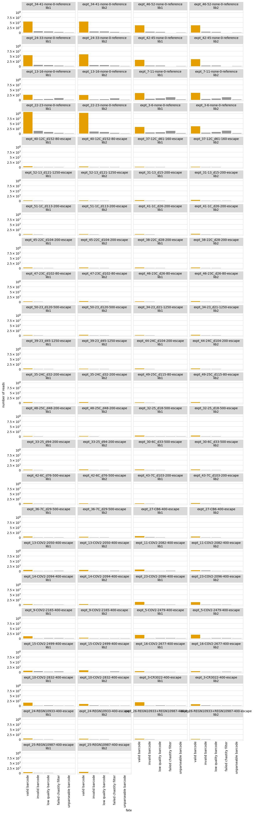

# Aggregate variant counts for all samples
Separate `Snakemake` rules count the observations of each variant in each sample from the Illumina barcode sequencing.
This Python Jupyter notebook aggregates all of this counts, and then adds them to a codon variant table.

## Set up analysis
### Import Python modules.
Use [plotnine](https://plotnine.readthedocs.io/en/stable/) for ggplot2-like plotting.

The analysis relies heavily on the Bloom lab's [dms_variants](https://jbloomlab.github.io/dms_variants) package:


```python
import glob
import itertools
import math
import os
import warnings

import Bio.SeqIO

import dms_variants.codonvarianttable
from dms_variants.constants import CBPALETTE
import dms_variants.utils
import dms_variants.plotnine_themes

from IPython.display import display, HTML

import pandas as pd

from plotnine import *

import yaml
```

Set [plotnine](https://plotnine.readthedocs.io/en/stable/) theme to the gray-grid one defined in `dms_variants`:


```python
theme_set(dms_variants.plotnine_themes.theme_graygrid())
```

Versions of key software:


```python
print(f"Using dms_variants version {dms_variants.__version__}")
```

    Using dms_variants version 0.8.5


Ignore warnings that clutter output:


```python
warnings.simplefilter('ignore')
```

Read the configuration file:


```python
with open('config.yaml') as f:
    config = yaml.safe_load(f)
```

Make output directory if needed:


```python
os.makedirs(config['counts_dir'], exist_ok=True)
```

## Initialize codon variant table
Initialize the [CodonVariantTable](https://jbloomlab.github.io/dms_variants/dms_variants.codonvarianttable.html#dms_variants.codonvarianttable.CodonVariantTable) using the wildtype gene sequence and the CSV file with the table of variants:


```python
wt_seqrecord = Bio.SeqIO.read(config['wildtype_sequence'], 'fasta')
geneseq = str(wt_seqrecord.seq)
primary_target = wt_seqrecord.name
print(f"Read sequence of {len(geneseq)} nt for {primary_target} from {config['wildtype_sequence']}")
      
print(f"Initializing CodonVariantTable from gene sequence and {config['codon_variant_table']}")
      
variants = dms_variants.codonvarianttable.CodonVariantTable(
                geneseq=geneseq,
                barcode_variant_file=config['codon_variant_table'],
                substitutions_are_codon=True,
                substitutions_col='codon_substitutions',
                primary_target=primary_target)
```

    Read sequence of 603 nt for SARS-CoV-2 from data/wildtype_sequence.fasta
    Initializing CodonVariantTable from gene sequence and results/prior_DMS_data/codon_variant_table.csv


## Read barcode counts / fates
Read data frame with list of all samples (barcode runs):


```python
print(f"Reading list of barcode runs from {config['barcode_runs']}")

barcode_runs = (pd.read_csv(config['barcode_runs'])
                .assign(sample_lib=lambda x: x['sample'] + '_' + x['library'],
                        counts_file=lambda x: config['counts_dir'] + '/' + x['sample_lib'] + '_counts.csv',
                        fates_file=lambda x: config['counts_dir'] + '/' + x['sample_lib'] + '_fates.csv',
                        )
                .drop(columns='R1')  # don't need this column, and very large
                )

assert all(map(os.path.isfile, barcode_runs['counts_file'])), 'missing some counts files'
assert all(map(os.path.isfile, barcode_runs['fates_file'])), 'missing some fates files'

display(HTML(barcode_runs.to_html(index=False)))
```

    Reading list of barcode runs from data/barcode_runs.csv


<table border="1" class="dataframe">
  <thead>
    <tr style="text-align: right;">
      <th>library</th>
      <th>sample</th>
      <th>date</th>
      <th>experiment</th>
      <th>antibody</th>
      <th>concentration</th>
      <th>concentration_units</th>
      <th>group</th>
      <th>selection</th>
      <th>frac_escape</th>
      <th>cells_sorted</th>
      <th>sample_lib</th>
      <th>counts_file</th>
      <th>fates_file</th>
    </tr>
  </thead>
  <tbody>
    <tr>
      <td>lib1</td>
      <td>expt_34-41-none-0-reference</td>
      <td>200910</td>
      <td>expt_34-41</td>
      <td>none</td>
      <td>0</td>
      <td>dilution</td>
      <td>clinical_serum</td>
      <td>reference</td>
      <td>NaN</td>
      <td>160000000.0</td>
      <td>expt_34-41-none-0-reference_lib1</td>
      <td>results/counts/expt_34-41-none-0-reference_lib1_counts.csv</td>
      <td>results/counts/expt_34-41-none-0-reference_lib1_fates.csv</td>
    </tr>
    <tr>
      <td>lib2</td>
      <td>expt_34-41-none-0-reference</td>
      <td>200910</td>
      <td>expt_34-41</td>
      <td>none</td>
      <td>0</td>
      <td>dilution</td>
      <td>clinical_serum</td>
      <td>reference</td>
      <td>NaN</td>
      <td>160000000.0</td>
      <td>expt_34-41-none-0-reference_lib2</td>
      <td>results/counts/expt_34-41-none-0-reference_lib2_counts.csv</td>
      <td>results/counts/expt_34-41-none-0-reference_lib2_fates.csv</td>
    </tr>
    <tr>
      <td>lib1</td>
      <td>expt_46-52-none-0-reference</td>
      <td>200917</td>
      <td>expt_46-52</td>
      <td>none</td>
      <td>0</td>
      <td>dilution</td>
      <td>clinical_serum</td>
      <td>reference</td>
      <td>NaN</td>
      <td>NaN</td>
      <td>expt_46-52-none-0-reference_lib1</td>
      <td>results/counts/expt_46-52-none-0-reference_lib1_counts.csv</td>
      <td>results/counts/expt_46-52-none-0-reference_lib1_fates.csv</td>
    </tr>
    <tr>
      <td>lib2</td>
      <td>expt_46-52-none-0-reference</td>
      <td>200917</td>
      <td>expt_46-52</td>
      <td>none</td>
      <td>0</td>
      <td>dilution</td>
      <td>clinical_serum</td>
      <td>reference</td>
      <td>NaN</td>
      <td>NaN</td>
      <td>expt_46-52-none-0-reference_lib2</td>
      <td>results/counts/expt_46-52-none-0-reference_lib2_counts.csv</td>
      <td>results/counts/expt_46-52-none-0-reference_lib2_fates.csv</td>
    </tr>
    <tr>
      <td>lib1</td>
      <td>expt_24-33-none-0-reference</td>
      <td>200904</td>
      <td>expt_24-33</td>
      <td>none</td>
      <td>0</td>
      <td>ng_per_mL</td>
      <td>clinical_serum</td>
      <td>reference</td>
      <td>NaN</td>
      <td>160000000.0</td>
      <td>expt_24-33-none-0-reference_lib1</td>
      <td>results/counts/expt_24-33-none-0-reference_lib1_counts.csv</td>
      <td>results/counts/expt_24-33-none-0-reference_lib1_fates.csv</td>
    </tr>
    <tr>
      <td>lib2</td>
      <td>expt_24-33-none-0-reference</td>
      <td>200904</td>
      <td>expt_24-33</td>
      <td>none</td>
      <td>0</td>
      <td>ng_per_mL</td>
      <td>clinical_serum</td>
      <td>reference</td>
      <td>NaN</td>
      <td>160000000.0</td>
      <td>expt_24-33-none-0-reference_lib2</td>
      <td>results/counts/expt_24-33-none-0-reference_lib2_counts.csv</td>
      <td>results/counts/expt_24-33-none-0-reference_lib2_fates.csv</td>
    </tr>
    <tr>
      <td>lib1</td>
      <td>expt_42-45-none-0-reference</td>
      <td>200915</td>
      <td>expt_42-45</td>
      <td>none</td>
      <td>0</td>
      <td>dilution</td>
      <td>clinical_serum</td>
      <td>reference</td>
      <td>NaN</td>
      <td>NaN</td>
      <td>expt_42-45-none-0-reference_lib1</td>
      <td>results/counts/expt_42-45-none-0-reference_lib1_counts.csv</td>
      <td>results/counts/expt_42-45-none-0-reference_lib1_fates.csv</td>
    </tr>
    <tr>
      <td>lib2</td>
      <td>expt_42-45-none-0-reference</td>
      <td>200915</td>
      <td>expt_42-45</td>
      <td>none</td>
      <td>0</td>
      <td>dilution</td>
      <td>clinical_serum</td>
      <td>reference</td>
      <td>NaN</td>
      <td>NaN</td>
      <td>expt_42-45-none-0-reference_lib2</td>
      <td>results/counts/expt_42-45-none-0-reference_lib2_counts.csv</td>
      <td>results/counts/expt_42-45-none-0-reference_lib2_fates.csv</td>
    </tr>
    <tr>
      <td>lib1</td>
      <td>expt_13-16-none-0-reference</td>
      <td>200720</td>
      <td>expt_13-16</td>
      <td>none</td>
      <td>0</td>
      <td>ng_per_mL</td>
      <td>none</td>
      <td>reference</td>
      <td>NaN</td>
      <td>160000000.0</td>
      <td>expt_13-16-none-0-reference_lib1</td>
      <td>results/counts/expt_13-16-none-0-reference_lib1_counts.csv</td>
      <td>results/counts/expt_13-16-none-0-reference_lib1_fates.csv</td>
    </tr>
    <tr>
      <td>lib2</td>
      <td>expt_13-16-none-0-reference</td>
      <td>200720</td>
      <td>expt_13-16</td>
      <td>none</td>
      <td>0</td>
      <td>ng_per_mL</td>
      <td>none</td>
      <td>reference</td>
      <td>NaN</td>
      <td>160000000.0</td>
      <td>expt_13-16-none-0-reference_lib2</td>
      <td>results/counts/expt_13-16-none-0-reference_lib2_counts.csv</td>
      <td>results/counts/expt_13-16-none-0-reference_lib2_fates.csv</td>
    </tr>
    <tr>
      <td>lib1</td>
      <td>expt_7-11-none-0-reference</td>
      <td>200616</td>
      <td>expt_7-11</td>
      <td>none</td>
      <td>0</td>
      <td>ng_per_mL</td>
      <td>none</td>
      <td>reference</td>
      <td>NaN</td>
      <td>160000000.0</td>
      <td>expt_7-11-none-0-reference_lib1</td>
      <td>results/counts/expt_7-11-none-0-reference_lib1_counts.csv</td>
      <td>results/counts/expt_7-11-none-0-reference_lib1_fates.csv</td>
    </tr>
    <tr>
      <td>lib2</td>
      <td>expt_7-11-none-0-reference</td>
      <td>200616</td>
      <td>expt_7-11</td>
      <td>none</td>
      <td>0</td>
      <td>ng_per_mL</td>
      <td>none</td>
      <td>reference</td>
      <td>NaN</td>
      <td>160000000.0</td>
      <td>expt_7-11-none-0-reference_lib2</td>
      <td>results/counts/expt_7-11-none-0-reference_lib2_counts.csv</td>
      <td>results/counts/expt_7-11-none-0-reference_lib2_fates.csv</td>
    </tr>
    <tr>
      <td>lib1</td>
      <td>expt_22-23-none-0-reference</td>
      <td>200810</td>
      <td>expt_22-23</td>
      <td>none</td>
      <td>0</td>
      <td>ng_per_mL</td>
      <td>none</td>
      <td>reference</td>
      <td>NaN</td>
      <td>160000000.0</td>
      <td>expt_22-23-none-0-reference_lib1</td>
      <td>results/counts/expt_22-23-none-0-reference_lib1_counts.csv</td>
      <td>results/counts/expt_22-23-none-0-reference_lib1_fates.csv</td>
    </tr>
    <tr>
      <td>lib2</td>
      <td>expt_22-23-none-0-reference</td>
      <td>200810</td>
      <td>expt_22-23</td>
      <td>none</td>
      <td>0</td>
      <td>ng_per_mL</td>
      <td>none</td>
      <td>reference</td>
      <td>NaN</td>
      <td>160000000.0</td>
      <td>expt_22-23-none-0-reference_lib2</td>
      <td>results/counts/expt_22-23-none-0-reference_lib2_counts.csv</td>
      <td>results/counts/expt_22-23-none-0-reference_lib2_fates.csv</td>
    </tr>
    <tr>
      <td>lib1</td>
      <td>expt_3-6-none-0-reference</td>
      <td>200615</td>
      <td>expt_3-6</td>
      <td>none</td>
      <td>0</td>
      <td>ng_per_mL</td>
      <td>none</td>
      <td>reference</td>
      <td>NaN</td>
      <td>160000000.0</td>
      <td>expt_3-6-none-0-reference_lib1</td>
      <td>results/counts/expt_3-6-none-0-reference_lib1_counts.csv</td>
      <td>results/counts/expt_3-6-none-0-reference_lib1_fates.csv</td>
    </tr>
    <tr>
      <td>lib2</td>
      <td>expt_3-6-none-0-reference</td>
      <td>200615</td>
      <td>expt_3-6</td>
      <td>none</td>
      <td>0</td>
      <td>ng_per_mL</td>
      <td>none</td>
      <td>reference</td>
      <td>NaN</td>
      <td>160000000.0</td>
      <td>expt_3-6-none-0-reference_lib2</td>
      <td>results/counts/expt_3-6-none-0-reference_lib2_counts.csv</td>
      <td>results/counts/expt_3-6-none-0-reference_lib2_fates.csv</td>
    </tr>
    <tr>
      <td>lib1</td>
      <td>expt_40-12C_d152-80-escape</td>
      <td>200910</td>
      <td>expt_40</td>
      <td>12C_d152</td>
      <td>80</td>
      <td>dilution</td>
      <td>clinical_serum</td>
      <td>escape</td>
      <td>0.040</td>
      <td>530574.0</td>
      <td>expt_40-12C_d152-80-escape_lib1</td>
      <td>results/counts/expt_40-12C_d152-80-escape_lib1_counts.csv</td>
      <td>results/counts/expt_40-12C_d152-80-escape_lib1_fates.csv</td>
    </tr>
    <tr>
      <td>lib2</td>
      <td>expt_40-12C_d152-80-escape</td>
      <td>200910</td>
      <td>expt_40</td>
      <td>12C_d152</td>
      <td>80</td>
      <td>dilution</td>
      <td>clinical_serum</td>
      <td>escape</td>
      <td>0.052</td>
      <td>528440.0</td>
      <td>expt_40-12C_d152-80-escape_lib2</td>
      <td>results/counts/expt_40-12C_d152-80-escape_lib2_counts.csv</td>
      <td>results/counts/expt_40-12C_d152-80-escape_lib2_fates.csv</td>
    </tr>
    <tr>
      <td>lib1</td>
      <td>expt_37-12C_d61-160-escape</td>
      <td>200910</td>
      <td>expt_37</td>
      <td>12C_d61</td>
      <td>160</td>
      <td>dilution</td>
      <td>clinical_serum</td>
      <td>escape</td>
      <td>0.033</td>
      <td>289524.0</td>
      <td>expt_37-12C_d61-160-escape_lib1</td>
      <td>results/counts/expt_37-12C_d61-160-escape_lib1_counts.csv</td>
      <td>results/counts/expt_37-12C_d61-160-escape_lib1_fates.csv</td>
    </tr>
    <tr>
      <td>lib2</td>
      <td>expt_37-12C_d61-160-escape</td>
      <td>200910</td>
      <td>expt_37</td>
      <td>12C_d61</td>
      <td>160</td>
      <td>dilution</td>
      <td>clinical_serum</td>
      <td>escape</td>
      <td>0.031</td>
      <td>373381.0</td>
      <td>expt_37-12C_d61-160-escape_lib2</td>
      <td>results/counts/expt_37-12C_d61-160-escape_lib2_counts.csv</td>
      <td>results/counts/expt_37-12C_d61-160-escape_lib2_fates.csv</td>
    </tr>
    <tr>
      <td>lib1</td>
      <td>expt_52-13_d121-1250-escape</td>
      <td>200917</td>
      <td>expt_52</td>
      <td>13_d121</td>
      <td>1250</td>
      <td>dilution</td>
      <td>clinical_serum</td>
      <td>escape</td>
      <td>0.042</td>
      <td>521978.0</td>
      <td>expt_52-13_d121-1250-escape_lib1</td>
      <td>results/counts/expt_52-13_d121-1250-escape_lib1_counts.csv</td>
      <td>results/counts/expt_52-13_d121-1250-escape_lib1_fates.csv</td>
    </tr>
    <tr>
      <td>lib2</td>
      <td>expt_52-13_d121-1250-escape</td>
      <td>200917</td>
      <td>expt_52</td>
      <td>13_d121</td>
      <td>1250</td>
      <td>dilution</td>
      <td>clinical_serum</td>
      <td>escape</td>
      <td>0.048</td>
      <td>631476.0</td>
      <td>expt_52-13_d121-1250-escape_lib2</td>
      <td>results/counts/expt_52-13_d121-1250-escape_lib2_counts.csv</td>
      <td>results/counts/expt_52-13_d121-1250-escape_lib2_fates.csv</td>
    </tr>
    <tr>
      <td>lib1</td>
      <td>expt_31-13_d15-200-escape</td>
      <td>200904</td>
      <td>expt_31</td>
      <td>13_d15</td>
      <td>200</td>
      <td>dilution</td>
      <td>clinical_serum</td>
      <td>escape</td>
      <td>0.044</td>
      <td>501386.0</td>
      <td>expt_31-13_d15-200-escape_lib1</td>
      <td>results/counts/expt_31-13_d15-200-escape_lib1_counts.csv</td>
      <td>results/counts/expt_31-13_d15-200-escape_lib1_fates.csv</td>
    </tr>
    <tr>
      <td>lib2</td>
      <td>expt_31-13_d15-200-escape</td>
      <td>200904</td>
      <td>expt_31</td>
      <td>13_d15</td>
      <td>200</td>
      <td>dilution</td>
      <td>clinical_serum</td>
      <td>escape</td>
      <td>0.057</td>
      <td>502894.0</td>
      <td>expt_31-13_d15-200-escape_lib2</td>
      <td>results/counts/expt_31-13_d15-200-escape_lib2_counts.csv</td>
      <td>results/counts/expt_31-13_d15-200-escape_lib2_fates.csv</td>
    </tr>
    <tr>
      <td>lib1</td>
      <td>expt_51-1C_d113-200-escape</td>
      <td>200917</td>
      <td>expt_51</td>
      <td>1C_d113</td>
      <td>200</td>
      <td>dilution</td>
      <td>clinical_serum</td>
      <td>escape</td>
      <td>0.037</td>
      <td>445318.0</td>
      <td>expt_51-1C_d113-200-escape_lib1</td>
      <td>results/counts/expt_51-1C_d113-200-escape_lib1_counts.csv</td>
      <td>results/counts/expt_51-1C_d113-200-escape_lib1_fates.csv</td>
    </tr>
    <tr>
      <td>lib2</td>
      <td>expt_51-1C_d113-200-escape</td>
      <td>200917</td>
      <td>expt_51</td>
      <td>1C_d113</td>
      <td>200</td>
      <td>dilution</td>
      <td>clinical_serum</td>
      <td>escape</td>
      <td>0.047</td>
      <td>576459.0</td>
      <td>expt_51-1C_d113-200-escape_lib2</td>
      <td>results/counts/expt_51-1C_d113-200-escape_lib2_counts.csv</td>
      <td>results/counts/expt_51-1C_d113-200-escape_lib2_fates.csv</td>
    </tr>
    <tr>
      <td>lib1</td>
      <td>expt_41-1C_d26-200-escape</td>
      <td>200910</td>
      <td>expt_41</td>
      <td>1C_d26</td>
      <td>200</td>
      <td>dilution</td>
      <td>clinical_serum</td>
      <td>escape</td>
      <td>0.045</td>
      <td>599453.0</td>
      <td>expt_41-1C_d26-200-escape_lib1</td>
      <td>results/counts/expt_41-1C_d26-200-escape_lib1_counts.csv</td>
      <td>results/counts/expt_41-1C_d26-200-escape_lib1_fates.csv</td>
    </tr>
    <tr>
      <td>lib2</td>
      <td>expt_41-1C_d26-200-escape</td>
      <td>200910</td>
      <td>expt_41</td>
      <td>1C_d26</td>
      <td>200</td>
      <td>dilution</td>
      <td>clinical_serum</td>
      <td>escape</td>
      <td>0.036</td>
      <td>522412.0</td>
      <td>expt_41-1C_d26-200-escape_lib2</td>
      <td>results/counts/expt_41-1C_d26-200-escape_lib2_counts.csv</td>
      <td>results/counts/expt_41-1C_d26-200-escape_lib2_fates.csv</td>
    </tr>
    <tr>
      <td>lib1</td>
      <td>expt_45-22C_d104-200-escape</td>
      <td>200915</td>
      <td>expt_45</td>
      <td>22C_d104</td>
      <td>200</td>
      <td>dilution</td>
      <td>clinical_serum</td>
      <td>escape</td>
      <td>0.050</td>
      <td>645592.0</td>
      <td>expt_45-22C_d104-200-escape_lib1</td>
      <td>results/counts/expt_45-22C_d104-200-escape_lib1_counts.csv</td>
      <td>results/counts/expt_45-22C_d104-200-escape_lib1_fates.csv</td>
    </tr>
    <tr>
      <td>lib2</td>
      <td>expt_45-22C_d104-200-escape</td>
      <td>200915</td>
      <td>expt_45</td>
      <td>22C_d104</td>
      <td>200</td>
      <td>dilution</td>
      <td>clinical_serum</td>
      <td>escape</td>
      <td>0.044</td>
      <td>637035.0</td>
      <td>expt_45-22C_d104-200-escape_lib2</td>
      <td>results/counts/expt_45-22C_d104-200-escape_lib2_counts.csv</td>
      <td>results/counts/expt_45-22C_d104-200-escape_lib2_fates.csv</td>
    </tr>
    <tr>
      <td>lib1</td>
      <td>expt_38-22C_d28-200-escape</td>
      <td>200910</td>
      <td>expt_38</td>
      <td>22C_d28</td>
      <td>200</td>
      <td>dilution</td>
      <td>clinical_serum</td>
      <td>escape</td>
      <td>0.047</td>
      <td>532618.0</td>
      <td>expt_38-22C_d28-200-escape_lib1</td>
      <td>results/counts/expt_38-22C_d28-200-escape_lib1_counts.csv</td>
      <td>results/counts/expt_38-22C_d28-200-escape_lib1_fates.csv</td>
    </tr>
    <tr>
      <td>lib2</td>
      <td>expt_38-22C_d28-200-escape</td>
      <td>200910</td>
      <td>expt_38</td>
      <td>22C_d28</td>
      <td>200</td>
      <td>dilution</td>
      <td>clinical_serum</td>
      <td>escape</td>
      <td>0.029</td>
      <td>502292.0</td>
      <td>expt_38-22C_d28-200-escape_lib2</td>
      <td>results/counts/expt_38-22C_d28-200-escape_lib2_counts.csv</td>
      <td>results/counts/expt_38-22C_d28-200-escape_lib2_fates.csv</td>
    </tr>
    <tr>
      <td>lib1</td>
      <td>expt_47-23C_d102-80-escape</td>
      <td>200917</td>
      <td>expt_47</td>
      <td>23C_d102</td>
      <td>80</td>
      <td>dilution</td>
      <td>clinical_serum</td>
      <td>escape</td>
      <td>0.030</td>
      <td>370503.0</td>
      <td>expt_47-23C_d102-80-escape_lib1</td>
      <td>results/counts/expt_47-23C_d102-80-escape_lib1_counts.csv</td>
      <td>results/counts/expt_47-23C_d102-80-escape_lib1_fates.csv</td>
    </tr>
    <tr>
      <td>lib2</td>
      <td>expt_47-23C_d102-80-escape</td>
      <td>200917</td>
      <td>expt_47</td>
      <td>23C_d102</td>
      <td>80</td>
      <td>dilution</td>
      <td>clinical_serum</td>
      <td>escape</td>
      <td>0.058</td>
      <td>727991.0</td>
      <td>expt_47-23C_d102-80-escape_lib2</td>
      <td>results/counts/expt_47-23C_d102-80-escape_lib2_counts.csv</td>
      <td>results/counts/expt_47-23C_d102-80-escape_lib2_fates.csv</td>
    </tr>
    <tr>
      <td>lib1</td>
      <td>expt_46-23C_d26-80-escape</td>
      <td>200917</td>
      <td>expt_46</td>
      <td>23C_d26</td>
      <td>80</td>
      <td>dilution</td>
      <td>clinical_serum</td>
      <td>escape</td>
      <td>0.027</td>
      <td>450907.0</td>
      <td>expt_46-23C_d26-80-escape_lib1</td>
      <td>results/counts/expt_46-23C_d26-80-escape_lib1_counts.csv</td>
      <td>results/counts/expt_46-23C_d26-80-escape_lib1_fates.csv</td>
    </tr>
    <tr>
      <td>lib2</td>
      <td>expt_46-23C_d26-80-escape</td>
      <td>200917</td>
      <td>expt_46</td>
      <td>23C_d26</td>
      <td>80</td>
      <td>dilution</td>
      <td>clinical_serum</td>
      <td>escape</td>
      <td>0.046</td>
      <td>649814.0</td>
      <td>expt_46-23C_d26-80-escape_lib2</td>
      <td>results/counts/expt_46-23C_d26-80-escape_lib2_counts.csv</td>
      <td>results/counts/expt_46-23C_d26-80-escape_lib2_fates.csv</td>
    </tr>
    <tr>
      <td>lib1</td>
      <td>expt_50-23_d120-500-escape</td>
      <td>200917</td>
      <td>expt_50</td>
      <td>23_d120</td>
      <td>500</td>
      <td>dilution</td>
      <td>clinical_serum</td>
      <td>escape</td>
      <td>0.045</td>
      <td>467275.0</td>
      <td>expt_50-23_d120-500-escape_lib1</td>
      <td>results/counts/expt_50-23_d120-500-escape_lib1_counts.csv</td>
      <td>results/counts/expt_50-23_d120-500-escape_lib1_fates.csv</td>
    </tr>
    <tr>
      <td>lib2</td>
      <td>expt_50-23_d120-500-escape</td>
      <td>200917</td>
      <td>expt_50</td>
      <td>23_d120</td>
      <td>500</td>
      <td>dilution</td>
      <td>clinical_serum</td>
      <td>escape</td>
      <td>0.064</td>
      <td>774180.0</td>
      <td>expt_50-23_d120-500-escape_lib2</td>
      <td>results/counts/expt_50-23_d120-500-escape_lib2_counts.csv</td>
      <td>results/counts/expt_50-23_d120-500-escape_lib2_fates.csv</td>
    </tr>
    <tr>
      <td>lib1</td>
      <td>expt_34-23_d21-1250-escape</td>
      <td>200910</td>
      <td>expt_34</td>
      <td>23_d21</td>
      <td>1250</td>
      <td>dilution</td>
      <td>clinical_serum</td>
      <td>escape</td>
      <td>0.026</td>
      <td>203778.0</td>
      <td>expt_34-23_d21-1250-escape_lib1</td>
      <td>results/counts/expt_34-23_d21-1250-escape_lib1_counts.csv</td>
      <td>results/counts/expt_34-23_d21-1250-escape_lib1_fates.csv</td>
    </tr>
    <tr>
      <td>lib2</td>
      <td>expt_34-23_d21-1250-escape</td>
      <td>200910</td>
      <td>expt_34</td>
      <td>23_d21</td>
      <td>1250</td>
      <td>dilution</td>
      <td>clinical_serum</td>
      <td>escape</td>
      <td>0.017</td>
      <td>228514.0</td>
      <td>expt_34-23_d21-1250-escape_lib2</td>
      <td>results/counts/expt_34-23_d21-1250-escape_lib2_counts.csv</td>
      <td>results/counts/expt_34-23_d21-1250-escape_lib2_fates.csv</td>
    </tr>
    <tr>
      <td>lib1</td>
      <td>expt_39-23_d45-1250-escape</td>
      <td>200910</td>
      <td>expt_39</td>
      <td>23_d45</td>
      <td>1250</td>
      <td>dilution</td>
      <td>clinical_serum</td>
      <td>escape</td>
      <td>0.031</td>
      <td>459593.0</td>
      <td>expt_39-23_d45-1250-escape_lib1</td>
      <td>results/counts/expt_39-23_d45-1250-escape_lib1_counts.csv</td>
      <td>results/counts/expt_39-23_d45-1250-escape_lib1_fates.csv</td>
    </tr>
    <tr>
      <td>lib2</td>
      <td>expt_39-23_d45-1250-escape</td>
      <td>200910</td>
      <td>expt_39</td>
      <td>23_d45</td>
      <td>1250</td>
      <td>dilution</td>
      <td>clinical_serum</td>
      <td>escape</td>
      <td>0.025</td>
      <td>331160.0</td>
      <td>expt_39-23_d45-1250-escape_lib2</td>
      <td>results/counts/expt_39-23_d45-1250-escape_lib2_counts.csv</td>
      <td>results/counts/expt_39-23_d45-1250-escape_lib2_fates.csv</td>
    </tr>
    <tr>
      <td>lib1</td>
      <td>expt_44-24C_d104-200-escape</td>
      <td>200915</td>
      <td>expt_44</td>
      <td>24C_d104</td>
      <td>200</td>
      <td>dilution</td>
      <td>clinical_serum</td>
      <td>escape</td>
      <td>0.046</td>
      <td>641483.0</td>
      <td>expt_44-24C_d104-200-escape_lib1</td>
      <td>results/counts/expt_44-24C_d104-200-escape_lib1_counts.csv</td>
      <td>results/counts/expt_44-24C_d104-200-escape_lib1_fates.csv</td>
    </tr>
    <tr>
      <td>lib2</td>
      <td>expt_44-24C_d104-200-escape</td>
      <td>200915</td>
      <td>expt_44</td>
      <td>24C_d104</td>
      <td>200</td>
      <td>dilution</td>
      <td>clinical_serum</td>
      <td>escape</td>
      <td>0.055</td>
      <td>722686.0</td>
      <td>expt_44-24C_d104-200-escape_lib2</td>
      <td>results/counts/expt_44-24C_d104-200-escape_lib2_counts.csv</td>
      <td>results/counts/expt_44-24C_d104-200-escape_lib2_fates.csv</td>
    </tr>
    <tr>
      <td>lib1</td>
      <td>expt_35-24C_d32-200-escape</td>
      <td>200910</td>
      <td>expt_35</td>
      <td>24C_d32</td>
      <td>200</td>
      <td>dilution</td>
      <td>clinical_serum</td>
      <td>escape</td>
      <td>0.067</td>
      <td>569827.0</td>
      <td>expt_35-24C_d32-200-escape_lib1</td>
      <td>results/counts/expt_35-24C_d32-200-escape_lib1_counts.csv</td>
      <td>results/counts/expt_35-24C_d32-200-escape_lib1_fates.csv</td>
    </tr>
    <tr>
      <td>lib2</td>
      <td>expt_35-24C_d32-200-escape</td>
      <td>200910</td>
      <td>expt_35</td>
      <td>24C_d32</td>
      <td>200</td>
      <td>dilution</td>
      <td>clinical_serum</td>
      <td>escape</td>
      <td>0.065</td>
      <td>507246.0</td>
      <td>expt_35-24C_d32-200-escape_lib2</td>
      <td>results/counts/expt_35-24C_d32-200-escape_lib2_counts.csv</td>
      <td>results/counts/expt_35-24C_d32-200-escape_lib2_fates.csv</td>
    </tr>
    <tr>
      <td>lib1</td>
      <td>expt_49-25C_d115-80-escape</td>
      <td>200917</td>
      <td>expt_49</td>
      <td>25C_d115</td>
      <td>80</td>
      <td>dilution</td>
      <td>clinical_serum</td>
      <td>escape</td>
      <td>0.044</td>
      <td>421799.0</td>
      <td>expt_49-25C_d115-80-escape_lib1</td>
      <td>results/counts/expt_49-25C_d115-80-escape_lib1_counts.csv</td>
      <td>results/counts/expt_49-25C_d115-80-escape_lib1_fates.csv</td>
    </tr>
    <tr>
      <td>lib2</td>
      <td>expt_49-25C_d115-80-escape</td>
      <td>200917</td>
      <td>expt_49</td>
      <td>25C_d115</td>
      <td>80</td>
      <td>dilution</td>
      <td>clinical_serum</td>
      <td>escape</td>
      <td>0.059</td>
      <td>677714.0</td>
      <td>expt_49-25C_d115-80-escape_lib2</td>
      <td>results/counts/expt_49-25C_d115-80-escape_lib2_counts.csv</td>
      <td>results/counts/expt_49-25C_d115-80-escape_lib2_fates.csv</td>
    </tr>
    <tr>
      <td>lib1</td>
      <td>expt_48-25C_d48-200-escape</td>
      <td>200917</td>
      <td>expt_48</td>
      <td>25C_d48</td>
      <td>200</td>
      <td>dilution</td>
      <td>clinical_serum</td>
      <td>escape</td>
      <td>0.040</td>
      <td>466102.0</td>
      <td>expt_48-25C_d48-200-escape_lib1</td>
      <td>results/counts/expt_48-25C_d48-200-escape_lib1_counts.csv</td>
      <td>results/counts/expt_48-25C_d48-200-escape_lib1_fates.csv</td>
    </tr>
    <tr>
      <td>lib2</td>
      <td>expt_48-25C_d48-200-escape</td>
      <td>200917</td>
      <td>expt_48</td>
      <td>25C_d48</td>
      <td>200</td>
      <td>dilution</td>
      <td>clinical_serum</td>
      <td>escape</td>
      <td>0.050</td>
      <td>571563.0</td>
      <td>expt_48-25C_d48-200-escape_lib2</td>
      <td>results/counts/expt_48-25C_d48-200-escape_lib2_counts.csv</td>
      <td>results/counts/expt_48-25C_d48-200-escape_lib2_fates.csv</td>
    </tr>
    <tr>
      <td>lib1</td>
      <td>expt_32-25_d18-500-escape</td>
      <td>200904</td>
      <td>expt_32</td>
      <td>25_d18</td>
      <td>500</td>
      <td>dilution</td>
      <td>clinical_serum</td>
      <td>escape</td>
      <td>0.051</td>
      <td>547164.0</td>
      <td>expt_32-25_d18-500-escape_lib1</td>
      <td>results/counts/expt_32-25_d18-500-escape_lib1_counts.csv</td>
      <td>results/counts/expt_32-25_d18-500-escape_lib1_fates.csv</td>
    </tr>
    <tr>
      <td>lib2</td>
      <td>expt_32-25_d18-500-escape</td>
      <td>200904</td>
      <td>expt_32</td>
      <td>25_d18</td>
      <td>500</td>
      <td>dilution</td>
      <td>clinical_serum</td>
      <td>escape</td>
      <td>0.059</td>
      <td>562520.0</td>
      <td>expt_32-25_d18-500-escape_lib2</td>
      <td>results/counts/expt_32-25_d18-500-escape_lib2_counts.csv</td>
      <td>results/counts/expt_32-25_d18-500-escape_lib2_fates.csv</td>
    </tr>
    <tr>
      <td>lib1</td>
      <td>expt_33-25_d94-200-escape</td>
      <td>200904</td>
      <td>expt_33</td>
      <td>25_d94</td>
      <td>200</td>
      <td>dilution</td>
      <td>clinical_serum</td>
      <td>escape</td>
      <td>0.052</td>
      <td>382787.0</td>
      <td>expt_33-25_d94-200-escape_lib1</td>
      <td>results/counts/expt_33-25_d94-200-escape_lib1_counts.csv</td>
      <td>results/counts/expt_33-25_d94-200-escape_lib1_fates.csv</td>
    </tr>
    <tr>
      <td>lib2</td>
      <td>expt_33-25_d94-200-escape</td>
      <td>200904</td>
      <td>expt_33</td>
      <td>25_d94</td>
      <td>200</td>
      <td>dilution</td>
      <td>clinical_serum</td>
      <td>escape</td>
      <td>0.042</td>
      <td>422273.0</td>
      <td>expt_33-25_d94-200-escape_lib2</td>
      <td>results/counts/expt_33-25_d94-200-escape_lib2_counts.csv</td>
      <td>results/counts/expt_33-25_d94-200-escape_lib2_fates.csv</td>
    </tr>
    <tr>
      <td>lib1</td>
      <td>expt_30-6C_d33-500-escape</td>
      <td>200904</td>
      <td>expt_30</td>
      <td>6C_d33</td>
      <td>500</td>
      <td>dilution</td>
      <td>clinical_serum</td>
      <td>escape</td>
      <td>0.051</td>
      <td>589736.0</td>
      <td>expt_30-6C_d33-500-escape_lib1</td>
      <td>results/counts/expt_30-6C_d33-500-escape_lib1_counts.csv</td>
      <td>results/counts/expt_30-6C_d33-500-escape_lib1_fates.csv</td>
    </tr>
    <tr>
      <td>lib2</td>
      <td>expt_30-6C_d33-500-escape</td>
      <td>200904</td>
      <td>expt_30</td>
      <td>6C_d33</td>
      <td>500</td>
      <td>dilution</td>
      <td>clinical_serum</td>
      <td>escape</td>
      <td>0.047</td>
      <td>506366.0</td>
      <td>expt_30-6C_d33-500-escape_lib2</td>
      <td>results/counts/expt_30-6C_d33-500-escape_lib2_counts.csv</td>
      <td>results/counts/expt_30-6C_d33-500-escape_lib2_fates.csv</td>
    </tr>
    <tr>
      <td>lib1</td>
      <td>expt_42-6C_d76-500-escape</td>
      <td>200915</td>
      <td>expt_42</td>
      <td>6C_d76</td>
      <td>500</td>
      <td>dilution</td>
      <td>clinical_serum</td>
      <td>escape</td>
      <td>0.043</td>
      <td>600854.0</td>
      <td>expt_42-6C_d76-500-escape_lib1</td>
      <td>results/counts/expt_42-6C_d76-500-escape_lib1_counts.csv</td>
      <td>results/counts/expt_42-6C_d76-500-escape_lib1_fates.csv</td>
    </tr>
    <tr>
      <td>lib2</td>
      <td>expt_42-6C_d76-500-escape</td>
      <td>200915</td>
      <td>expt_42</td>
      <td>6C_d76</td>
      <td>500</td>
      <td>dilution</td>
      <td>clinical_serum</td>
      <td>escape</td>
      <td>0.038</td>
      <td>601796.0</td>
      <td>expt_42-6C_d76-500-escape_lib2</td>
      <td>results/counts/expt_42-6C_d76-500-escape_lib2_counts.csv</td>
      <td>results/counts/expt_42-6C_d76-500-escape_lib2_fates.csv</td>
    </tr>
    <tr>
      <td>lib1</td>
      <td>expt_43-7C_d103-200-escape</td>
      <td>200915</td>
      <td>expt_43</td>
      <td>7C_d103</td>
      <td>200</td>
      <td>dilution</td>
      <td>clinical_serum</td>
      <td>escape</td>
      <td>0.049</td>
      <td>653383.0</td>
      <td>expt_43-7C_d103-200-escape_lib1</td>
      <td>results/counts/expt_43-7C_d103-200-escape_lib1_counts.csv</td>
      <td>results/counts/expt_43-7C_d103-200-escape_lib1_fates.csv</td>
    </tr>
    <tr>
      <td>lib2</td>
      <td>expt_43-7C_d103-200-escape</td>
      <td>200915</td>
      <td>expt_43</td>
      <td>7C_d103</td>
      <td>200</td>
      <td>dilution</td>
      <td>clinical_serum</td>
      <td>escape</td>
      <td>0.049</td>
      <td>654893.0</td>
      <td>expt_43-7C_d103-200-escape_lib2</td>
      <td>results/counts/expt_43-7C_d103-200-escape_lib2_counts.csv</td>
      <td>results/counts/expt_43-7C_d103-200-escape_lib2_fates.csv</td>
    </tr>
    <tr>
      <td>lib1</td>
      <td>expt_36-7C_d29-500-escape</td>
      <td>200910</td>
      <td>expt_36</td>
      <td>7C_d29</td>
      <td>500</td>
      <td>dilution</td>
      <td>clinical_serum</td>
      <td>escape</td>
      <td>0.061</td>
      <td>625811.0</td>
      <td>expt_36-7C_d29-500-escape_lib1</td>
      <td>results/counts/expt_36-7C_d29-500-escape_lib1_counts.csv</td>
      <td>results/counts/expt_36-7C_d29-500-escape_lib1_fates.csv</td>
    </tr>
    <tr>
      <td>lib2</td>
      <td>expt_36-7C_d29-500-escape</td>
      <td>200910</td>
      <td>expt_36</td>
      <td>7C_d29</td>
      <td>500</td>
      <td>dilution</td>
      <td>clinical_serum</td>
      <td>escape</td>
      <td>0.061</td>
      <td>535256.0</td>
      <td>expt_36-7C_d29-500-escape_lib2</td>
      <td>results/counts/expt_36-7C_d29-500-escape_lib2_counts.csv</td>
      <td>results/counts/expt_36-7C_d29-500-escape_lib2_fates.csv</td>
    </tr>
    <tr>
      <td>lib1</td>
      <td>expt_27-CB6-400-escape</td>
      <td>200904</td>
      <td>expt_27</td>
      <td>CB6</td>
      <td>400</td>
      <td>ng_per_mL</td>
      <td>clinical_serum</td>
      <td>escape</td>
      <td>0.222</td>
      <td>1907893.0</td>
      <td>expt_27-CB6-400-escape_lib1</td>
      <td>results/counts/expt_27-CB6-400-escape_lib1_counts.csv</td>
      <td>results/counts/expt_27-CB6-400-escape_lib1_fates.csv</td>
    </tr>
    <tr>
      <td>lib2</td>
      <td>expt_27-CB6-400-escape</td>
      <td>200904</td>
      <td>expt_27</td>
      <td>CB6</td>
      <td>400</td>
      <td>ng_per_mL</td>
      <td>clinical_serum</td>
      <td>escape</td>
      <td>0.225</td>
      <td>927804.0</td>
      <td>expt_27-CB6-400-escape_lib2</td>
      <td>results/counts/expt_27-CB6-400-escape_lib2_counts.csv</td>
      <td>results/counts/expt_27-CB6-400-escape_lib2_fates.csv</td>
    </tr>
    <tr>
      <td>lib1</td>
      <td>expt_13-COV2-2050-400-escape</td>
      <td>200720</td>
      <td>expt_13</td>
      <td>COV2-2050</td>
      <td>400</td>
      <td>ng_per_mL</td>
      <td>Crowe</td>
      <td>escape</td>
      <td>0.078</td>
      <td>1253185.0</td>
      <td>expt_13-COV2-2050-400-escape_lib1</td>
      <td>results/counts/expt_13-COV2-2050-400-escape_lib1_counts.csv</td>
      <td>results/counts/expt_13-COV2-2050-400-escape_lib1_fates.csv</td>
    </tr>
    <tr>
      <td>lib2</td>
      <td>expt_13-COV2-2050-400-escape</td>
      <td>200720</td>
      <td>expt_13</td>
      <td>COV2-2050</td>
      <td>400</td>
      <td>ng_per_mL</td>
      <td>Crowe</td>
      <td>escape</td>
      <td>0.104</td>
      <td>1588138.0</td>
      <td>expt_13-COV2-2050-400-escape_lib2</td>
      <td>results/counts/expt_13-COV2-2050-400-escape_lib2_counts.csv</td>
      <td>results/counts/expt_13-COV2-2050-400-escape_lib2_fates.csv</td>
    </tr>
    <tr>
      <td>lib1</td>
      <td>expt_11-COV2-2082-400-escape</td>
      <td>200616</td>
      <td>expt_11</td>
      <td>COV2-2082</td>
      <td>400</td>
      <td>ng_per_mL</td>
      <td>Crowe</td>
      <td>escape</td>
      <td>0.057</td>
      <td>522474.0</td>
      <td>expt_11-COV2-2082-400-escape_lib1</td>
      <td>results/counts/expt_11-COV2-2082-400-escape_lib1_counts.csv</td>
      <td>results/counts/expt_11-COV2-2082-400-escape_lib1_fates.csv</td>
    </tr>
    <tr>
      <td>lib2</td>
      <td>expt_11-COV2-2082-400-escape</td>
      <td>200616</td>
      <td>expt_11</td>
      <td>COV2-2082</td>
      <td>400</td>
      <td>ng_per_mL</td>
      <td>Crowe</td>
      <td>escape</td>
      <td>0.086</td>
      <td>512138.0</td>
      <td>expt_11-COV2-2082-400-escape_lib2</td>
      <td>results/counts/expt_11-COV2-2082-400-escape_lib2_counts.csv</td>
      <td>results/counts/expt_11-COV2-2082-400-escape_lib2_fates.csv</td>
    </tr>
    <tr>
      <td>lib1</td>
      <td>expt_14-COV2-2094-400-escape</td>
      <td>200720</td>
      <td>expt_14</td>
      <td>COV2-2094</td>
      <td>400</td>
      <td>ng_per_mL</td>
      <td>Crowe</td>
      <td>escape</td>
      <td>0.069</td>
      <td>853420.0</td>
      <td>expt_14-COV2-2094-400-escape_lib1</td>
      <td>results/counts/expt_14-COV2-2094-400-escape_lib1_counts.csv</td>
      <td>results/counts/expt_14-COV2-2094-400-escape_lib1_fates.csv</td>
    </tr>
    <tr>
      <td>lib2</td>
      <td>expt_14-COV2-2094-400-escape</td>
      <td>200720</td>
      <td>expt_14</td>
      <td>COV2-2094</td>
      <td>400</td>
      <td>ng_per_mL</td>
      <td>Crowe</td>
      <td>escape</td>
      <td>0.071</td>
      <td>954885.0</td>
      <td>expt_14-COV2-2094-400-escape_lib2</td>
      <td>results/counts/expt_14-COV2-2094-400-escape_lib2_counts.csv</td>
      <td>results/counts/expt_14-COV2-2094-400-escape_lib2_fates.csv</td>
    </tr>
    <tr>
      <td>lib1</td>
      <td>expt_23-COV2-2096-400-escape</td>
      <td>200810</td>
      <td>expt_23</td>
      <td>COV2-2096</td>
      <td>400</td>
      <td>ng_per_mL</td>
      <td>Crowe</td>
      <td>escape</td>
      <td>0.155</td>
      <td>1018697.0</td>
      <td>expt_23-COV2-2096-400-escape_lib1</td>
      <td>results/counts/expt_23-COV2-2096-400-escape_lib1_counts.csv</td>
      <td>results/counts/expt_23-COV2-2096-400-escape_lib1_fates.csv</td>
    </tr>
    <tr>
      <td>lib2</td>
      <td>expt_23-COV2-2096-400-escape</td>
      <td>200810</td>
      <td>expt_23</td>
      <td>COV2-2096</td>
      <td>400</td>
      <td>ng_per_mL</td>
      <td>Crowe</td>
      <td>escape</td>
      <td>0.110</td>
      <td>927621.0</td>
      <td>expt_23-COV2-2096-400-escape_lib2</td>
      <td>results/counts/expt_23-COV2-2096-400-escape_lib2_counts.csv</td>
      <td>results/counts/expt_23-COV2-2096-400-escape_lib2_fates.csv</td>
    </tr>
    <tr>
      <td>lib1</td>
      <td>expt_9-COV2-2165-400-escape</td>
      <td>200616</td>
      <td>expt_9</td>
      <td>COV2-2165</td>
      <td>400</td>
      <td>ng_per_mL</td>
      <td>Crowe</td>
      <td>escape</td>
      <td>0.071</td>
      <td>911426.0</td>
      <td>expt_9-COV2-2165-400-escape_lib1</td>
      <td>results/counts/expt_9-COV2-2165-400-escape_lib1_counts.csv</td>
      <td>results/counts/expt_9-COV2-2165-400-escape_lib1_fates.csv</td>
    </tr>
    <tr>
      <td>lib2</td>
      <td>expt_9-COV2-2165-400-escape</td>
      <td>200616</td>
      <td>expt_9</td>
      <td>COV2-2165</td>
      <td>400</td>
      <td>ng_per_mL</td>
      <td>Crowe</td>
      <td>escape</td>
      <td>0.029</td>
      <td>393068.0</td>
      <td>expt_9-COV2-2165-400-escape_lib2</td>
      <td>results/counts/expt_9-COV2-2165-400-escape_lib2_counts.csv</td>
      <td>results/counts/expt_9-COV2-2165-400-escape_lib2_fates.csv</td>
    </tr>
    <tr>
      <td>lib1</td>
      <td>expt_5-COV2-2479-400-escape</td>
      <td>200615</td>
      <td>expt_5</td>
      <td>COV2-2479</td>
      <td>400</td>
      <td>ng_per_mL</td>
      <td>Crowe</td>
      <td>escape</td>
      <td>0.050</td>
      <td>684856.0</td>
      <td>expt_5-COV2-2479-400-escape_lib1</td>
      <td>results/counts/expt_5-COV2-2479-400-escape_lib1_counts.csv</td>
      <td>results/counts/expt_5-COV2-2479-400-escape_lib1_fates.csv</td>
    </tr>
    <tr>
      <td>lib2</td>
      <td>expt_5-COV2-2479-400-escape</td>
      <td>200615</td>
      <td>expt_5</td>
      <td>COV2-2479</td>
      <td>400</td>
      <td>ng_per_mL</td>
      <td>Crowe</td>
      <td>escape</td>
      <td>0.044</td>
      <td>582089.0</td>
      <td>expt_5-COV2-2479-400-escape_lib2</td>
      <td>results/counts/expt_5-COV2-2479-400-escape_lib2_counts.csv</td>
      <td>results/counts/expt_5-COV2-2479-400-escape_lib2_fates.csv</td>
    </tr>
    <tr>
      <td>lib1</td>
      <td>expt_15-COV2-2499-400-escape</td>
      <td>200720</td>
      <td>expt_15</td>
      <td>COV2-2499</td>
      <td>400</td>
      <td>ng_per_mL</td>
      <td>Crowe</td>
      <td>escape</td>
      <td>0.177</td>
      <td>2593041.0</td>
      <td>expt_15-COV2-2499-400-escape_lib1</td>
      <td>results/counts/expt_15-COV2-2499-400-escape_lib1_counts.csv</td>
      <td>results/counts/expt_15-COV2-2499-400-escape_lib1_fates.csv</td>
    </tr>
    <tr>
      <td>lib2</td>
      <td>expt_15-COV2-2499-400-escape</td>
      <td>200720</td>
      <td>expt_15</td>
      <td>COV2-2499</td>
      <td>400</td>
      <td>ng_per_mL</td>
      <td>Crowe</td>
      <td>escape</td>
      <td>0.185</td>
      <td>2655138.0</td>
      <td>expt_15-COV2-2499-400-escape_lib2</td>
      <td>results/counts/expt_15-COV2-2499-400-escape_lib2_counts.csv</td>
      <td>results/counts/expt_15-COV2-2499-400-escape_lib2_fates.csv</td>
    </tr>
    <tr>
      <td>lib1</td>
      <td>expt_16-COV2-2677-400-escape</td>
      <td>200720</td>
      <td>expt_16</td>
      <td>COV2-2677</td>
      <td>400</td>
      <td>ng_per_mL</td>
      <td>Crowe</td>
      <td>escape</td>
      <td>0.086</td>
      <td>1243786.0</td>
      <td>expt_16-COV2-2677-400-escape_lib1</td>
      <td>results/counts/expt_16-COV2-2677-400-escape_lib1_counts.csv</td>
      <td>results/counts/expt_16-COV2-2677-400-escape_lib1_fates.csv</td>
    </tr>
    <tr>
      <td>lib2</td>
      <td>expt_16-COV2-2677-400-escape</td>
      <td>200720</td>
      <td>expt_16</td>
      <td>COV2-2677</td>
      <td>400</td>
      <td>ng_per_mL</td>
      <td>Crowe</td>
      <td>escape</td>
      <td>0.088</td>
      <td>1457488.0</td>
      <td>expt_16-COV2-2677-400-escape_lib2</td>
      <td>results/counts/expt_16-COV2-2677-400-escape_lib2_counts.csv</td>
      <td>results/counts/expt_16-COV2-2677-400-escape_lib2_fates.csv</td>
    </tr>
    <tr>
      <td>lib1</td>
      <td>expt_10-COV2-2832-400-escape</td>
      <td>200616</td>
      <td>expt_10</td>
      <td>COV2-2832</td>
      <td>400</td>
      <td>ng_per_mL</td>
      <td>Crowe</td>
      <td>escape</td>
      <td>0.116</td>
      <td>1525920.0</td>
      <td>expt_10-COV2-2832-400-escape_lib1</td>
      <td>results/counts/expt_10-COV2-2832-400-escape_lib1_counts.csv</td>
      <td>results/counts/expt_10-COV2-2832-400-escape_lib1_fates.csv</td>
    </tr>
    <tr>
      <td>lib2</td>
      <td>expt_10-COV2-2832-400-escape</td>
      <td>200616</td>
      <td>expt_10</td>
      <td>COV2-2832</td>
      <td>400</td>
      <td>ng_per_mL</td>
      <td>Crowe</td>
      <td>escape</td>
      <td>0.076</td>
      <td>975400.0</td>
      <td>expt_10-COV2-2832-400-escape_lib2</td>
      <td>results/counts/expt_10-COV2-2832-400-escape_lib2_counts.csv</td>
      <td>results/counts/expt_10-COV2-2832-400-escape_lib2_fates.csv</td>
    </tr>
    <tr>
      <td>lib1</td>
      <td>expt_3-CR3022-400-escape</td>
      <td>200615</td>
      <td>expt_3</td>
      <td>CR3022</td>
      <td>400</td>
      <td>ng_per_mL</td>
      <td>CR3022</td>
      <td>escape</td>
      <td>0.148</td>
      <td>1790556.0</td>
      <td>expt_3-CR3022-400-escape_lib1</td>
      <td>results/counts/expt_3-CR3022-400-escape_lib1_counts.csv</td>
      <td>results/counts/expt_3-CR3022-400-escape_lib1_fates.csv</td>
    </tr>
    <tr>
      <td>lib2</td>
      <td>expt_3-CR3022-400-escape</td>
      <td>200615</td>
      <td>expt_3</td>
      <td>CR3022</td>
      <td>400</td>
      <td>ng_per_mL</td>
      <td>CR3022</td>
      <td>escape</td>
      <td>0.091</td>
      <td>1175925.0</td>
      <td>expt_3-CR3022-400-escape_lib2</td>
      <td>results/counts/expt_3-CR3022-400-escape_lib2_counts.csv</td>
      <td>results/counts/expt_3-CR3022-400-escape_lib2_fates.csv</td>
    </tr>
    <tr>
      <td>lib1</td>
      <td>expt_24-REGN10933-400-escape</td>
      <td>200904</td>
      <td>expt_24</td>
      <td>REGN10933</td>
      <td>400</td>
      <td>ng_per_mL</td>
      <td>clinical_serum</td>
      <td>escape</td>
      <td>0.174</td>
      <td>1252342.0</td>
      <td>expt_24-REGN10933-400-escape_lib1</td>
      <td>results/counts/expt_24-REGN10933-400-escape_lib1_counts.csv</td>
      <td>results/counts/expt_24-REGN10933-400-escape_lib1_fates.csv</td>
    </tr>
    <tr>
      <td>lib2</td>
      <td>expt_24-REGN10933-400-escape</td>
      <td>200904</td>
      <td>expt_24</td>
      <td>REGN10933</td>
      <td>400</td>
      <td>ng_per_mL</td>
      <td>clinical_serum</td>
      <td>escape</td>
      <td>0.154</td>
      <td>984237.0</td>
      <td>expt_24-REGN10933-400-escape_lib2</td>
      <td>results/counts/expt_24-REGN10933-400-escape_lib2_counts.csv</td>
      <td>results/counts/expt_24-REGN10933-400-escape_lib2_fates.csv</td>
    </tr>
    <tr>
      <td>lib1</td>
      <td>expt_26-REGN10933+REGN10987-400-escape</td>
      <td>200904</td>
      <td>expt_26</td>
      <td>REGN10933+REGN10987</td>
      <td>400</td>
      <td>ng_per_mL</td>
      <td>clinical_serum</td>
      <td>escape</td>
      <td>0.101</td>
      <td>635898.0</td>
      <td>expt_26-REGN10933+REGN10987-400-escape_lib1</td>
      <td>results/counts/expt_26-REGN10933+REGN10987-400-escape_lib1_counts.csv</td>
      <td>results/counts/expt_26-REGN10933+REGN10987-400-escape_lib1_fates.csv</td>
    </tr>
    <tr>
      <td>lib2</td>
      <td>expt_26-REGN10933+REGN10987-400-escape</td>
      <td>200904</td>
      <td>expt_26</td>
      <td>REGN10933+REGN10987</td>
      <td>400</td>
      <td>ng_per_mL</td>
      <td>clinical_serum</td>
      <td>escape</td>
      <td>0.083</td>
      <td>585188.0</td>
      <td>expt_26-REGN10933+REGN10987-400-escape_lib2</td>
      <td>results/counts/expt_26-REGN10933+REGN10987-400-escape_lib2_counts.csv</td>
      <td>results/counts/expt_26-REGN10933+REGN10987-400-escape_lib2_fates.csv</td>
    </tr>
    <tr>
      <td>lib1</td>
      <td>expt_25-REGN10987-400-escape</td>
      <td>200904</td>
      <td>expt_25</td>
      <td>REGN10987</td>
      <td>400</td>
      <td>ng_per_mL</td>
      <td>clinical_serum</td>
      <td>escape</td>
      <td>0.148</td>
      <td>1155004.0</td>
      <td>expt_25-REGN10987-400-escape_lib1</td>
      <td>results/counts/expt_25-REGN10987-400-escape_lib1_counts.csv</td>
      <td>results/counts/expt_25-REGN10987-400-escape_lib1_fates.csv</td>
    </tr>
    <tr>
      <td>lib2</td>
      <td>expt_25-REGN10987-400-escape</td>
      <td>200904</td>
      <td>expt_25</td>
      <td>REGN10987</td>
      <td>400</td>
      <td>ng_per_mL</td>
      <td>clinical_serum</td>
      <td>escape</td>
      <td>0.150</td>
      <td>1091502.0</td>
      <td>expt_25-REGN10987-400-escape_lib2</td>
      <td>results/counts/expt_25-REGN10987-400-escape_lib2_counts.csv</td>
      <td>results/counts/expt_25-REGN10987-400-escape_lib2_fates.csv</td>
    </tr>
  </tbody>
</table>


Confirm sample / library combinations unique:


```python
assert len(barcode_runs) == len(barcode_runs.groupby(['sample', 'library']))
```

Make sure the the libraries for which we have barcode runs are all in our variant table:


```python
unknown_libs = set(barcode_runs['library']) - set(variants.libraries)
if unknown_libs:
    raise ValueError(f"Libraries with barcode runs not in variant table: {unknown_libs}")
```

Now concatenate the barcode counts and fates for each sample:


```python
counts = pd.concat([pd.read_csv(f) for f in barcode_runs['counts_file']],
                   sort=False,
                   ignore_index=True)

print('First few lines of counts data frame:')
display(HTML(counts.head().to_html(index=False)))

fates = pd.concat([pd.read_csv(f) for f in barcode_runs['fates_file']],
                  sort=False,
                  ignore_index=True)

print('First few lines of fates data frame:')
display(HTML(fates.head().to_html(index=False)))
```

    First few lines of counts data frame:


<table border="1" class="dataframe">
  <thead>
    <tr style="text-align: right;">
      <th>barcode</th>
      <th>count</th>
      <th>library</th>
      <th>sample</th>
    </tr>
  </thead>
  <tbody>
    <tr>
      <td>TAGTAACAATGCGGTA</td>
      <td>200832</td>
      <td>lib1</td>
      <td>expt_34-41-none-0-reference</td>
    </tr>
    <tr>
      <td>TTCCAAAATATTGTCA</td>
      <td>164928</td>
      <td>lib1</td>
      <td>expt_34-41-none-0-reference</td>
    </tr>
    <tr>
      <td>TTAATTAGTATCAGGT</td>
      <td>72580</td>
      <td>lib1</td>
      <td>expt_34-41-none-0-reference</td>
    </tr>
    <tr>
      <td>TAATATGCAAGAGCCA</td>
      <td>45851</td>
      <td>lib1</td>
      <td>expt_34-41-none-0-reference</td>
    </tr>
    <tr>
      <td>ATAAAAAGTCCATATG</td>
      <td>43774</td>
      <td>lib1</td>
      <td>expt_34-41-none-0-reference</td>
    </tr>
  </tbody>
</table>


    First few lines of fates data frame:


<table border="1" class="dataframe">
  <thead>
    <tr style="text-align: right;">
      <th>fate</th>
      <th>count</th>
      <th>library</th>
      <th>sample</th>
    </tr>
  </thead>
  <tbody>
    <tr>
      <td>valid barcode</td>
      <td>54668614</td>
      <td>lib1</td>
      <td>expt_34-41-none-0-reference</td>
    </tr>
    <tr>
      <td>invalid barcode</td>
      <td>5775896</td>
      <td>lib1</td>
      <td>expt_34-41-none-0-reference</td>
    </tr>
    <tr>
      <td>low quality barcode</td>
      <td>5140529</td>
      <td>lib1</td>
      <td>expt_34-41-none-0-reference</td>
    </tr>
    <tr>
      <td>failed chastity filter</td>
      <td>3095302</td>
      <td>lib1</td>
      <td>expt_34-41-none-0-reference</td>
    </tr>
    <tr>
      <td>unparseable barcode</td>
      <td>1177650</td>
      <td>lib1</td>
      <td>expt_34-41-none-0-reference</td>
    </tr>
  </tbody>
</table>


## Examine fates of parsed barcodes
First, we'll analyze the "fates" of the parsed barcodes.
These fates represent what happened to each Illumina read we parsed:
 - Did the barcode read fail the Illumina chastity filter?
 - Was the barcode *unparseable* (i.e., the read didn't appear to be a valid barcode based on flanking regions)?
 - Was the barcode sequence too *low quality* based on the Illumina quality scores?
 - Was the barcode parseable but *invalid* (i.e., not in our list of variant-associated barcodes in the codon variant table)?
 - Was the barcode *valid*, and so will be added to variant counts.
 
First, we just write a CSV file with all the barcode fates:


```python
fatesfile = os.path.join(config['counts_dir'], 'barcode_fates.csv')
print(f"Writing barcode fates to {fatesfile}")
fates.to_csv(fatesfile, index=False)
```

    Writing barcode fates to results/counts/barcode_fates.csv


Next, we tabulate the barcode fates in wide format:


```python
display(HTML(fates
             .pivot_table(columns='fate',
                          values='count',
                          index=['sample', 'library'])
             .applymap('{:.1e}'.format)  # scientific notation
             .to_html()
             ))
```


<table border="1" class="dataframe">
  <thead>
    <tr style="text-align: right;">
      <th></th>
      <th>fate</th>
      <th>failed chastity filter</th>
      <th>invalid barcode</th>
      <th>low quality barcode</th>
      <th>unparseable barcode</th>
      <th>valid barcode</th>
    </tr>
    <tr>
      <th>sample</th>
      <th>library</th>
      <th></th>
      <th></th>
      <th></th>
      <th></th>
      <th></th>
    </tr>
  </thead>
  <tbody>
    <tr>
      <th rowspan="2" valign="top">expt_10-COV2-2832-400-escape</th>
      <th>lib1</th>
      <td>1.2e+06</td>
      <td>6.4e+05</td>
      <td>1.8e+06</td>
      <td>2.5e+05</td>
      <td>1.5e+07</td>
    </tr>
    <tr>
      <th>lib2</th>
      <td>1.3e+06</td>
      <td>1.4e+06</td>
      <td>1.3e+06</td>
      <td>5.5e+05</td>
      <td>8.8e+06</td>
    </tr>
    <tr>
      <th rowspan="2" valign="top">expt_11-COV2-2082-400-escape</th>
      <th>lib1</th>
      <td>1.3e+06</td>
      <td>5.0e+05</td>
      <td>1.1e+06</td>
      <td>2.0e+05</td>
      <td>7.5e+06</td>
    </tr>
    <tr>
      <th>lib2</th>
      <td>1.2e+06</td>
      <td>3.3e+06</td>
      <td>9.1e+05</td>
      <td>4.9e+05</td>
      <td>4.2e+06</td>
    </tr>
    <tr>
      <th rowspan="2" valign="top">expt_13-16-none-0-reference</th>
      <th>lib1</th>
      <td>8.0e+06</td>
      <td>2.8e+06</td>
      <td>3.6e+06</td>
      <td>7.3e+05</td>
      <td>2.5e+07</td>
    </tr>
    <tr>
      <th>lib2</th>
      <td>7.6e+06</td>
      <td>2.2e+06</td>
      <td>3.4e+06</td>
      <td>7.4e+05</td>
      <td>2.4e+07</td>
    </tr>
    <tr>
      <th rowspan="2" valign="top">expt_13-COV2-2050-400-escape</th>
      <th>lib1</th>
      <td>1.5e+06</td>
      <td>3.3e+05</td>
      <td>6.7e+05</td>
      <td>1.3e+05</td>
      <td>4.8e+06</td>
    </tr>
    <tr>
      <th>lib2</th>
      <td>1.8e+06</td>
      <td>6.1e+05</td>
      <td>8.0e+05</td>
      <td>2.9e+05</td>
      <td>5.7e+06</td>
    </tr>
    <tr>
      <th rowspan="2" valign="top">expt_14-COV2-2094-400-escape</th>
      <th>lib1</th>
      <td>1.0e+06</td>
      <td>2.3e+05</td>
      <td>4.8e+05</td>
      <td>8.1e+04</td>
      <td>3.4e+06</td>
    </tr>
    <tr>
      <th>lib2</th>
      <td>1.1e+06</td>
      <td>1.0e+06</td>
      <td>5.1e+05</td>
      <td>1.9e+05</td>
      <td>2.9e+06</td>
    </tr>
    <tr>
      <th rowspan="2" valign="top">expt_15-COV2-2499-400-escape</th>
      <th>lib1</th>
      <td>3.0e+06</td>
      <td>3.9e+06</td>
      <td>1.5e+06</td>
      <td>2.3e+05</td>
      <td>6.8e+06</td>
    </tr>
    <tr>
      <th>lib2</th>
      <td>2.5e+06</td>
      <td>5.0e+05</td>
      <td>1.2e+06</td>
      <td>3.2e+05</td>
      <td>8.6e+06</td>
    </tr>
    <tr>
      <th rowspan="2" valign="top">expt_16-COV2-2677-400-escape</th>
      <th>lib1</th>
      <td>1.3e+06</td>
      <td>5.1e+05</td>
      <td>5.9e+05</td>
      <td>1.3e+05</td>
      <td>4.0e+06</td>
    </tr>
    <tr>
      <th>lib2</th>
      <td>1.5e+06</td>
      <td>1.1e+06</td>
      <td>6.6e+05</td>
      <td>3.2e+05</td>
      <td>4.0e+06</td>
    </tr>
    <tr>
      <th rowspan="2" valign="top">expt_22-23-none-0-reference</th>
      <th>lib1</th>
      <td>2.8e+06</td>
      <td>1.2e+07</td>
      <td>7.6e+06</td>
      <td>1.0e+06</td>
      <td>1.1e+08</td>
    </tr>
    <tr>
      <th>lib2</th>
      <td>2.8e+06</td>
      <td>9.1e+06</td>
      <td>7.5e+06</td>
      <td>1.0e+06</td>
      <td>1.0e+08</td>
    </tr>
    <tr>
      <th rowspan="2" valign="top">expt_23-COV2-2096-400-escape</th>
      <th>lib1</th>
      <td>3.2e+05</td>
      <td>8.7e+05</td>
      <td>9.4e+05</td>
      <td>8.6e+04</td>
      <td>1.3e+07</td>
    </tr>
    <tr>
      <th>lib2</th>
      <td>3.3e+05</td>
      <td>4.9e+05</td>
      <td>8.7e+05</td>
      <td>2.0e+05</td>
      <td>1.3e+07</td>
    </tr>
    <tr>
      <th rowspan="2" valign="top">expt_24-33-none-0-reference</th>
      <th>lib1</th>
      <td>3.0e+06</td>
      <td>5.7e+06</td>
      <td>5.0e+06</td>
      <td>1.2e+06</td>
      <td>5.4e+07</td>
    </tr>
    <tr>
      <th>lib2</th>
      <td>3.2e+06</td>
      <td>5.5e+06</td>
      <td>5.3e+06</td>
      <td>1.2e+06</td>
      <td>5.8e+07</td>
    </tr>
    <tr>
      <th rowspan="2" valign="top">expt_24-REGN10933-400-escape</th>
      <th>lib1</th>
      <td>0.0e+00</td>
      <td>3.3e+05</td>
      <td>3.4e+05</td>
      <td>7.4e+04</td>
      <td>4.5e+06</td>
    </tr>
    <tr>
      <th>lib2</th>
      <td>0.0e+00</td>
      <td>3.8e+05</td>
      <td>2.7e+05</td>
      <td>9.8e+04</td>
      <td>3.4e+06</td>
    </tr>
    <tr>
      <th rowspan="2" valign="top">expt_25-REGN10987-400-escape</th>
      <th>lib1</th>
      <td>0.0e+00</td>
      <td>1.2e+06</td>
      <td>3.7e+05</td>
      <td>9.9e+04</td>
      <td>4.0e+06</td>
    </tr>
    <tr>
      <th>lib2</th>
      <td>0.0e+00</td>
      <td>4.9e+05</td>
      <td>4.1e+05</td>
      <td>1.5e+05</td>
      <td>5.2e+06</td>
    </tr>
    <tr>
      <th rowspan="2" valign="top">expt_26-REGN10933+REGN10987-400-escape</th>
      <th>lib1</th>
      <td>0.0e+00</td>
      <td>3.7e+05</td>
      <td>2.4e+05</td>
      <td>8.7e+04</td>
      <td>3.1e+06</td>
    </tr>
    <tr>
      <th>lib2</th>
      <td>0.0e+00</td>
      <td>2.7e+05</td>
      <td>2.0e+05</td>
      <td>7.1e+04</td>
      <td>2.4e+06</td>
    </tr>
    <tr>
      <th rowspan="2" valign="top">expt_27-CB6-400-escape</th>
      <th>lib1</th>
      <td>0.0e+00</td>
      <td>2.0e+06</td>
      <td>6.2e+05</td>
      <td>1.5e+05</td>
      <td>6.7e+06</td>
    </tr>
    <tr>
      <th>lib2</th>
      <td>0.0e+00</td>
      <td>3.6e+05</td>
      <td>2.8e+05</td>
      <td>9.7e+04</td>
      <td>3.6e+06</td>
    </tr>
    <tr>
      <th rowspan="2" valign="top">expt_3-6-none-0-reference</th>
      <th>lib1</th>
      <td>1.2e+07</td>
      <td>4.9e+06</td>
      <td>6.5e+06</td>
      <td>1.4e+06</td>
      <td>3.2e+07</td>
    </tr>
    <tr>
      <th>lib2</th>
      <td>1.3e+07</td>
      <td>3.6e+06</td>
      <td>6.8e+06</td>
      <td>1.7e+06</td>
      <td>3.6e+07</td>
    </tr>
    <tr>
      <th rowspan="2" valign="top">expt_3-CR3022-400-escape</th>
      <th>lib1</th>
      <td>1.1e+06</td>
      <td>7.3e+05</td>
      <td>1.9e+06</td>
      <td>2.9e+05</td>
      <td>1.7e+07</td>
    </tr>
    <tr>
      <th>lib2</th>
      <td>1.2e+06</td>
      <td>2.4e+06</td>
      <td>1.2e+06</td>
      <td>4.4e+05</td>
      <td>7.6e+06</td>
    </tr>
    <tr>
      <th rowspan="2" valign="top">expt_30-6C_d33-500-escape</th>
      <th>lib1</th>
      <td>1.8e+05</td>
      <td>4.1e+05</td>
      <td>3.0e+05</td>
      <td>7.1e+04</td>
      <td>3.1e+06</td>
    </tr>
    <tr>
      <th>lib2</th>
      <td>1.7e+05</td>
      <td>3.2e+05</td>
      <td>2.8e+05</td>
      <td>8.5e+04</td>
      <td>2.9e+06</td>
    </tr>
    <tr>
      <th rowspan="2" valign="top">expt_31-13_d15-200-escape</th>
      <th>lib1</th>
      <td>1.6e+05</td>
      <td>3.9e+05</td>
      <td>2.6e+05</td>
      <td>8.0e+04</td>
      <td>2.7e+06</td>
    </tr>
    <tr>
      <th>lib2</th>
      <td>1.9e+05</td>
      <td>3.6e+05</td>
      <td>3.2e+05</td>
      <td>1.0e+05</td>
      <td>3.4e+06</td>
    </tr>
    <tr>
      <th rowspan="2" valign="top">expt_32-25_d18-500-escape</th>
      <th>lib1</th>
      <td>2.4e+05</td>
      <td>6.2e+05</td>
      <td>3.9e+05</td>
      <td>2.2e+05</td>
      <td>3.8e+06</td>
    </tr>
    <tr>
      <th>lib2</th>
      <td>2.0e+05</td>
      <td>3.6e+05</td>
      <td>3.2e+05</td>
      <td>9.0e+04</td>
      <td>3.5e+06</td>
    </tr>
    <tr>
      <th rowspan="2" valign="top">expt_33-25_d94-200-escape</th>
      <th>lib1</th>
      <td>1.3e+05</td>
      <td>2.2e+05</td>
      <td>2.1e+05</td>
      <td>6.4e+04</td>
      <td>2.1e+06</td>
    </tr>
    <tr>
      <th>lib2</th>
      <td>1.4e+05</td>
      <td>2.4e+05</td>
      <td>2.3e+05</td>
      <td>6.1e+04</td>
      <td>2.4e+06</td>
    </tr>
    <tr>
      <th rowspan="2" valign="top">expt_34-23_d21-1250-escape</th>
      <th>lib1</th>
      <td>8.3e+04</td>
      <td>2.1e+05</td>
      <td>1.3e+05</td>
      <td>3.2e+04</td>
      <td>1.4e+06</td>
    </tr>
    <tr>
      <th>lib2</th>
      <td>1.4e+05</td>
      <td>3.2e+05</td>
      <td>2.4e+05</td>
      <td>5.8e+04</td>
      <td>2.5e+06</td>
    </tr>
    <tr>
      <th rowspan="2" valign="top">expt_34-41-none-0-reference</th>
      <th>lib1</th>
      <td>3.1e+06</td>
      <td>5.8e+06</td>
      <td>5.1e+06</td>
      <td>1.2e+06</td>
      <td>5.5e+07</td>
    </tr>
    <tr>
      <th>lib2</th>
      <td>3.0e+06</td>
      <td>5.1e+06</td>
      <td>5.1e+06</td>
      <td>1.1e+06</td>
      <td>5.4e+07</td>
    </tr>
    <tr>
      <th rowspan="2" valign="top">expt_35-24C_d32-200-escape</th>
      <th>lib1</th>
      <td>1.8e+05</td>
      <td>3.7e+05</td>
      <td>2.9e+05</td>
      <td>6.1e+04</td>
      <td>3.0e+06</td>
    </tr>
    <tr>
      <th>lib2</th>
      <td>1.7e+05</td>
      <td>3.2e+05</td>
      <td>2.9e+05</td>
      <td>6.6e+04</td>
      <td>3.0e+06</td>
    </tr>
    <tr>
      <th rowspan="2" valign="top">expt_36-7C_d29-500-escape</th>
      <th>lib1</th>
      <td>2.4e+05</td>
      <td>5.1e+05</td>
      <td>3.9e+05</td>
      <td>8.5e+04</td>
      <td>4.2e+06</td>
    </tr>
    <tr>
      <th>lib2</th>
      <td>1.7e+05</td>
      <td>3.1e+05</td>
      <td>2.8e+05</td>
      <td>6.5e+04</td>
      <td>3.0e+06</td>
    </tr>
    <tr>
      <th rowspan="2" valign="top">expt_37-12C_d61-160-escape</th>
      <th>lib1</th>
      <td>1.0e+05</td>
      <td>2.1e+05</td>
      <td>1.7e+05</td>
      <td>4.0e+04</td>
      <td>1.8e+06</td>
    </tr>
    <tr>
      <th>lib2</th>
      <td>1.2e+05</td>
      <td>2.1e+05</td>
      <td>1.9e+05</td>
      <td>4.8e+04</td>
      <td>2.1e+06</td>
    </tr>
    <tr>
      <th rowspan="2" valign="top">expt_38-22C_d28-200-escape</th>
      <th>lib1</th>
      <td>1.7e+05</td>
      <td>3.8e+05</td>
      <td>2.9e+05</td>
      <td>6.7e+04</td>
      <td>3.0e+06</td>
    </tr>
    <tr>
      <th>lib2</th>
      <td>1.5e+05</td>
      <td>2.8e+05</td>
      <td>2.4e+05</td>
      <td>5.1e+04</td>
      <td>2.6e+06</td>
    </tr>
    <tr>
      <th rowspan="2" valign="top">expt_39-23_d45-1250-escape</th>
      <th>lib1</th>
      <td>1.4e+05</td>
      <td>3.2e+05</td>
      <td>2.4e+05</td>
      <td>5.6e+04</td>
      <td>2.5e+06</td>
    </tr>
    <tr>
      <th>lib2</th>
      <td>1.3e+05</td>
      <td>3.1e+05</td>
      <td>2.2e+05</td>
      <td>5.1e+04</td>
      <td>2.3e+06</td>
    </tr>
    <tr>
      <th rowspan="2" valign="top">expt_40-12C_d152-80-escape</th>
      <th>lib1</th>
      <td>2.0e+05</td>
      <td>4.2e+05</td>
      <td>3.3e+05</td>
      <td>7.4e+04</td>
      <td>3.5e+06</td>
    </tr>
    <tr>
      <th>lib2</th>
      <td>1.7e+05</td>
      <td>3.1e+05</td>
      <td>2.9e+05</td>
      <td>7.0e+04</td>
      <td>3.0e+06</td>
    </tr>
    <tr>
      <th rowspan="2" valign="top">expt_41-1C_d26-200-escape</th>
      <th>lib1</th>
      <td>0.0e+00</td>
      <td>3.1e+05</td>
      <td>1.6e+05</td>
      <td>5.8e+04</td>
      <td>2.0e+06</td>
    </tr>
    <tr>
      <th>lib2</th>
      <td>1.7e+05</td>
      <td>4.1e+05</td>
      <td>3.0e+05</td>
      <td>1.0e+05</td>
      <td>3.1e+06</td>
    </tr>
    <tr>
      <th rowspan="2" valign="top">expt_42-45-none-0-reference</th>
      <th>lib1</th>
      <td>0.0e+00</td>
      <td>3.4e+06</td>
      <td>2.5e+06</td>
      <td>8.0e+05</td>
      <td>3.2e+07</td>
    </tr>
    <tr>
      <th>lib2</th>
      <td>0.0e+00</td>
      <td>3.3e+06</td>
      <td>3.1e+06</td>
      <td>9.0e+05</td>
      <td>3.5e+07</td>
    </tr>
    <tr>
      <th rowspan="2" valign="top">expt_42-6C_d76-500-escape</th>
      <th>lib1</th>
      <td>0.0e+00</td>
      <td>4.1e+05</td>
      <td>2.3e+05</td>
      <td>8.1e+04</td>
      <td>2.9e+06</td>
    </tr>
    <tr>
      <th>lib2</th>
      <td>0.0e+00</td>
      <td>2.6e+05</td>
      <td>1.8e+05</td>
      <td>5.9e+04</td>
      <td>2.3e+06</td>
    </tr>
    <tr>
      <th rowspan="2" valign="top">expt_43-7C_d103-200-escape</th>
      <th>lib1</th>
      <td>0.0e+00</td>
      <td>2.9e+05</td>
      <td>1.7e+05</td>
      <td>5.5e+04</td>
      <td>2.2e+06</td>
    </tr>
    <tr>
      <th>lib2</th>
      <td>0.0e+00</td>
      <td>2.9e+05</td>
      <td>2.2e+05</td>
      <td>6.8e+04</td>
      <td>2.7e+06</td>
    </tr>
    <tr>
      <th rowspan="2" valign="top">expt_44-24C_d104-200-escape</th>
      <th>lib1</th>
      <td>0.0e+00</td>
      <td>3.3e+05</td>
      <td>2.0e+05</td>
      <td>6.5e+04</td>
      <td>2.5e+06</td>
    </tr>
    <tr>
      <th>lib2</th>
      <td>0.0e+00</td>
      <td>3.1e+05</td>
      <td>2.2e+05</td>
      <td>7.8e+04</td>
      <td>2.8e+06</td>
    </tr>
    <tr>
      <th rowspan="2" valign="top">expt_45-22C_d104-200-escape</th>
      <th>lib1</th>
      <td>0.0e+00</td>
      <td>3.4e+05</td>
      <td>2.0e+05</td>
      <td>8.6e+04</td>
      <td>2.5e+06</td>
    </tr>
    <tr>
      <th>lib2</th>
      <td>0.0e+00</td>
      <td>3.3e+05</td>
      <td>2.3e+05</td>
      <td>8.8e+04</td>
      <td>2.9e+06</td>
    </tr>
    <tr>
      <th rowspan="2" valign="top">expt_46-23C_d26-80-escape</th>
      <th>lib1</th>
      <td>0.0e+00</td>
      <td>2.9e+05</td>
      <td>1.7e+05</td>
      <td>5.9e+04</td>
      <td>2.1e+06</td>
    </tr>
    <tr>
      <th>lib2</th>
      <td>0.0e+00</td>
      <td>2.8e+05</td>
      <td>2.0e+05</td>
      <td>6.5e+04</td>
      <td>2.6e+06</td>
    </tr>
    <tr>
      <th rowspan="2" valign="top">expt_46-52-none-0-reference</th>
      <th>lib1</th>
      <td>0.0e+00</td>
      <td>3.8e+06</td>
      <td>2.8e+06</td>
      <td>8.8e+05</td>
      <td>3.6e+07</td>
    </tr>
    <tr>
      <th>lib2</th>
      <td>0.0e+00</td>
      <td>3.4e+06</td>
      <td>2.9e+06</td>
      <td>8.8e+05</td>
      <td>3.6e+07</td>
    </tr>
    <tr>
      <th rowspan="2" valign="top">expt_47-23C_d102-80-escape</th>
      <th>lib1</th>
      <td>0.0e+00</td>
      <td>2.1e+05</td>
      <td>1.2e+05</td>
      <td>3.7e+04</td>
      <td>1.4e+06</td>
    </tr>
    <tr>
      <th>lib2</th>
      <td>0.0e+00</td>
      <td>3.3e+05</td>
      <td>2.4e+05</td>
      <td>8.4e+04</td>
      <td>3.1e+06</td>
    </tr>
    <tr>
      <th rowspan="2" valign="top">expt_48-25C_d48-200-escape</th>
      <th>lib1</th>
      <td>0.0e+00</td>
      <td>2.9e+05</td>
      <td>1.6e+05</td>
      <td>5.0e+04</td>
      <td>1.9e+06</td>
    </tr>
    <tr>
      <th>lib2</th>
      <td>0.0e+00</td>
      <td>2.9e+05</td>
      <td>1.9e+05</td>
      <td>6.5e+04</td>
      <td>2.3e+06</td>
    </tr>
    <tr>
      <th rowspan="2" valign="top">expt_49-25C_d115-80-escape</th>
      <th>lib1</th>
      <td>0.0e+00</td>
      <td>2.4e+05</td>
      <td>1.1e+05</td>
      <td>6.6e+04</td>
      <td>1.4e+06</td>
    </tr>
    <tr>
      <th>lib2</th>
      <td>0.0e+00</td>
      <td>3.3e+05</td>
      <td>2.1e+05</td>
      <td>6.6e+04</td>
      <td>2.8e+06</td>
    </tr>
    <tr>
      <th rowspan="2" valign="top">expt_5-COV2-2479-400-escape</th>
      <th>lib1</th>
      <td>1.4e+06</td>
      <td>1.0e+06</td>
      <td>2.2e+06</td>
      <td>4.3e+05</td>
      <td>1.8e+07</td>
    </tr>
    <tr>
      <th>lib2</th>
      <td>1.8e+06</td>
      <td>9.0e+05</td>
      <td>2.1e+06</td>
      <td>1.2e+06</td>
      <td>1.8e+07</td>
    </tr>
    <tr>
      <th rowspan="2" valign="top">expt_50-23_d120-500-escape</th>
      <th>lib1</th>
      <td>0.0e+00</td>
      <td>3.0e+05</td>
      <td>1.6e+05</td>
      <td>6.3e+04</td>
      <td>2.0e+06</td>
    </tr>
    <tr>
      <th>lib2</th>
      <td>0.0e+00</td>
      <td>3.3e+05</td>
      <td>2.2e+05</td>
      <td>8.0e+04</td>
      <td>2.8e+06</td>
    </tr>
    <tr>
      <th rowspan="2" valign="top">expt_51-1C_d113-200-escape</th>
      <th>lib1</th>
      <td>0.0e+00</td>
      <td>2.4e+05</td>
      <td>1.2e+05</td>
      <td>3.7e+04</td>
      <td>1.4e+06</td>
    </tr>
    <tr>
      <th>lib2</th>
      <td>0.0e+00</td>
      <td>2.7e+05</td>
      <td>1.7e+05</td>
      <td>5.6e+04</td>
      <td>2.1e+06</td>
    </tr>
    <tr>
      <th rowspan="2" valign="top">expt_52-13_d121-1250-escape</th>
      <th>lib1</th>
      <td>0.0e+00</td>
      <td>2.3e+05</td>
      <td>1.6e+05</td>
      <td>5.1e+04</td>
      <td>2.0e+06</td>
    </tr>
    <tr>
      <th>lib2</th>
      <td>0.0e+00</td>
      <td>2.2e+05</td>
      <td>1.8e+05</td>
      <td>5.5e+04</td>
      <td>2.2e+06</td>
    </tr>
    <tr>
      <th rowspan="2" valign="top">expt_7-11-none-0-reference</th>
      <th>lib1</th>
      <td>1.3e+07</td>
      <td>5.1e+06</td>
      <td>6.8e+06</td>
      <td>1.5e+06</td>
      <td>3.4e+07</td>
    </tr>
    <tr>
      <th>lib2</th>
      <td>1.3e+07</td>
      <td>3.5e+06</td>
      <td>6.7e+06</td>
      <td>1.6e+06</td>
      <td>3.5e+07</td>
    </tr>
    <tr>
      <th rowspan="2" valign="top">expt_9-COV2-2165-400-escape</th>
      <th>lib1</th>
      <td>1.5e+06</td>
      <td>4.7e+05</td>
      <td>1.4e+06</td>
      <td>2.4e+05</td>
      <td>1.1e+07</td>
    </tr>
    <tr>
      <th>lib2</th>
      <td>1.3e+06</td>
      <td>3.1e+05</td>
      <td>6.6e+05</td>
      <td>4.7e+05</td>
      <td>3.3e+06</td>
    </tr>
  </tbody>
</table>


Now we plot the barcode-read fates for each library / sample, showing the bars for valid barcodes in orange and the others in gray.
We see that the largest fraction of barcode reads correspond to valid barcodes, and most of the others are invalid barcodes (probably because the map to variants that aren't present in our variant table since we didn't associate all variants with barcodes). The exception to this is lib2 Titeseq_03_bin3; the PCR for this sample in the original sequencing run failed, so we followed it up with a single MiSeq lane. We did not filter out the PhiX reads from this data before parsing, so these PhiX reads will deflate the fraction of valid barcode reads as expected, but does not indicate any problems.


```python
ncol = 4
nfacets = len(fates.groupby(['sample', 'library']))

barcode_fate_plot = (
    ggplot(
        fates
        .assign(sample=lambda x: pd.Categorical(x['sample'],
                                                x['sample'].unique(),
                                                ordered=True),
                fate=lambda x: pd.Categorical(x['fate'],
                                              x['fate'].unique(),
                                              ordered=True),
                is_valid=lambda x: x['fate'] == 'valid barcode'
                ), 
        aes('fate', 'count', fill='is_valid')) +
    geom_bar(stat='identity') +
    facet_wrap('~ sample + library', ncol=ncol) +
    scale_fill_manual(CBPALETTE, guide=False) +
    theme(figure_size=(3.25 * ncol, 2 * math.ceil(nfacets / ncol)),
          axis_text_x=element_text(angle=90),
          panel_grid_major_x=element_blank()
          ) +
    scale_y_continuous(labels=dms_variants.utils.latex_sci_not,
                       name='number of reads')
    )

_ = barcode_fate_plot.draw()
```


    

    


## Add barcode counts to variant table
Now we use the [CodonVariantTable.add_sample_counts_df](https://jbloomlab.github.io/dms_variants/dms_variants.codonvarianttable.html#dms_variants.codonvarianttable.CodonVariantTable.add_sample_counts_df) method to add the barcode counts to the variant table:


```python
variants.add_sample_counts_df(counts)
```

The variant table now has a `variant_count_df` attribute that gives a data frame of all the variant counts.
Here are the first few lines:


```python
display(HTML(variants.variant_count_df.head().to_html(index=False)))
```


<table border="1" class="dataframe">
  <thead>
    <tr style="text-align: right;">
      <th>target</th>
      <th>library</th>
      <th>sample</th>
      <th>barcode</th>
      <th>count</th>
      <th>variant_call_support</th>
      <th>codon_substitutions</th>
      <th>aa_substitutions</th>
      <th>n_codon_substitutions</th>
      <th>n_aa_substitutions</th>
    </tr>
  </thead>
  <tbody>
    <tr>
      <td>BM48-31</td>
      <td>lib1</td>
      <td>expt_34-41-none-0-reference</td>
      <td>TCCAAGGAAATTGTGA</td>
      <td>637</td>
      <td>3</td>
      <td>BM48-31</td>
      <td>BM48-31</td>
      <td>0</td>
      <td>0</td>
    </tr>
    <tr>
      <td>BM48-31</td>
      <td>lib1</td>
      <td>expt_34-41-none-0-reference</td>
      <td>CGATGAATTCAGCTCT</td>
      <td>320</td>
      <td>12</td>
      <td>BM48-31</td>
      <td>BM48-31</td>
      <td>0</td>
      <td>0</td>
    </tr>
    <tr>
      <td>BM48-31</td>
      <td>lib1</td>
      <td>expt_34-41-none-0-reference</td>
      <td>CTACCAAGGATGCTAT</td>
      <td>257</td>
      <td>4</td>
      <td>BM48-31</td>
      <td>BM48-31</td>
      <td>0</td>
      <td>0</td>
    </tr>
    <tr>
      <td>BM48-31</td>
      <td>lib1</td>
      <td>expt_34-41-none-0-reference</td>
      <td>TTACAAATAACACCAT</td>
      <td>188</td>
      <td>2</td>
      <td>BM48-31</td>
      <td>BM48-31</td>
      <td>0</td>
      <td>0</td>
    </tr>
    <tr>
      <td>BM48-31</td>
      <td>lib1</td>
      <td>expt_34-41-none-0-reference</td>
      <td>CCAAGAAAGGCCCCCT</td>
      <td>157</td>
      <td>2</td>
      <td>BM48-31</td>
      <td>BM48-31</td>
      <td>0</td>
      <td>0</td>
    </tr>
  </tbody>
</table>


Write the variant counts data frame to a CSV file.
It can then be used to re-initialize a [CodonVariantTable](https://jbloomlab.github.io/dms_variants/dms_variants.codonvarianttable.html#dms_variants.codonvarianttable.CodonVariantTable) via its [from_variant_count_df](https://jbloomlab.github.io/dms_variants/dms_variants.codonvarianttable.html#dms_variants.codonvarianttable.CodonVariantTable.from_variant_count_df) method:


```python
print(f"Writing variant counts to {config['variant_counts']}")
variants.variant_count_df.to_csv(config['variant_counts'], index=False)
```

    Writing variant counts to results/counts/variant_counts.csv


The [CodonVariantTable](https://jbloomlab.github.io/dms_variants/dms_variants.codonvarianttable.html#dms_variants.codonvarianttable.CodonVariantTable) has lots of nice functions that can be used to analyze the counts it contains.
However, we do that in the next notebook so we don't have to re-run this entire (rather computationally intensive) notebook every time we want to analyze a new aspect of the counts.
