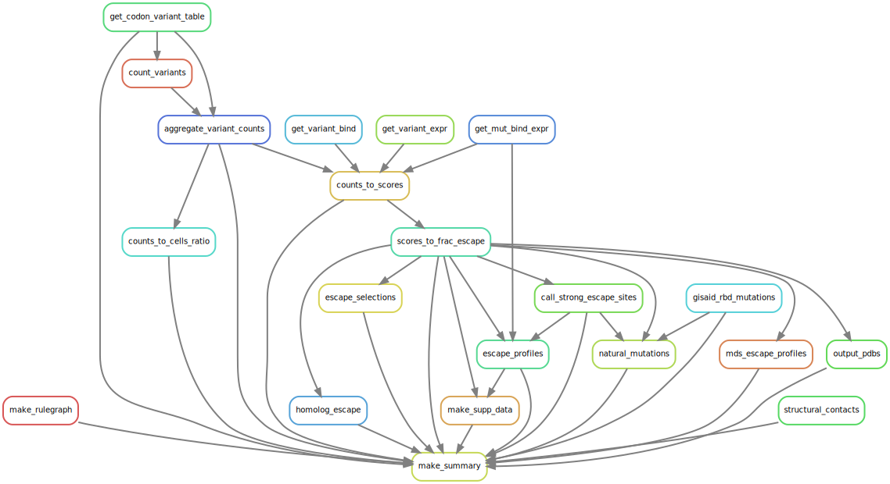

# Summary

Analysis run by [Snakefile](../../Snakefile)
using [this config file](../../config.yaml).
See the [README in the top directory](../../README.md)
for details.

Here is the rule graph of the computational workflow:

Here is the Markdown output of each notebook in the workflow:

1. Get codon-variant-table from [here](https://media.githubusercontent.com/media/jbloomlab/SARS-CoV-2-RBD_DMS/master/results/variants/codon_variant_table.csv).

2. Count variants and then
   [aggregate counts](aggregate_variant_counts.md) to create
   to create [variant counts file](../counts/variant_counts.csv).

3. [Analyze sequencing counts to cells ratio](counts_to_cells_ratio.md);
   this prints a list of any samples where this ratio too low. Also
   creates [a CSV](../counts/counts_to_cells.csv) with the
   sequencing counts, number of sorted cells, and ratios for
   all samples.

4. [Escape scores from variant counts](counts_to_scores.md).

5. [Escape fractions for mutations and homologs](scores_to_frac_escape.md);
   creating [mutation escape fraction file](../escape_scores/escape_fracs.csv)
   and [homolog escape fraction file](../escape_scores/escape_fracs_homologs.csv).

6. [Call sites of strong escape](call_strong_escape_sites.md),
   and write to [a CSV file](../escape_profiles/strong_escape_sites.csv).

7. Plot [escape profiles](escape_profiles.md).

9. [Multidimensional scaling](mds_escape_profiles.md) on escape profiles.

10. Map escape profiles to ``*.pdb`` files using [this notebook](output_pdbs.md)

11. Output a list of RBD structural contacts for each antibody with a high-resolution structure using [this notebook](annotate_structural_contacts.md)

12. [Count mutations in GISAID RBD sequences](gisaid_rbd_mutations.md).
   to create [this counts file](../GISAID_mutations/mutation_counts.csv).

13. [Analyze GISAID mutations at sites of escape](natural_mutations.md).

14. [Escape from binding by homologs](homolog_escape.md).

15. [Analyze viral escape selections](escape_selections.md).

16. [Make supplementary data files](make_supp_data.md),
    which are [here](../supp_data). These include
    `dms-view` input files.